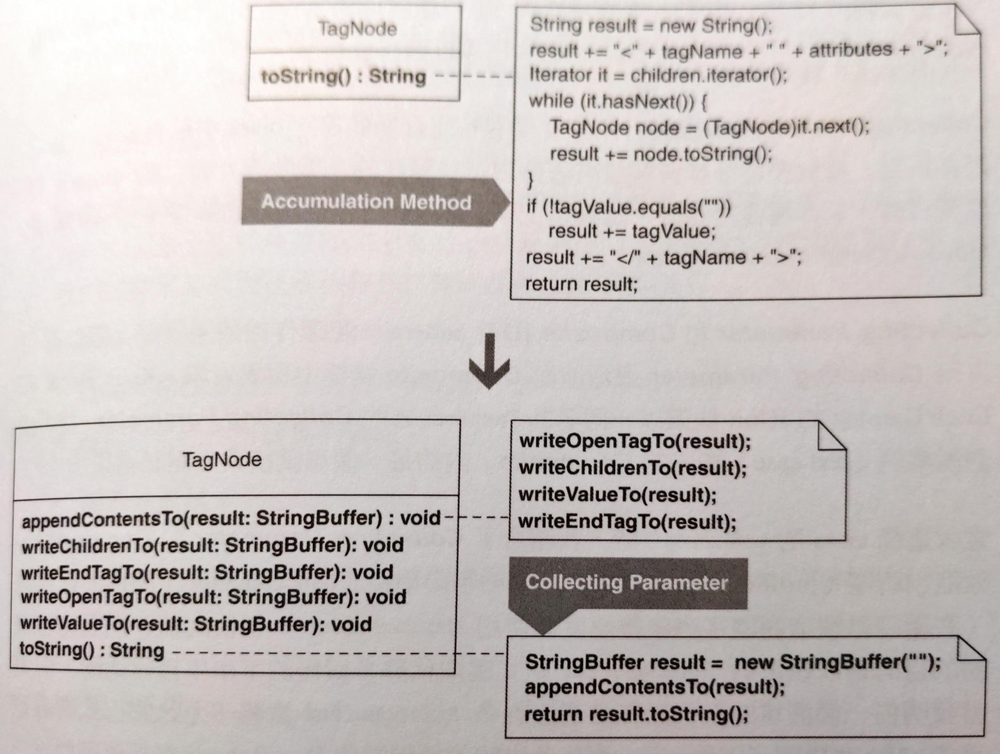

# Move Accumulation to Collecting Parameter

將積累資訊的任務移交給 **Collecting Parameter**。




## 動機

Kent Beck 在《Smalltalk Best Practice Patterns》中定義了 **Collecting Parameter** pattern。將 **Collecting Pattern** 物件傳入函式，是為了從函式中搜尋資訊。這個 pattern 經常和 **Composed Method** 拴在一起。

為了把很多函式分解成 Composed Method，你需要決定如何從「被 Composed Method 呼叫」的函式中累積資訊。你可以把 **Collecting Parameter** 傳入這些函式來累積結果，避免那些函式各自返回結果再結合。

**Collecting Parameter** 也可以被傳入多個物件的函式。當它拜訪多個物件時，有兩個辦法可以累積資訊：
- 讓每個物件回呼（call back） **Collecting Parameter**（也是個物件）的函式。
- 物件把自己傳給 **Collecting Parameter**，後者回呼那些物件來獲得資料。

**Collecting Parameter** 被設計來從 *帶有特定介面的特定類別* 中累積資料。從「有多種資料並有著存取這些資料的多種多樣介面」的類別累積資料時，**Collecting Parameter** 並非運作得很好，可能改用 **Visitor** 會更好。

**Collecting Parameter** 和 **Composite** pattern 一起運作得很好，因為你可以用 **Collecting Parameter** 遞迴地從 **Composite** 結構來累積資訊。

::: tip 優點
- 有助於將體積龐大的函式轉為較小、較簡單、較容易閱讀的函式。
- 可以讓最後產出的程式碼執行更快。

:::


## 作法

1. 找出一個會累積資訊的 **積累函式（accumulation method）**，其結果（某個區域變數）會成為 **Collecting Parameter**。<br>
    如果這個結果物件的型別不能讓你在函式間累積資訊，請設法改變型別。<br>
    例如 Java 的 `String` 不讓你在函式間累積資訊，所以必須改用 `StringBuffer`。
2. 在積累函式中找出一個資訊 **積累措施（accumulation step）**，實施 *Extract Method* 抽出一個 private 函式。令此函式回傳型別為 `void`，然後把結果物件作為一個參數傳給它；在那個 private 函式中把資訊寫入結果物件。
3. 針對每個積累措施重複步驟 2，直到原本程式碼被函式呼叫式取代為止 — 呼叫的正是上面那些被抽取出來的 private 函式（它們接收並改寫結果物件）。<br>
    我們的積累函式現在應該有三行程式碼做出以下動作：
    - 具現一個結果物件
    - 將結果物件傳給許多函式（中的第一個）
    - 得到結果物件所收集的資訊


## 範例

這篇範例從一個基於 **Composite** 的程式碼開始重構（來自 [Replace Implicit Tree with Composite](../ch7/replace-implicit-tree-with-composite.md)）。這個 **Composite** 是以「擁有 `toString()`」的單個 `TagNode` class 塑造出來的。其 `toString()` 遞迴走訪 XML 樹狀結構的節點，最後把找到的資訊轉成 `String`。我把 `toString()` 重構地更容易被理解。

1. 以下 `toString()` 遞迴地從 **Composite** 結構內的每個 tag 累積資訊，把結果存入 `result` 中。
    ```java
    class TagNode {
        public String toString() { 
            String result = new String(); 
            result += "<" + tagName + " " + attributes + ">"; 
            Iterator it = children.iterator(); 
            while (it.hasNext()) { 
                TagNode node = (TagNode)it.next(); 
                result += node.toString(); 
            } 
            if (!value.equals("")) 
                result += value; 
            
            result += "</" + tagName + ">"; 
            return result; 
        }
    }
    ```
    現在把 `result` 的型別改成 `StringBuffer`：
    ```java
    StringBuffer result = new StringBuffer("");
    ```
2. 找到第一個資訊累積措施，此措施把帶有任一個屬性的 XML open tag 串接到 `result` 變數。對它 *Extract Method*，使以下：
    ```java
    result += "<" + tagName + " " + attributes + ">";
    ```
    被抽取成：
    ```java
    private void writeOpenTagTo(StringBuffer result) { 
        result.append("<"); 
        result.append(name); 
        result.append(" ");
        result.append(attributes.toString()); 
        result.append(">"); 
    }
    ```
3. 接下來，繼續在 `toString()` 其他部份 *Extract Method*。把焦點放在「把 child XML 節點加入 `result`」的程式碼上。程式碼帶有遞迴步驟。

    ```java{7}
    class TagNode {
        public String toString() {
            // ...
            Iterator it = children.iterator();
            while (it.hasNext()) { 
                TagNode node = (TagNode)it.next(); 
                result += node.toString() ; 
            } 
            if (!value.equals("")) 
                result += value; 
                // ... 
        }
    }
    ```

    這個遞迴意味著 **Collecting Parameter** 需要被傳給 `toString()`。但問題在於 `toString()` 不接受參數，所以不能只是抽取函式而已，必須找其他方案。最後決定以輔助函式來解決問題。

    ```java
    public String toString() { 
        StringBuffer result = new StringBuffer(""); 
        appendContentsTo(result); 
        return result.toString(); 
    } 
    
    private void appendContentsTo(StringBuffer result) { 
        writeOpenTagTo(result); 
        // ... 
    }
    ```

    現在需要的遞迴行為可以交給 `appendContentsTo` 去操作了：

    ```java{3,11,15}
    private void appendContentsTo(StringBuffer result) { 
        writeOpenTagTo(result); 
        writeChildrenTo(result); 
        ... 
        return result.toString(); 
    } 
    private void writeChildrenTo(StringBuffer result) { 
        Iterator it = children.iterator(); 
        while (it.hasNext()) { 
            TagNode node = (TagNode)it.next(); 
            node.appendContentsTo(result); // now recursive call will work 
        } 
        
        if (!value.equals("")) 
            result.append(value); 
    }
    ```

    我們看著 `writeChildrenTo()`，它所作的事情是：遞迴增加 children，還有把一個值加入 tag。為了把這兩個獨立行動突顯出來，我又把 *處理數值* 的那段程式碼抽取為獨立函式：

    ```java
    private void writeValueTo(StringBuffer result) { 
        if (!value.equals("")) 
            result.append(value); 
    }
    ```

    再抽取出一個用來寫入 XML close tag 的函式。最後程式碼如下：

    ```java
    public class TagNode {
        public String toString() { 
            StringBuffer result = new StringBuffer(""); 
            appendContentsTo(result); 
            return result.toString(); 
        } 
        
        private void appendContentsTo(StringBuffer result) { 
            writeOpenTagTo(result); 
            writeChildrenTo(result); 
            writeValueTo(result);
            writeEndTagTo(result); 
        } 
        
        private void writeOpenTagTo(StringBuffer result) { 
            result.append("<"); 
            result.append(name); 
            result.append(attributes.toString()); 
            result.append(">"); 
        } 
        
        private void writeChildrenTo(StringBuffer result) { 
            Iterator it = children.iterator(); 
            while (it.hasNext()) { 
                TagNode node = (TagNode)it.next(); 
                node.appendContentsTo(result); 
            } 
        } 
        
        private void writeValueTo(StringBuffer result) { 
            if (!value.equals("")) 
                result.append(value); 
        } 
        
        private void writeEndTagTo(StringBuffer result) { 
            result.append("</"); 
            result.append(name); 
            result.append(">");
        }
    }
    ```

    現在 `toString()` 變得很簡單，而 `appendContentsTo()` 則可以良好展示一個 **Composed Method**。
