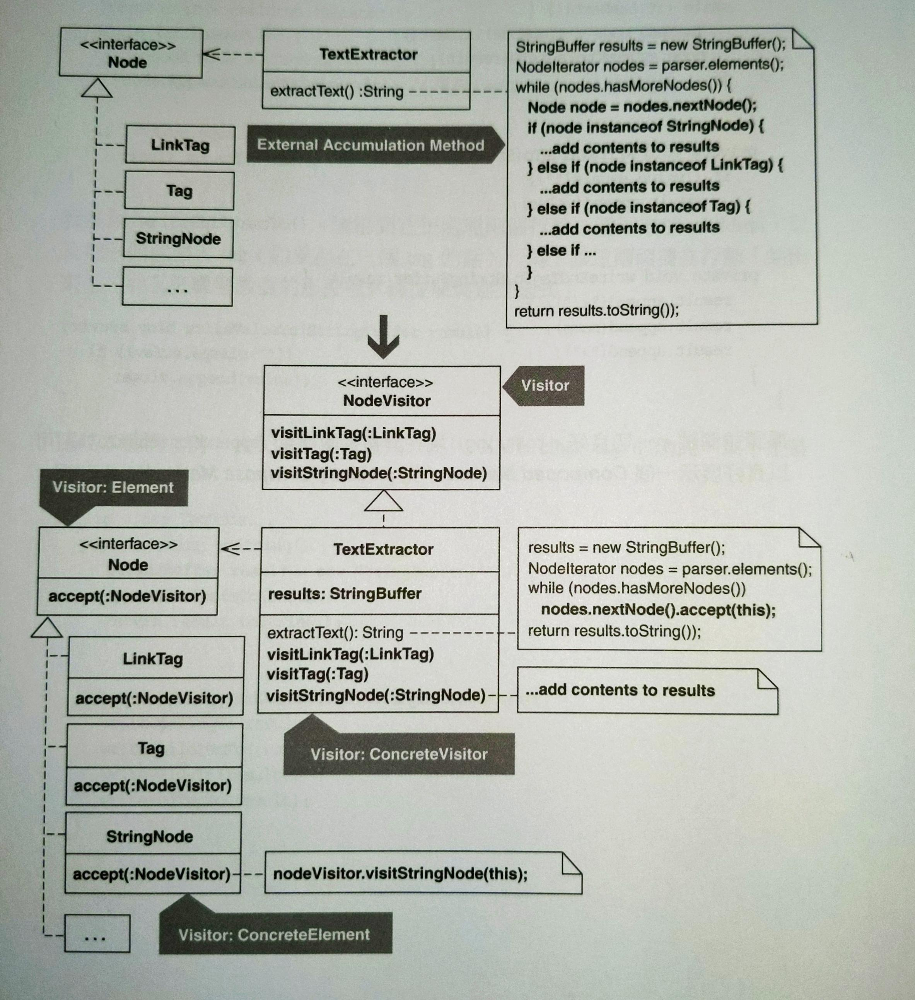
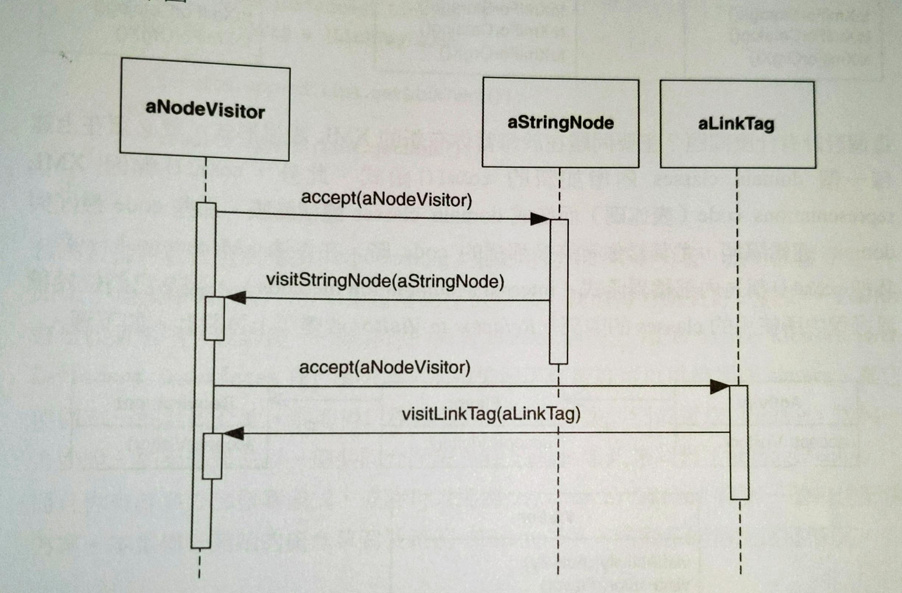
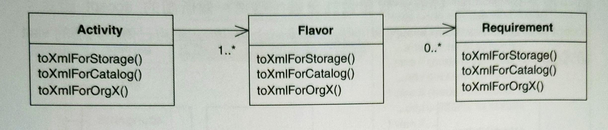
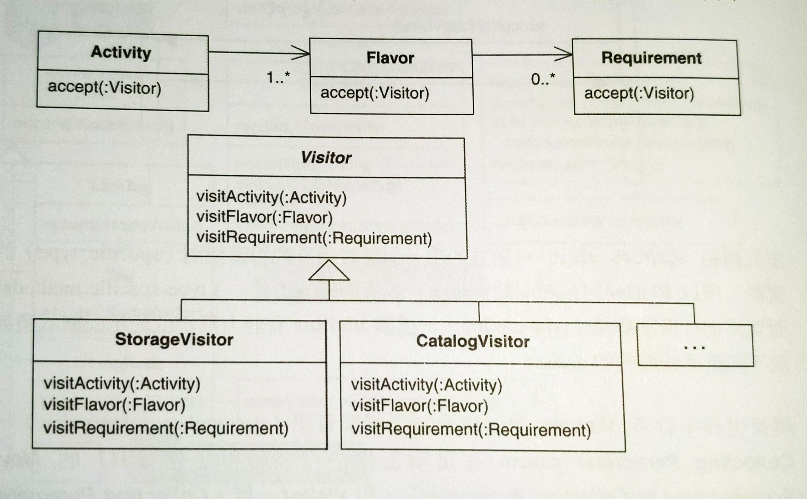
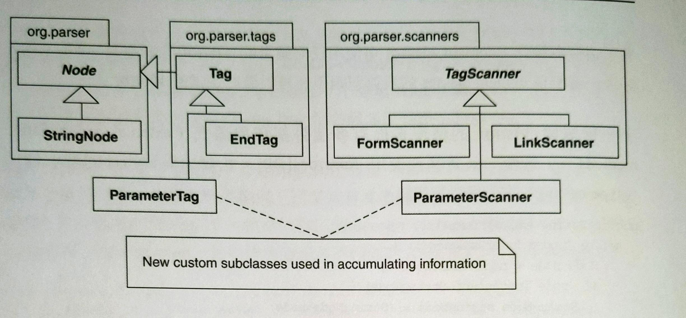

# Move Accumulation to Visitor

將累積任務移到 **Visitor**。




## 動機

Ralph Johnson (《Design Pattern》作者之一) ：
> 你大多數時候不需要 **Visitor**，但當你需要的時候你就得用。

### Visitor

**Visitor** 能夠拜訪每個類別進行操作，它拜訪的類別是異質的，這些類別各自有其介面和資料。

**Visitor** 可以藉由 double-dispatch 與異質的類別互動：這些類別接受一個 **Visitor** 實體作為參數 (`accept`) ，然後回呼 (callback)  **Visitor**。



由於 **Visitor** 的 `visit(...)` 第一個參數是有明確型別的，所以它可以呼叫該參數實體中「型別明確的函式 (type-specific methods) 」而不需要轉型，這讓 **Visitor** 有能力拜訪位於相同或不同繼承體系中的類別。

### 用處一：內部累積

現實世界中許多 **Visitor** 的工作是為了累積資訊。**Collecting Parameter** 和 **Visitor** 一樣可以被傳給多個物件，從物件身上累積資訊。差別是能否輕鬆的在異質的類別中累積。

當有多個演算法執行在同一個異質物件結構上，就需要 **Visitor**。例如：有三個 domain classes 能夠產出各不相同的 XML 表達形式，如下圖：



問題：當你有新的 XML 表達形式，就必須在上面每個 domain classes 增加新的 `toXml()` 函式。除此之外，`toXml()` 會因為 representations code 而造成 domain classes 體積膨脹。這些 code 最好和 domain 邏輯分開。

*Refactor to Visitor* 改變設計如下：



有此設計，domain classes 可以使用任何適當的 **Visitor** 來表達 XML。曾經擠在 domain classes 的表達邏輯也被封裝在適當的 **Visitor** 內。

### 用處二：外部累積

另一種用處是你有多個外部累積函式，這樣的函式往往會使用 **Iterator**，並利用異質物件的轉型取得特定資訊，例如：

```java{7,8,11,13,15}
public String extractText() {
    // ...
    while (nodes.hasMoreNodes()) { 
        Node node = nodes.nextNode(); 
        
        if (node instanceof StringNode) { 
            StringNode stringNode = (StringNode)node ; 
            results.append(stringNode.getText()); 
        } 
        else if (node instanceof LinkTag) { 
            LinkTag linkTag = (LinkTag)node ; 
            if (isPreTag) 
                results.append(link.getLinkText()); 
            else 
                results.append(link.getLink()); 
        } 
        else if {
            // ...
        }
    }
}
```

- 如果不是太頻繁的話，對物件轉型來使用物件特有介面是可以接受的。
- 如果確實太頻繁，要考慮更好的設計。
    - 使用 **Visitor**？
      - 也許可以，除非：沾染 Alternative Classes with Different Interfaces 壞味道。
        - 這種情況也許能重構那些類別，來擁有一個共用介面，這樣就不需要 **Visitor**。
        - 如果無法產生共用介面讓異質類別看起來同質，就可以透過 *refactor to Visitor*。

### 用處三

如果沒有內部也沒有外部累積，還是可以使用 **Visitor**。例如：

在 HTML Parser 中曾經寫了兩個 subclasses 完成一個資訊累積任務，如下圖：



如果 **Visitor** 必須拜訪的那一組 classes 頻繁的成長，最好避免採用 **Visitor**。因為這樣要在每個類別新增 accept，並在 **Visitor** 寫一個相應的 visit 函式。

但也不要太篤信這條規則。作者在 HTML Parser 考慮 refactor to **Visitor** 時，發現 **Visitor** 需要拜訪的最初一組 classes 太龐大且經常變動。進一步探究之後發現這些 classes 只有一個子集真正需要被拜訪，其他 classes 可以用它們的 superclass 的 visit 函式來拜訪。

### 反對一：破壞封裝

有時候 visitee 的函式不是 public，就必須改成 public 才可以拜訪。但很多 **Visitor** 實作並不要求改變可視度，或是改變的成本遠小於使用其他解法。

### 反對二：增加太多複雜或晦澀的程式碼

- 有人說看著 visit loop 會不知道在做什麼事情。
  - 但如果你懂 **Visitor** 你就會很清楚。

因此：是否晦澀難懂要看團隊對此 pattern 的接受度。如果真的需要，**Visitor** 會讓複雜的程式碼變得簡單。

### 小結

**Visitor** pattern 是個雙面刃：威力強大而複雜。請在確定需要時再使用它，不要沈迷 patterns。

::: tip 優點
- 能容納異質物件結構的多個演算法。
- 可在不同的繼承體系拜訪類別。
- 不必轉型就能呼叫異質類別的指定型別函式。

:::

::: warning 缺點
- 如果使用一個共同介面就能讓異質類別變為同質，這樣做會讓設計變得更複雜。
- 必須新增 accept 和 visit 函式。
- 可能破壞封裝性。

:::


## 作法

定義：

- 累積函式：負責從異質類別累積資訊的函式。
- 外部累積函式：不屬於異質類別的某個類別內。
- 內部累積函式：屬於異質類別的某個類別內。

### 外部累積函式

定義：

包含累積函式的類別稱為 host。如果 host 已經扮演太多角色，請先實施 *Replace Method with Method Object* 將累積函式抽取到一個新的 host 內。

1. 找出累積函式中的累積邏輯所指涉的任何區域變數，將這些區域變數轉為 host 類別的欄位。
2. 實施 *Extract Method* 在針對某個累積來源的累積邏輯上。調整抽出來的函式，讓它可以接受以累積源為型別的參數，並命名為 `accept(...)`。
3. 對 `accept(...)` 實施 *Extract Method* 抽出 `visitClassName()` 函式 `ClassName` 對應 `accept(...)` 的累積源。這個新函式接受一個參數並以累積源當作參數型別，例如：`visitEndTag(EndTag endTag)`。
4. 實施 *Move Method* 將每個 `accpet(...)` 移到相應的累積源。現在，每個 `accept(...)` 接受一個 host 型別的參數。
5. 在這個累積函式中，對每個 `accept(...)` 呼叫都實施 *Inline Method*。
6. 在累積源的 superclasses 和 interfaces 實施 [Unify Interfaces](../ch11/unify-interfaces.md)，讓 `accept(...)` 可以被多型呼叫。
7. 將累積函式一般化，讓每個累積源的 `accept(...)` 可以被多型呼叫。
8. 在 host 上實施 *Extract Interface* 建立 visitor 介面，裡面宣告由 host 實作的所有 visit 函式。
9. 改變每個 `accept(...)` 簽名式，使用上面的 visitor 介面。

### 內部累積函式

1. 透過新建立類別的方式建立出一個 visitor。考慮在類別名稱中使用 visitor 字樣。
2. 找出 visitee，visitor 會在裡面累積資料。把一個 `visitClassName(...)` 的函式加入 visitor，例如：`visitor.visitEndTag(...)`。讓這個函式回傳 void，並帶一個 visitee 參數。
    <br>針對這個「被 visitor 從中累積資訊」的繼承體系的每個類別重複此步驟。
3. 在每個 visitee 的累積函式實施 *Extract Method*，於是累積函式改呼叫一個新的函式，稱為 accept 函式。讓它的簽名式在所有類別中相同，以便每個累積函式都有相同的「呼叫 accept 函式」的程式碼。
4. 現在，累積函式在每個類別中完全相同。實施 *Pull Up Method* 移到 superclass 內。
5. 實施 *Add Parameter*，在 accept 函式的每個實作中加入一個 visitor 型別參數。當累積函式呼叫 accpet 函式時，讓它傳入一個 visitor 新實體。
6. 透過「在 visitee 的 accept 函式身上實施 *Move Method*」而在 visitor 產生一個 visit 函式。現在，這個 accpet 函式呼叫一個「可接受 visitee 型別參數」的 visit 函式。<br>
    例如：名為 `StringNode` 的 visitee 和一個 `Visitor` 的 visitor：
    ```java
    class StringNode {
        void accept(Visitor visitor) { 
            visitor.visitStringNode(this); 
        } 
    }
    
    class Visitor { 
        void visitStringNode(StringNode stringNode) {
            ...
        }
    }
    ```
    對每個 visitee 重複進行這個步驟。

### Visitor 取代

假設你既沒有內部累積函式也沒有外部累積函式，但你的程式碼如果以 **Visitor** 取代的話會更好。

1. 透過建立新 class 的方式建立一個 concrete visitor。考慮在 class 名稱中使用 `visitor` 字樣。
    - 如果建立的是你的第二個 concrete visitor：
      1. 請在第一個 concrete visitor 身上實施 *Extract Superclass*，建立起你的 abstract visitor
      2. 變更所有 visitees (定義於步驟 2) 上的訊息簽名 (message signatures) ，使它們接受一個 abstract visitor 而不是你的第一個 concrete visitor。
      實施 Extract Superclass 時不要上提任何「只針對特定 concrete visitor 而不適用所有concrete visitors」的資料或函式。
2. 找出一個 visitee，它是個 class，concrete visitor 必須從其中累積資料。
    把一個名為 `visitClassName` 的函式加入 concrete visitor，此處 `ClassName` 是 visitee 的名稱。
    讓 visit 函式的返回型別為 void，並讓它帶一個 visitee 引數。
3. 將一個帶有 concrete visitor 參數或 abstract visitor 參數 (如果你有的話) 的 public accept 函式加入步驟 2 所得的 visitee 中。
    讓這個函式回呼 (call back) concrete visitor 的 visit 函式，並傳入一個 reference to visitee。
4. 對每一個 visitee 重複步驟 2, 3。現在你擁有了你的 concrete visitor 骨幹。
5. 在你的 concrete visitor 身上實作一個 public 函式 (用以取得累積結果)。目前讓累積結果為empty 或 null。
6. 在累積函式中定義一個型別為 concrete visitor 的區域欄位，並具現它。
    然後找出累積函式碼，其中會從每一個 visitee 累積資訊。
    為累積函式添加程式碼，用來呼叫每個 visitee 的 accept 函式，並於呼叫時傳入 concrete visitor 的實體。
    完成後，更新累積函式，讓它得以使用 concrete visitor 的累積結果而不是其一般結果。最後這個部分會破壞你的測試。
7. 實作 concrete visitor 上的每一個 visit 函式。
    這個步驟相當大，而且沒有單組作法可以包辦它，因為所有情況都不一樣。
    當你把程式碼從累積函式複製到每個 visit 函式時，要讓它與新家相稱，作法是：
    - 確定每個 visit 函式可從其 visitee 中取用必要的資料/邏輯
    - 宣告並初始化 concrete visitor 欄位，它們將被兩個或更多個 visit 函式取用。
    - 將累積過程中的必要資料從累積函式傳到 concrete visitor 的建構式中。
8. 從累積函式中儘可能移除舊碼。
9. 剩下的程式碼應該是巡訪一群物件並將 concrete visitor 傳給每個 visitee 的 accept 函式。
    如果某些受訪物件沒有 accept 函式 (也就足說並非 visitees) ，為那些 classes (或其 base class) 定義一個無作為的 accept 函式,於是你的迭代碼 (iteration code) 就不必在呼叫accept函式時區別那些物件。
10. 對累積函式的迭代碼 (iteration code ) 實施 *Extract Method*，建立起一個 local accept 函式。
    這個新函式應該接受唯一的 concrete visitor 引數，並且應該巡訪一群物件，將 concrete visitor 傳給每個物件的 accept 函式。
11. 把 local accept 函式移到一個更適合的地方，例如其他客戶可輕鬆取用的某個 class 內。

## 範例

範例來自 [HTML Parser](https://sourceforge.net/projects/htmlparser/)。

Parser 用戶通常從 HTML 或 XML 文件累積資訊，利用 `TextExtractor` 的 `extractText()` 函式：

```java
public class TextExtractor {
    // ...
    public String extractText() throws ParserException { 
        Node node; 
        boolean isPreTag = false; 
        boolean isScriptTag = false; 
        StringBuffer results = new StringBuffer(); 
        
        parser.flushScanners(); 
        parser.registerScanners(); 
        
        for (NodeIterator e = parser.elements(); e.hasMoreNodes();) { 
            node = e.nextNode(); 
            if (node instanceof StringNode) { 
                if (!isScriptTag) { 
                    StringNode stringNode = (StringNode) node; 
                    if (isPreTag) 
                        results.append(stringNode.getText()); 
                    else { 
                        String text = Translate.decode(stringNode.getText()); 
                        if (getReplaceNonBreakingSpace()) 
                            text = text.replace('\a0', ’ ’); 
                            if (getCollapse()) 
                                collapse(results, text); 
                            else 
                                results.append(text); 
                    } 
                }
            } else if (node instanceof LinkTag) { 
                LinkTag link = (LinkTag) node; 
                if (isPreTag) 
                    results.append(link.getLinkText()); 
                else 
                    collapse(results, Translate.decode(link.getLinkText()));
                
                if (getLinks()) { 
                    results.append("<"); 
                    results.append(link.getLink()); 
                    results.append(">"); 
                } 
            } else if (node instanceof EndTag) { 
                EndTag endTag = (EndTag) node; 
                String tagName = endTag.getTagName(); 
                
                if (tagName.equalsIgnoreCase("PRE")) 
                    isPreTag = false; 
                else if (tagName.equalsIgnoreCase("SCRIPT")) 
                    isScriptTag = false; 
                } else if (node instanceof Tag) { 
                    Tag tag = (Tag) node; 
                    String tagName = tag.getTagName(); 
                    if (tagName.equalsIgnoreCase("PRE")) 
                        isPreTag = true; 
                    else if (tagName.equalsIgnoreCase("SCRIPT")) 
                        isScriptTag = true; 
                }
            } 
            return (results.toString()); 
        }
    }
}
```

這段程式碼：
1. 巡訪 parser 回傳的所有節點
2. 判斷每個節點的型別
3. 轉換資料型別
4. 從節點中累積資料

決定是否重構、如何重構時，考慮以下問題：
- **Visitor** 實作是否更簡練？
- 在「parser 的其他區域」或「客戶碼中有關 parser 的程式碼」，**Visitor** 的實作可以採用類似的重構嗎？
- 有比 **Visitor** 更簡單的解法嗎？
- 既有的程式碼是否足夠？

推論：
- 這段程式碼呼叫兩個不同的函式來蒐集所有 `LinkTag` 的文字或其 link，因此無法以一個共同的累積函式來蒐集資料。
- 除了 **Visitor** 之外，沒有簡單方法可以避免 `instanceof` 呼叫和型別轉換。
- parser 其他區域和客戶碼可以因為使用 **Visitor** 而改善。

接下來考慮：讓 `TextExtractor` 扮演 **Visitor** 是否合理，或是應該從 `TextExtractor` 抽取一個類別來扮演 **Visitor**。
- `TextExtractor` 只負責抽取文字，所以它會是個好的 **Visitor**。

1. 將區域變數轉換為欄位
    ```java{3-5,8-10}
    public class TextExtractor {
        // ...
        private boolean isPreTag;
        private boolean isScriptTag;
        private StringBuffer results;

        public String extractText() {
            // boolean isPreTag = false;
            // boolean isScriptTag = false;
            // StringBuffer results = new StringBuffer();
            // ...
        }
    }
    ```
2. 在第一個出現的累積碼實施 *Extract Method*：
    ```java{8,14-30}
    public class TextExtractor {
        // ...
        public String extractText() {
            // ... 
            for (NodeIterator e = parser.elements(); e.hasMoreNodes();) { 
                node = e.nextNode();
                if (node instanceof StringNode) { 
                    accept(node);
                } else if () 
                // ... 
            }
        }

        private void accept(Node node) { 
            if (!isScriptTag) { 
                StringNode stringNode = (StringNode) node;

                if (isPreTag) 
                    results.append(stringNode.getText());
                else { 
                    String text = Translate.decode(stringNode.getText());
                    if (getReplaceNonBreakingSpace()) 
                        text = text.replace(’\a0’, ’ ’);                    
                    if (getCollapse()) 
                        collapse(results, text);
                    else 
                        results.append(text);
                } 
            } 
        }
    }
    ```

    目前這個 `accept()` 把 `node` 轉型成 `StringNode`。之後會為了每個累積來源建立一個 `accept()`，所以必須訂製一個 `StringNode` 型別的參數：

    ```java{9,13,16}
    public class TextExtractor {
        // ...
        public String extractText() {
            // ...
            for (NodeIterator e = parser.elements(); e.hasMoreNodes();) { 
                node = e.nextNode(); 
                
                if (node instanceof StringNode) { 
                    accept((StringNode)node); 
                } else if () 
                //...
        }
        private void accept(StringNode stringNode) {
            // ...
            if (!isScriptTag) {
                // StringNode stringNode = (StringNode) node;
                // ...
        }
    }
    ```

    編譯並測試後，對其他所有累積來源重複這個步驟，產生如下：

    ```java{9,11,13,15}
    public class TextExtractor {
        // ...
        public String extractText() {
            // ... 
            for (NodeIterator e = parser.elements(); e.hasMoreNodes();) { 
                node = e.nextNode(); 
                
                if (node instanceof StringNode) { 
                    accept((StringNode)node); 
                } else if (node instanceof LinkTag) { 
                    accept((LinkTag)node); 
                } else if (node instanceof EndTag) { 
                    accept((EndTag)node); 
                } else if (node instanceof Tag) { 
                    accept((Tag)node);
                } 
            }
            return (results.toString());
        }
    }
    ```
3. 在 `accpet(StringNode stringNode)` 函式本體上 *Extract Method*，建立一個 `visitStringNode()`：
    ```java{4,7-23}
    public class TextExtractor {
        // ...
        private void accept(StringNode stringNode) {
            visitStringNode(stringNode);
        } 
        
        private void visitStringNode(StringNode stringNode) { 
            if (!isScriptTag) { 
                if (isPreTag) 
                    results.append(stringNode.getText()); 
                else { 
                    String text = Translate.decode(stringNode.getText()); 
                    
                    if (getReplaceNonBreakingSpace()) 
                        text = text.replace(’\a0’, ’ ’); 
                    
                    if (getCollapse()) 
                        collapse(results, text);
                    else 
                        results.append(text); 
                } 
            } 
        }
    }
    ```

    編譯並測試後，對所有 `accept()` 重複這個步驟：

    ```java{}
    public class TextExtractor {
        // ...
        private void accept(Tag tag) { 
            visitTag(tag); 
        } 
        
        private void visitTag(Tag tag) // ... 
        
        private void accept(EndTag endTag) { 
            visitEndTag(endTag);
        } 
        
        private void visitEndTag(EndTag endTag) // ... 
        
        private void accept(LinkTag link) {
            visitLinkTag(link);
        }
        
        private void visitLinkTag(LinkTag link) // ... 
        
        private void accept(StringNode stringNode) { 
            visitStringNode(stringNode); 
        } 
        
        private void visitStringNode(StringNode stringNode) //...
    }
    ```
4. 實施 *Move Method* 把每個 `accpet()` 移到相關的累積來源：
    
    ```java
    public class TextExtractor {
        // ...
        private void accept(StringNode stringNode) { 
            visitStringNode(stringNode); 
        }
    }
    ```

    移到 `StringNode`：

    ```java
    public class StringNode {
        // ...
        public void accept(TextExtractor textExtractor) { 
            textExtractor.visitStringNode(this);
        }
    }
    ```

    調整程式碼，讓它呼叫 `StringNode` 的 `accept()`：

    ```java{4}
    public class TextExtractor {
        // ...
        private void accept(StringNode stringNode) { 
            stringNode.accept(this); 
        }
    }
    ```

    這個改動要先把 `TextExtractor` 的 `visitStringNode()` 改成 public。編譯並測試正常以後，重複這個步驟。
5. 對 `extractText()` 的每個 `accept()` 實施 *Inline Method*：
    ```java{9,11,13,15}
    public class TextExtractor {
        // ...
        public String extractText() {
            // ...
            for (NodeIterator e = parser.elements(); e.hasMoreNodes();) { 
                node = e.nextNode(); 
                
                if (node instanceof StringNode) { 
                    ((StringNode)node).accept(this); 
                } else if (node instanceof LinkTag) { 
                    ((LinkTag)node).accept(this); 
                } else if (node instanceof EndTag) { 
                    ((EndTag)node).accept(this); 
                } else if (node instanceof Tag) { 
                    ((Tag)node).accept(this); 
                } 
            } 
            
            return (results.toString()); 
        }

        // private void accept(Tag tag) { 
        //     tag.accept(this); 
        // } 

        // private void accept(EndTag endTag) { 
        //     endTag.accept(this); 
        // } 

        // private void accept(LinkTag link) { 
        //     link.accept(this); 
        // }

        // private void accept(StringNode stringNode) { 
        //     stringNode.accept(this); 
        // }
    }
    ```
6. 作者希望 `extractText()` 以多型的方式呼叫 `accept()`，而不必轉型。為此，在 `StringNode`, `LinkTag`, ... 的 superclass 和相關 interface 實施 *Unify Interface*：

    ```java
    public interface Node {
        public void accept(TextExtractor textExtractor); 
    }
    
    public abstract class AbstractNode implements Node {
        public void accept(TextExtractor textExtractor) {}
    }
    ```
7. 改變 `extractText()` 讓它以多型方式呼叫 `accept()`：

    ```java{7}
    public class TextExtractor {
        // ...
        public String extractText() {
            // ...
            for (NodeIterator e = parser.elements(); e.hasMoreNodes();) { 
                node = e.nextNode(); 
                node.accept(this); 
            }
        }
    }
    ```
8. 從 `TextExtractor` 抽出一個 `visitor` interface：

    ```java
    public interface NodeVisitor { 
        public void visitTag(Tag tag); 
        public void visitEndTag(EndTag endTag); 
        public void visitLinkTag(LinkTag link);
        public void visitStringNode(StringNode stringNode); 
    } 
    
    public class TextExtractor implements NodeVisitor // ...
    ```
9. 更改每個 `accept()`，讓它接受一個 `NodeVisitor` 參數而非 `TextExtractor`：

    ```java
    public interface Node {
        // ...
        public void accept(NodeVisitor nodeVisitor);         
    }
    
    public abstract class AbstractNode implements Node {
        public void accept(NodeVisitor nodeVisitor) {} 
    }

    public class StringNode extends AbstractNode {
        // ...
        public void accept(NodeVisitor nodeVisitor) { 
            nodeVisitor.visitStringNode(this); 
        }
    }   
    ```
