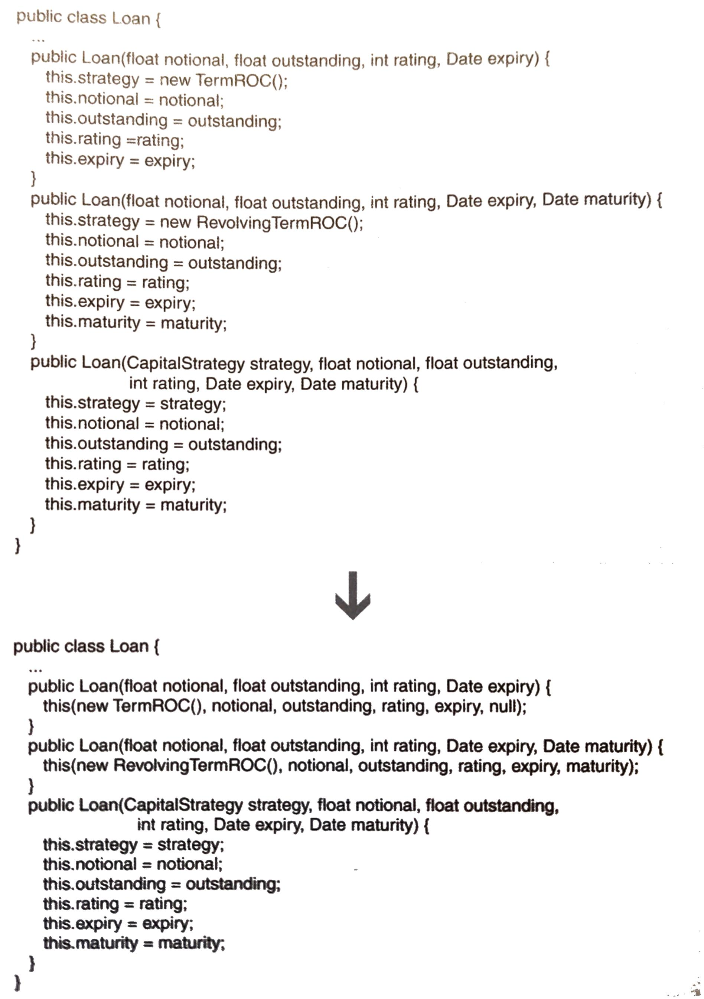

# Chain Constructors

把建構式串連起來，用來獲得少量的重複碼。




## 動機

為何要減少建構式的重複碼？假如一個類別有多個建構式，其中一個需要修改時，可能會忘記修改另一個（重複的部份）。

如果你的類別因為有很多建構式而降低可讀性，可以考慮使用 [Replace Constructors with Creation Methods](../ch6/replace-constructors-with-creation-methods.md)。


## 作法

1. 找出兩個含有重複碼的建構式。判斷哪一個可以呼叫另一個，使重複碼可以安全地被移除，改成其中一個建構式。
2. 對所有建構式重複步驟 1
3. 修改「可能不必是 public」的建構式的可視度 (visibility)


## 範例

```java
// 1
public Loan(float notional, float outstanding, int rating, Date expiry) { 
    this.strategy = new TermROC(); 
    this.notional = notional; 
    this.outstanding = outstanding; 
    this.rating = rating; 
    this.expiry = expiry; 
}
// 2
public Loan(float notional, float outstanding, int rating, Date expiry, Date maturity) { 
    this.strategy = new RevolvingTermROC(); 
    this.notional = notional;
    this.outstanding = outstanding; 
    this.rating = rating; 
    this.expiry = expiry; 
    this.maturity = maturity;
}
// 3
public Loan(CapitalStrategy strategy, float notional, float outstanding, int rating, Date expiry, Date maturity) { 
    this.strategy = strategy; 
    this.notional = notional; 
    this.outstanding = outstanding; 
    this.rating = rating; 
    this.expiry = expiry; 
    this.maturity = maturity; 
}
```

1. 觀察：發現可以用最少量的步驟，在第 1 個建構式呼叫第 3 個建構式。因此把第 1 個建構式改成
    ```java
    public Loan(float notional, float outstanding, int rating, Date expiry) { 
        this(new TermROC(), notional, outstanding, rating, expiry, null);
    }
    ```
2. 重複步驟 1。發現第 2 個建構式也能呼叫第 3 個建構式。因此把第 2 個建構式修改成
    ```java
    public Loan(float notional, float outstanding, int rating, Date expiry, Date maturity) { 
        this(new RevolvingTermROC(), notional, outstanding, rating, expiry, maturity);
    }
    ```
    由此可看出第 3 個建構式是 catch-all 建構式。
3. 檢查是否可以改變可視度，發現不行，於是完成重構。
