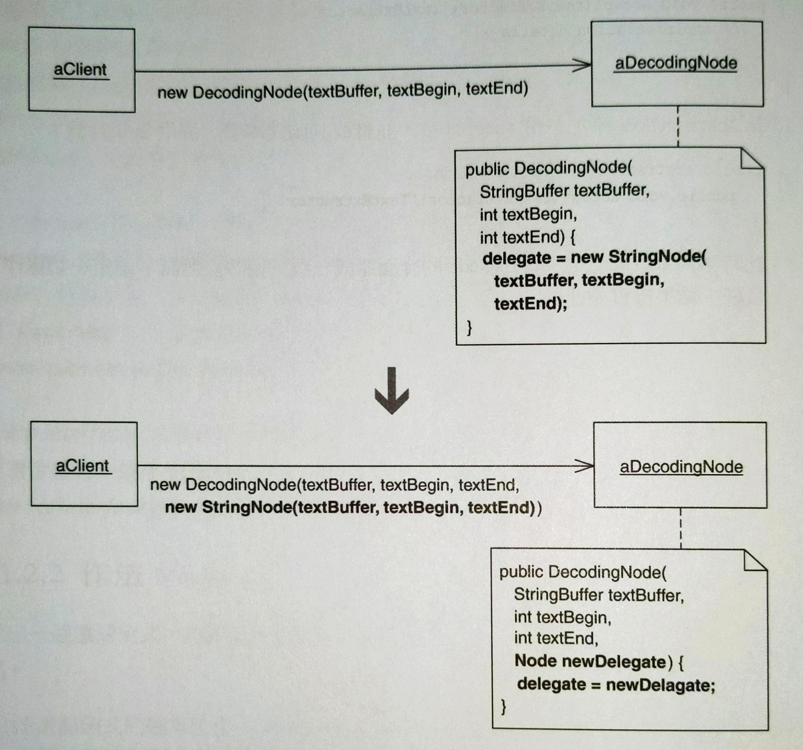

# Extract Parameter

方法：在賦值語句（assignment statement）的一部分抽取成參數。




## 動機

有時候想要對物件內某個欄位賦值，這個值由另一個物件給予。如果該欄位已經有一個 local value，可以把賦值語句的一部分抽取參數，讓客戶可以指定欄位值。


### 何時會需要？

- *Replace Inheritance with Delegation* 重構的最後階段，delegating class 會有一個欄位代表其委託對象（受託者，delegatee）：`delegate` 。但這個欄位需要由客戶來賦值。

完成這項重構以後，可能會需要 *Remove Parameter* 移除沒用的參數。


## 作法

1. 欄位的賦值語句必須在建構式或函式內。如果不在，把它移進去。
2. 實施 *Add Parameter* 傳入欄位值，並把欄位型別當作參數型別。
    更改賦值語句，讓欄位獲得參數值。


## 範例

在 [Move Embellishment to Decorator](../ch7/move-embellishment-to-decorator.md) 中，HTML Parser 的 `DecodingNode` class 有一個 `delegate` 欄位，這個欄位在建構式被賦予新創建的 `StringNode` 實體：

```java
public class DecodingNode implements Node {
    // ...
    private Node delegate; 
    
    public DecodingNode(StringBuffer textBuffer, int textBegin, int textEnd) { 
        delegate = new StringNode(textBuffer, textBegin, textEnd); 
    }
}
```

1. 由於 `delegate` 已在建構式，因此跳過進行下一步。
2. 實施 *Add Parameter* 並設定預設參數為 `new StringNode(textBuffer, textBegin, textEnd)`。然後修改賦值句。

    ```java{6-7}
    public class DecodingNode implements Node {
        // ...
        private Node delegate; 
        
        public DecodingNode(StringBuffer textBuffer, int textBegin, int textEnd, 
        Node newDelegate ) { 
            delegate = newDelegate; 
        }
    }
    ```

    這會導致客戶端（`StringNode`）也必須修改：

    ```java{5}
    public class StringNode {
        // ...
        ... {
            return new DecodingNode(..., 
            new StringNode(textBuffer, textBegin, textEnd));
        }
    }
    ```

    編譯並測試通過之後，實施 *Remove Parameter* 幾次，來讓 `DecodingNode` 建構式變成如下：

    ```java{6-8}
    public class DecodingNode implements Node {
        // ...
        private Node delegate; 
        
        public DecodingNode( 
            // StringBuffer textBuffer, int textBegin, int textEnd, 
            Node newDelegate ) { 
                delegate = newDelegate; 
            }
    }
    ```
