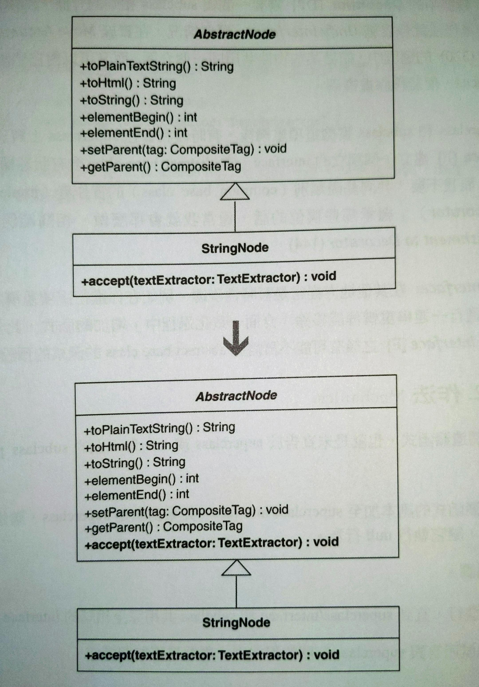

# Unify Interfaces

讓 superclass 或 interface 擁有和 subclass 相同的介面。

方法：在 subclass 上面找出 superclass 或 interface 沒有的 public 函式，然後加上去並且讓它們執行 null 行為。




## 動機

當 superclass 或 interface 需要與 subclass 相同的介面，就可以使用這項重構。


### 何時會需要？

- [Move Embellishment to Decorator](../ch7/move-embellishment-to-decorator.md) 中的 **Decorator** 需要與 subclass 相同的介面
- [Move Accumulation to Visitor](../ch10/move-accumulation-to-visitor.md) 用來移除重複碼

在 superclass 與 subclass 實施這項重構之後，有時候會在 superclass 實施 *Extract Interface* 建立一個獨立的 interface。
- 當 abstract base class 含有狀態欄位但是我不需要「共同基礎類別（common base class）的實作者（e.g. **Decorator**）」繼承那些欄位的話，就會這樣做。可參考：[Move Embellishment to Decorator](../ch7/move-embellishment-to-decorator.md) 

*Unify Interface* 在其他地方常常是暫時性步驟。
- 在這項重構之後還要進行一連串重構才能移除 *Unify Interface* 產生的函式。
- 實施 *Extract Interface* 後有可能不再需要 abstract base class 的函式的預設實作。


## 作法

找出一個遺漏的函式，亦即：不在 superclass 或 interface 的 subclass public 函式。

1. 把遺漏的函式複製一份加到 superclass 或 interface。如果是 superclass，修改函式本體，讓它執行 null 行為。
    重複進行，直到它們共用完全相同的 interface。


## 範例

HTML Parser 中需要把 `StringNode` 的 subclass 和它的 superclass `AbstractNode` 介面一致化。`StringNode` 擁有和 `AbstractNode` 幾乎一致的 public 函式，除了以下：

```java
public class StringNode extends AbstractNode {
    // ...
    public void accept(textExtractor: TextExtractor) { 
        // implementation details...
    }
}
```

1. 為 `AbstractNode` 加個 function `accept(...)` 並修改函式內容，使它提供 null 行為：

    ```java
    public abstract class AbstractNode {
        // ...
        public void accept(textExtractor: TextExtractor) {}
    }
    ```

    搞定。
