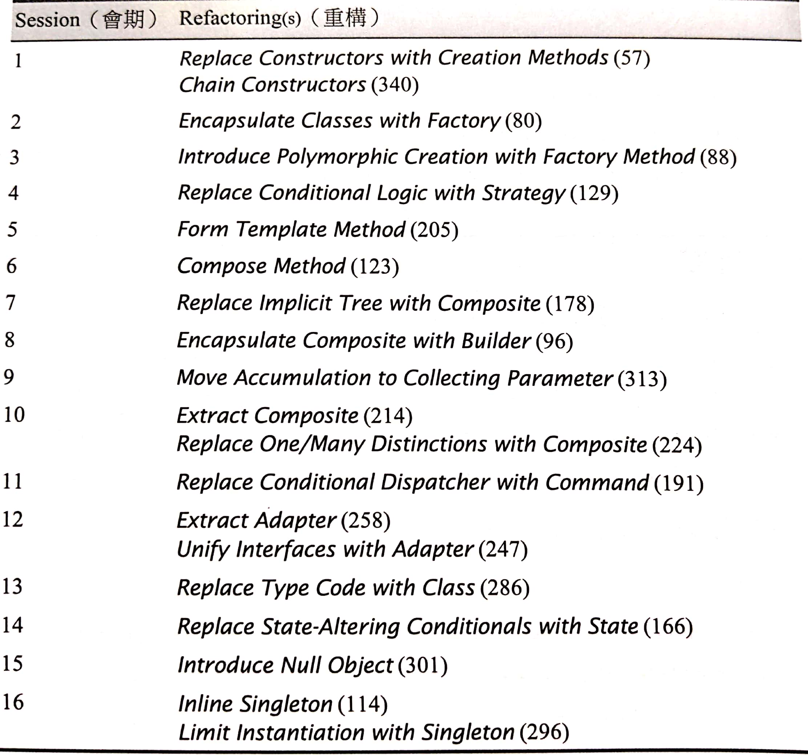
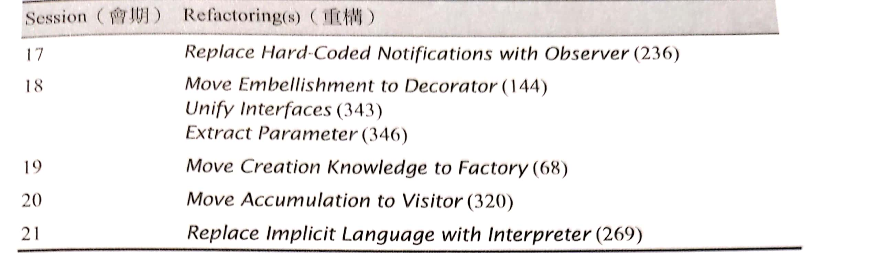

# Refactorings to Patterns 名錄

[[TOC]]

## 重構的記錄形式

- 名稱（Name）
- 概要（Summary）
  - 以 UML 描述設計上的變化
- 動機（Motivation）
  - 描述為何想要使用這項重構
  - 如果需要進一步細節，請查閱設計模式書籍
  - 優缺點
- 作法（Mechanics）
- 範例（Example）
- 變異（Variations）

## 本書指涉的專案

- XML Builder
- HTML Parser
- Loan Risk Calculator（貸款風險計算機）

## 學習順序

可以參考表格 5.1：

