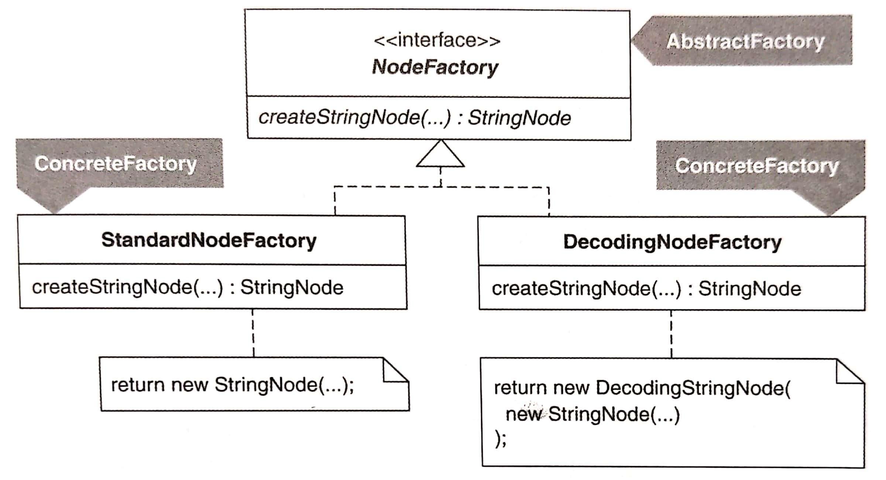

# 創建

本章的重構手法涵蓋與建立物件相關的問題：

- 建構式（constructor）的寫法
- 過度複雜的建構邏輯（construction logic）
- 非必要的 **Singleton** [DP]

## 創建函式（Creation Method）

建立並返回物件實體的 static 或 non-static 函式。

和 **Factory Method** [DP] 不一樣，**Factory Method** 不可以是 static，且必須被兩個 class 實作 -- 通常一個是 superclass 另一個是 subclass。

## Factory

在業界，**Factory** 定義不明確，可能是指 **Factory Method** 或是 **Abstract Factory**。作者的定義：「實作一個或多個 Creation Method(s)」的 classes。

如果建立物件的資料和程式碼蔓延在多個 classes，就會產生 *解法蔓生*（Solution Sprawl）的壞味道。需要使用 *Move Creation Knowledge to Factory* 把創建碼和資料集中在一個 **Factory**。

*Encapsulate Classes with Factory* 最常見的兩個動機是：
- 確保客戶經由共同介面對 classes 的實體進行溝通
- 讓 classes 的實體可以經由 **Factory** 被存取，降低客戶窺見 classes 細節的機會

### Factory Method

**Factory Method** 是個 non-static 函式，回傳 base class 或是 interface，而且在繼承體系中被實作，讓它可以進行多型創建（參考：[Introduce Polymorphic Creation with Factory Method](./introduce-polymorphic-creation-with-factory-method.md)）。

**Factory Method** 必須由某個 class 和其一或多個 subclasses 定義與實作。這些 classes 都是 Factories，但我們不會說 **Factory Method** 是個 **Factory**。

### Abstract Factory

**Abstract Factory** 是個 interface，被設計來 **可在執行期進行替換**，這樣系統可以讓用戶設定組態。

每個 **Abstract Factory** 都是 **Factory**，但 **Factory** 並不都是 **Abstract Factory**。當需求升級到必須支援「繼承族系的相依物件」的創建任務時，應該進化為 **Abstract Factory**。

**Factory Method**、**Factory** 和 **Abstract Factory** 的結構差異如下圖：

## Builder

**Builder** [DP] 是簡化物件結構的建構式最好的作法。

*Encapsulate Composite with Builder* 示範如何以更簡單、不容易出錯的方式建立 **Composite** [DP]。

## Singleton

因為經常遇到太多沒用的 **Singleton** [DP]，本章最後一項重構 *Inline Singleton* 用來教你如何移除 **Singleton**。
