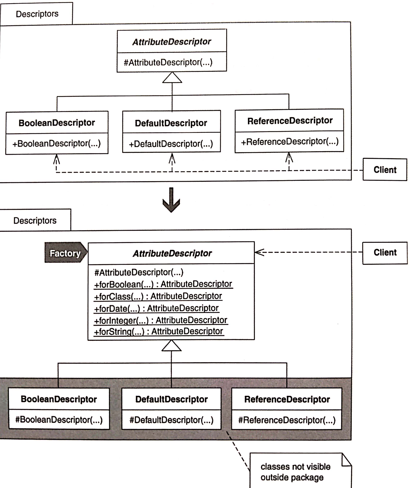
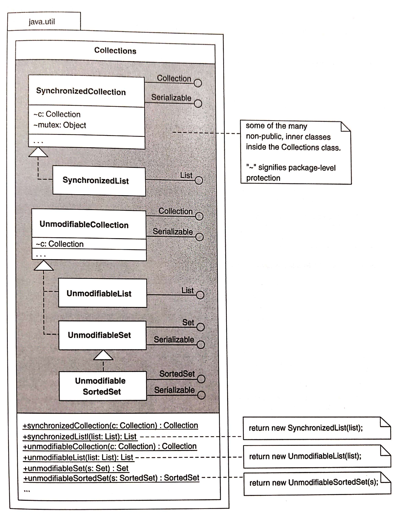

# Encapsulate Classes with Factory

以 Factory 封裝眾多 Classes。



[[TOC]]

## 動機

只要客戶端需要知道「某個 classes 的實體存在」，客戶端直接具現那些 classes 的能力就有價值。但如果不需要那些知識，這些 classes 是位於某個 package 內並實作同一個 interface，而且這種情況不太可能改變，這種情況下 package 內的 classes 可以隱藏起來不被外界發現，作法是讓一個 Factory 創建並返回「實作某共同介面的實體」。

簡單來說：
1. 「針對介面而非實體來編程」
2. 藏起 package 內不需要曝光的 classes。
3. 減少 package 概念的重量。
4. 透過 Factory 意象清晰的 Creation Method 來創建實體，簡化各個實體的創建工作。

::: tip 優點
- 透過「目的清晰」的函式產生各種實體，藉此簡化創建過程。
- 隱藏不須公開的 classes，並以此減輕 package 的概念重量（conceptual weight）。
- 有助於強制施行「針對介面編程而非實作編程」。

:::

::: warning 缺點
- 如果必須創建新種類的實體，就得創造出新的 Creation Methods 或更新舊的 Creation Methods。
- 當客戶端只能取用 Factory 的 binary code 而非 source code，客製化能力會受到限制

:::


## 作法

當你的 classes 共用同一個 public interface，共用同一個 superclass，並且位於同一個 package 內時，一般來說你會想用這個重構手法。
1. 找出「呼叫 class 建構式以創建某種實體」的客戶碼。
    對「建構式呼叫動作」實施 Extract Method，建立一個 public static function，這個函式便是 Creation Method。
    現在，實施 Move Method 把 Creation Method 搬到 callee 建構式所屬的 class 的 superclass 內。
    - 編譯並測試。
2. 找出上述的建構式的每個 caller，讓這些 caller 轉而呼叫 Creation Method。
    - 編譯並測試。
3. 針對這個 class 的建構式所創建的任何其他種類的實體，重複進行步驟 1 和步驟 2。
4. 宣告 class 的建構式為 non-public。
    - 編譯
5. 針對你想封裝的所有 classes，重複步驟 1--4。


## 範例

以下範例是 ORM，用來讀寫某個關聯式資料庫。

1. 這些 classes 協助把資料庫屬性映射到物件的 instance 變數。
    ```java
    package descriptors;
    public abstract class AttributeDescriptor...
        protected AttributeDescriptor(...)
    public class BooleanDescriptor extends AttributeDescriptor...
        public BooleanDescriptor(...) {
            super(...);
        }
        public class DefaultDescriptor extends AttributeDescriptor...
        public DefaultDescriptor(...) {
            super(...);
        }
        public class ReferenceDescriptor extends AttributeDescriptor...
        public ReferenceDescriptor(...) {
            super(...);
        }
    ```
    abstract `AttributeDescriptor` 的建構式被設為 protected，他的三個 subclasses 的建構式則被設為 public。雖然我只列出三個 subclasses，實際大約有 10 個。

    先把重點放在 `DefaultDescriptor`。第一步驟是確定一種可被 `DefaultDescriptor` 創建的實體。為此我們檢視若干程式碼：
    ```java
    protected List createAttributeDescriptors() {
        List result = new ArrayList();
        result.add(new DefaultDescriptor("remoteId", getClass(), Integer.TYPE));
        result.add(new DefaultDescriptor("createdDate", getClass(), Date.class));
        result.add(new DefaultDescriptor("lastChangedDate", getClass(), Date.class));
        result.add(new ReferenceDescriptor("createdBy", getClass(), User.class, RemoteUser.class));
        result.add(new ReferenceDescriptor("lastChangedBy", getClass(), User.class, RemoteUser.class));
        result.add(new DefaultDescriptor("optimisticLockVersion", getClass(), Integer.TYPE));
        return result;
    }
    ```
     我們發現 `DefaultDescriptor` 被用來表現對 `Integer` 和 `Date` 兩種型別的 mapping。
    雖然它也能用來映射其他型別，但我們一次只能專注一種情況。
    於是創造一個 Creation Method 用來建立 `Integer` 型別的 "attribute descriptors"。

    一開始實施 Extract Method 產生一個 `forInteger(...)` 的 public creation method:
    ```java
    protected List createAttributeDescriptors() {
        List result = new ArrayList();
        result.add(forInteger("remoteId", getClass(), Integer.TYPE));
        ...
    }
    public static DefaultDescriptor forInteger(...) {
        return new DefaultDescriptor(...);
    }
    ```

    由於 `forInteger` 總是針對 `Integer` 創建 `AttributeDescriptors` 物件，所以不再需要傳給它 `Integer.TYPE`：
    ```java
    protected List createAttributeDescriptors() {
        List result = new ArrayList();
        result.add(forInteger("remoteId", getClass()));
    }
    
    public static DefaultDescriptor forInteger(...) {
        return new DefaultDescriptor(..., Integer.TYPE);
    }
    ```
    要將 `forInteger` 回傳型別從 `DefaultDescriptor` 改成 `AttributeDescriptors`，因為我們希望客戶端經由 `AttributeDescriptor` interface 和所有 `AttributeDescriptor` subclass 互動：
    ```java
    public static AttributeDescriptor forInteger(...)...
    ```
    
    現在，實施 Move Method 把 `forInteger(...)` 搬到 `AttributeDescriptor`:
    ```java
    public abstract class AttributeDescriptor {
        public static AttributeDescriptor forInteger(...) {
            return new DefaultDescriptor(...);
        }
    ```
    
    於是 client 看起來像是這樣：
    ```java
    protected List createAttributeDescriptors()... 
        List result = new ArrayList();
        result.add(AttributeDescriptor.forInteger(...));
        ...
    ```
    最後，編譯並測試。
2. 尋找 `DefaultDescriptor` 建構式的所有其他 caller，讓他們改成呼叫剛創好的那個 Creation Method：
    ```java
    protected List createAttributeDescriptors() {
        List result = new ArrayList();
        result.add(AttributeDescriptor.forInteger("remoteId", getClass()));
        ...
        result.add(AttributeDescriptor.forInteger("optimisticLockVersion", getClass()));
        return result;
    }
    ```
    編譯並測試。
3. 繼續為其他種實體創造出 Creation Method 時，重複步驟 1, 2。
    ```java
    public abstract class AttributeDescriptor {
        public static AttributeDescriptor forInteger(...) {
            return new DefaultDescriptor(...);
        }

        public static AttributeDescriptor forDate(...) {
            return new DefaultDescriptor(...);
        }

        public static AttributeDescriptor forString(...) {
            return new DefaultDescriptor(...);
        }
    }
    ```
4. 將 `DefaultDescriptor` 建構式宣告為 protected：
    ```java
    public class DefaultDescriptor extends AttributeDescriptor {
        protected DefaultDescriptor(...) {
            super(...);
        }
    ```
    編譯。
5. 針對 `AttributeDescriptor` 其他 subclasses 重複步驟 1--4。
    完成後，新的程式碼：
    - 可存取 `AttributeDescriptor` 的 subclasses... 經由他們的 superclass。
    - 確保客戶端可以經由 `AttributeDescriptor` interface 獲得 subclass 的實體。
    - 防止客戶端直接具現 `AttributeDescriptor` 的 subclass。
    - 讓其他程式人知道 `AttributeDescriptor` subclass 不對外開放。
        客戶端與 subclasses 實體互動必須經由共同介面。

## 變異：封裝 Inner Classes

Java 的 `java.util.Collections` class 包含一個優秀範例：「以 Creation Method 封裝 classes 的所有細節」。這個 class 提供一個「讓 collections, lists, sets 和 maps 變成不可修改（unmodifiable）或同步（synchronized）」的方法給程式設計師。

作者使用具有保護作用的 *Proxy* [DP] 來實作。但他把 Collections class 裡的 proxies 定義為 non-public inner class，然後給 Collections 一組「程式設計師可以從中取得他們所需的各種 proxies」的 **Creation Methods**，而不是產生 public java.util Proxy classes（處理不可修改性和同步）然後再期待程式設計師來保護他們自己的 collections。


