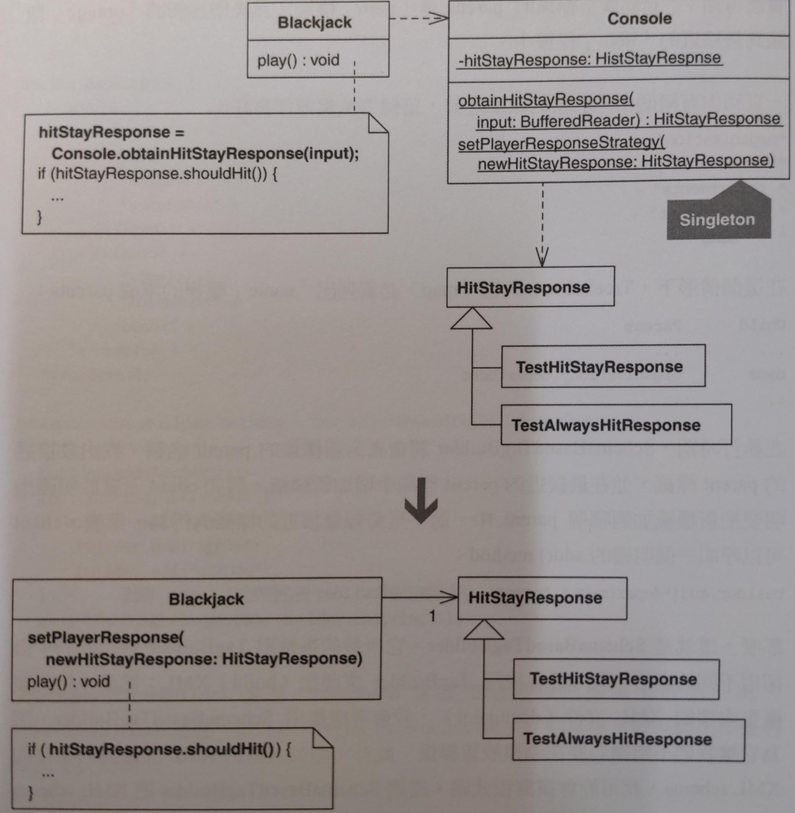

# Inline Singleton

程式碼需要存取物件，卻步需要一個用來存取該物件的全域點 (global point)。

把 Singleton 特徵移到「可儲存物件並提供該物件存取方法」的類別內，然後刪除 Singleton。



## 動機

**Singleton** 的目的是「保證某個類別只有一個物件實體，並提供一個可存取該物件實體的全域點」。

什麼時候不需要 **Singleton**？答：大部分時候。

如果「將一份物件資源以 reference 形式傳給其他需要它的眾多物件」比「讓那些物件以全域的方式存取該資源」更簡單時，**Singleton** 是非必要的。當你可以設計避免使用 **Singleton** 時，它就是非必要的。

::: tip 優點
- 讓物件間的合作更清晰明確
- 不需要特別程式碼來保護單一實體

:::

::: warning 缺點
- 當「穿越多層次來傳遞物件」十分棘手或困難時，設計會變得更複雜

:::


## 作法

這項重構機制等同於 *Inline Class*。在以下的步驟，absorbing class 是一個負責 inline Singleton 的類別。

1. 在你的 absorbing class 宣告一個 **Singleton** 的 public method 
    確保新的 method 可以表達/取代 (delegate back to) 原本的 Singleton，
    在 absorbing class 移除所有 static 的宣告
    - 但如果 absorbing class 本身就是個 **Singleton**，你需要保留 static。
2. 把所有 client code 參考 **Singleton** 的都改成去參考 absorbing class
3. 使用 *Move Method* 和 *Move Field* 把 **Singleton** 的功能全部移到 absorbing class
   - 如同第一步，如果你的 absorbing class 不是 **Singleton**，那就移除所有的 static。
4. 刪除 **Singleton**


## 範例

範例來自一個簡單的命令列版的 21 點。給玩家提示要 hit or stay，然後顯示玩家的手牌和莊家的手牌，最後看誰贏了。測試碼模擬玩家輸入 (hit or stay)。

玩家的輸入來自 `Console` 的 **Singleton**，存在 `HitStayResponse` 或是它的 subclasses。

```java
public class Console {
    static private HitStayResponse hitStayResponse = new HitStayResponse(); 
    private Console() { super(); } 
    public static HitStayResponse obtainHitStayResponse(BufferedReader input) { 
        hitStayResponse.readFrom(input); 
        return hitStayResponse; 
    } 
    public static void setPlayerResponse(HitStayResponse newHitStayResponse) { 
        hitStayResponse = newHitStayResponse; 
    } 
}
```

在遊戲開始的之前，一個特定的 `HitStayResponse` 會用 `Console` 註冊

```java
public class ScenarioTest extends TestCase... 
    public void testDealerStandsWhenPlayerBusts() { 
        Console.setPlayerResponse(new TestAlwaysHitResponse()); 
        int[] deck = { 10, 9, 7, 2, 6 }; 
        Blackjack blackjack = new Blackjack(deck); 
        blackjack.play(); 
        assertTrue("dealer wins", blackjack.didDealerWin()); 
        assertTrue("player loses", !blackjack.didPlayerWin()); 
        assertEquals("dealer total", 11, blackjack.getDealerTotal());
        assertEquals("player total", 23, blackjack.getPlayerTotal()); 
    }
```

`Blackjack` 呼叫 `Console` 來取得 `HitStayResponse` 的 instance

```java
public class Blackjack {
    // ...
    public void play() { 
        deal(); 
        writeln(player.getHandAsString()); 
        writeln(dealer.getHandAsStringWithFirstCardDown()); 
        HitStayResponse hitStayResponse; 
        do { 
            write("H)it or S)tay: "); 
            hitStayResponse = Console.obtainHitStayResponse(input);
            write(hitStayResponse.toString()); 
            if (hitStayResponse.shouldHit()) {
                dealCardTo(player); 
                writeln(player.getHandAsString()); 
            } 
        } while (canPlayerHit(hitStayResponse)); 
        // ... 
    }
}
```

問題: 這段 code 不在 application layer，從而難以傳遞 `HitStayResponse` instance 到需要他的層級。所有 `HitStayResponse` instance 的 code 都在 `Blackjack` 自身。為什麼 `Blackjack` 必須經由 `Console` 來取得 `HitStayResponse`？這沒必要！


1. 宣告 `Console` 的 public method 在 `Blackjack` 並刪除 static

    ```java
    public class Blackjack {
        public HitStayResponse obtainHitStayResponse(BufferedReader input) { 
            return Console.obtainHitStayResponse(input); 
        } 
        public void setPlayerResponse(HitStayResponse newHitStayResponse) { 
            Console.setPlayerResponse(newHitStayResponse); 
        }
    }
    ```
2. 把所有 callers to `Console` 變成 callers to `Blackjack`

    ```java{4,7}
    public class ScenarioTest extends TestCase {
        // ...
        public void testDealerStandsWhenPlayerBusts() { 
            // Console.setPlayerResponse(new TestAlwaysHitResponse()); 
            int[] deck = { 10, 9, 7, 2, 6 }; 
            Blackjack blackjack = new Blackjack(deck); 
            blackjack.setPlayerResponse(new TestAlwaysHitResponse()); 
            blackjack.play(); 
            assertTrue("dealer wins", blackjack.didDealerWin()); 
            assertTrue("player loses", !blackjack.didPlayerWin()); 
            assertEquals("dealer total", 11, blackjack.getDealerTotal()); 
            assertEquals("player total", 23, blackjack.getPlayerTotal()); 
        }
    }
    ```

    ```java{10}
    public class Blackjack {
        // ...
        public void play() { 
            deal(); 
            writeln(player.getHandAsString());
            writeln(dealer.getHandAsStringWithFirstCardDown()); 
            HitStayResponse hitStayResponse; 
            do { 
                write("H)it or S)tay: "); 
                hitStayResponse = obtainHitStayResponse(input);
                write(hitStayResponse.toString()); 
                if (hitStayResponse.shouldHit()) { 
                    dealCardTo(player); 
                    writeln(player.getHandAsString()); 
                } 
            } while (canPlayerHit(hitStayResponse)); 
            // ... 
        }
    }
    ```
3. 使用 *Move Method* 和 *Move Field* 把所有 `Console` 的功能搬到 `Blackjack`
4. 刪除 Console
