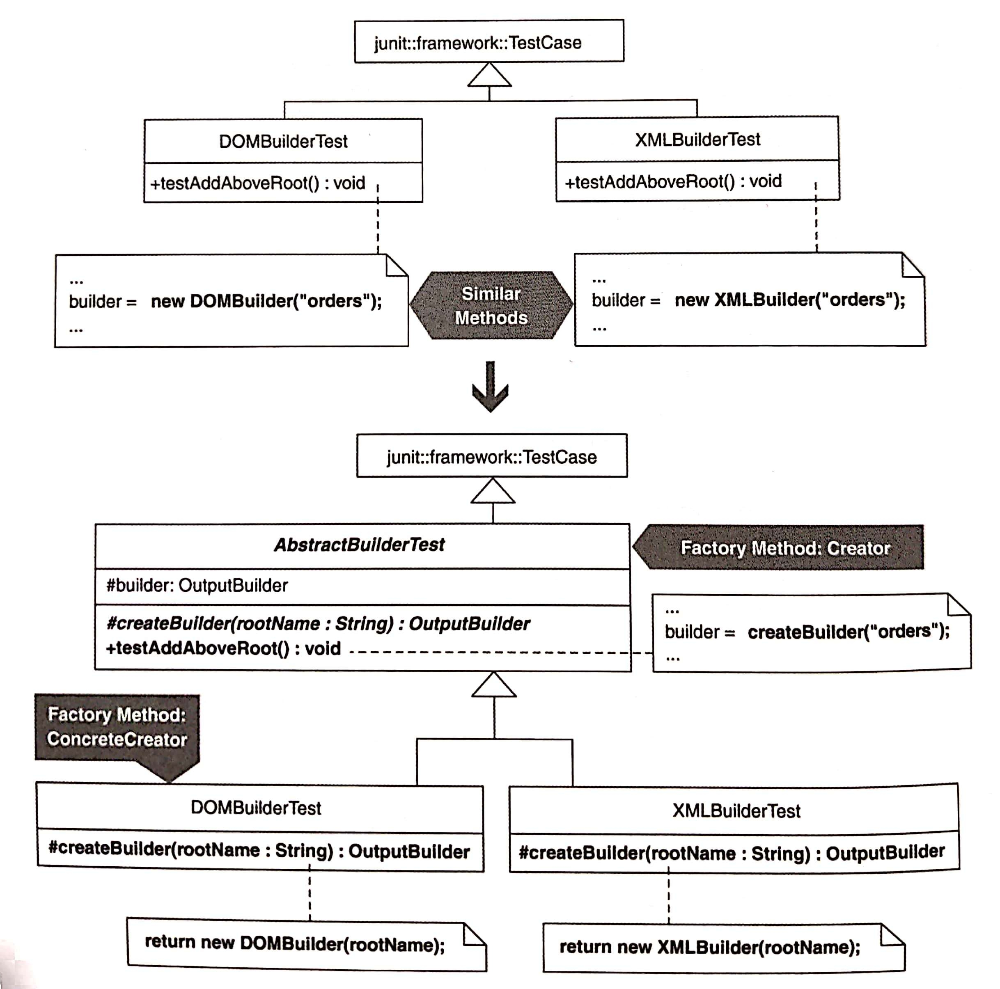
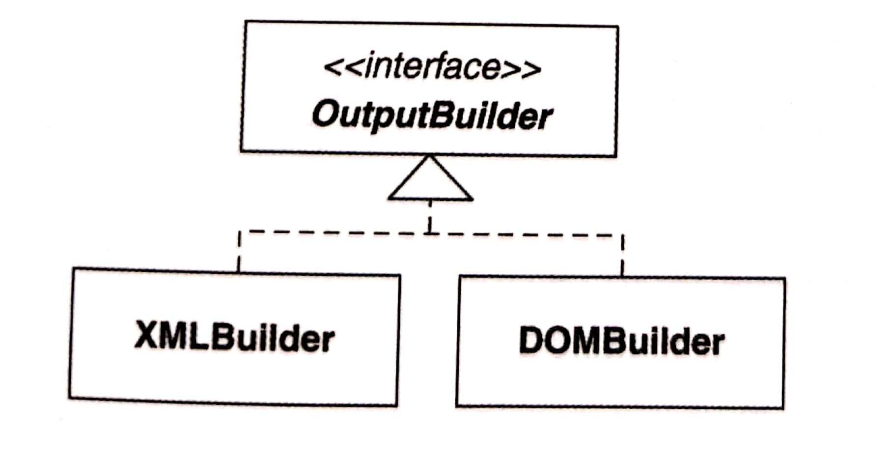

# Introduce Polymorphic Creation with Factory Method

以 Factory Method 導入多型創建（Polymorphic Creation）

為該函式製作單個 superclass 版本，稱為 Factory Method，專門處理物件的具現行為（instantiation）。




## 動機


:::tip 優點
- 減少 custom object creation step 所引發的重複
- 有效表達「創建行為發生於何處」以及「可以怎樣覆寫它」
- 強迫 class 必須實作「Factory Method 用到的型別」

:::

::: warning 缺點
- 可能會要求你傳遞非必要參數給某些 Factory Method 實作者

:::


## 作法

這個重構方法最常用於下列狀況：
1. 當 sibling subclasses 以類似手法（只有物件創建手段不同）實作某個函式時
    - 註：在繼承體系中，同一個 parent 底下眾旁系 classes，稱為 sibling subclasses
2. 當 superclass 和 subclass 以類似手法（只有物件創建手段不同）實作某個函式時

這裡提供的作法用來處理 sibling subclasses 的情況，並且可以輕易調整用於 superclass 和 subclass 的情況。

當某個函式在繼承體系中被近似實作出來，其中只有物件創建手段不同，此函式稱為 similar 函式。

作法：
1. 在一個持有 similar 函式的 subclass 中，修改那個函式，以便讓 custom object creation 發生在這些將會呼叫 instantiation method 的步驟。

    通常的作法是在 creation code 實施 *Extract Method*，或是重構 creation code，讓它呼叫一個事先被提煉出來的 instantiation method。

    請盡量為 instantiation method 取一個一般化的名稱（e.g. createBuilder, newProduct, ...），因為這些名稱需要用在 sibling subclass 的 similar 函式上。
    讓 instantiation method 返回型別為 similar 函式的 custom instantiation logic 的共通型別。
    - 編譯並測試
2. 對其他 sibling subclasses 的 similar 函式重複進行步驟 1。
    這會讓每個 sibling subclass 內建立一個 instantiation method，而且這個函式的 signature 在每個 sibling subclass 中都應該相同。
    - 編譯並測試
3. 修改 sibling subclasses 的 superclass。
    如果不能改或不想這樣做，可以用 *Extract Superclass* 產生一個 superclass（繼承自 sibling subclasses 的 superclass），讓 sibling subclass 繼承新的 superclass。

    Sibling subclasses 的 superclass 的參與者的名稱是 Factory Method: Creator。
    - 編譯並測試
4. 在 similar 函式身上實施 *Form Template Method*。
    這會連帶使用 *Pull Up Method*。
    當你實施這個重構的時候，一定要實踐下列忠告，他們來自 *Pull Up Method* 中的一段詮釋：
    
    > 如果你身處一個強型別語言，而你想要 pull up 的函式呼叫另一個函式，而且被呼叫函式位在兩個 subclasses 上而非 superclass 上，
    > 那就在 superclass 上宣告一個抽象函式。
    
    你在 superclass 宣告的抽象函式會成為你的 instantiation method。
    宣告了抽象函式，也就實現了一個 **Factory Method**。
    現在，每個 sibling subclass 都是一個 **Factory Method**: ConcreteCreator。
    - 編譯並測試
5. 如果 sibling subclass 還有其他 similar 函式，請重複步驟 1--4。
    這時候你會因為可以呼叫先前產生的 **Factory Method** 而受惠。
6. 如果多數 ConcreteCreator 的 **Factory Method** 含有相同的 instantiation code，請把程式碼搬到 superclass。
    作法是，先把 superclass 中的 **Factory Method** 宣告式改變成為一個 concrete 的 **Factory Method**，讓這個 concrete 函式執行預設（i.e. 大多數情況可接受）的 instantiation method。
    - 編譯並測試


## 範例

作者在某個專案中以 TDD 寫出一個 `XMLBuilder`，之後又寫一個 `DOMBuilder`，這個 class 的行為都類似 `XMLBuilder`，只不過他是透過 DOM 的方式在內部生產 XML 並讓客戶存取 DOM。

為了寫出 `DOMBuilder`，他複製貼上之前為 `XMLBuilder` 寫的測試，修改一個地方：讓他 instantiate `DOMBuilder` 而不是 `XMLBuilder`。

目標：



`XMLBuilderTest` 和 `DOMBuilderTest` 有很多相同的 tests，DOM 有自己另外的 tests。
如果不改的話，要在 XML 那邊修改的同時也要在 DOM 那邊修改。
因此要 refactor to Factory Method，以下是重構過程：
1. 第一個找到的 similar 函式是測試用的 `testAddAboveTest()`。
    將其 instantiation logic 提煉成為一個 instantiation method：
    ```java
    public class DOMBuilderTest extends TestCase...
        private OutputBuilder createBuilder(String rootName) {
            return new DOMBuilder(rootName);
        }

        public void testAddAboveRoot() {
            String invalidResult = 
                "<orders>" +
                "<order>" +
                "</order>" +
                "</orders>" +
                "<customer>" +
                "</customer>";
            builder = createBuilder("orders");    // !!
            builder.addBelow("order");
            try {
                builder.addAbove("customer");
                fail("expecting java.lang.RuntimeException");
            }
            catch (RuntimeException ignored) {}
        }
    ```
    注意：新寫的 `createBuilder()` 的返回型別是 `OutputBuilder`。
    使用這個型別是因為 sibling subclass `XMLBuilderTest` 需要定義他自己的 `createBuilder(...)`，而我希望 instantiation method 的 signature 在兩個 classes 內相同。
    - 編譯並測試
    
2. 現在，對所有 sibling subclasses（本例只有 `XMLBuilderTest`）進行步驟 1:
    ```java
    public class XMLBuilderTest extends TestCase...
        private OutputBuilder createBuilder(String rootName) {
            return new XMLBuilder(rootName);
        }
        public void testAddAboveRoot() {
            String invalidResult = 
                "<orders>" +
                "<order>" +
                "</order>" +
                "</orders>" +
                "<customer>" +
                "</customer>";
            builder = createBuilder("orders"); // !!
            builder.addBelow("order");
            try {
                builder.addAbove("customer");
                fail("expecting java.lang.RuntimeException");
            }
            catch (RuntimeException ignored) {} 
        }
    ```
    - 編譯並測試
3. 現在要修改測試碼的 superclass。
    但這個 superclass 是 `TestCase`，是 JUnit 框架的一部分，沒辦法改。
    所以使用 *Extract Superclass* 產生 `AbstractBuilderTest`，它成為我的 test classes 的新 superclass：
    ```java
    public class AbstractBuilderTest extends TestCase {
    }
    public class XMLBuilderTest extends AbstractBuilderTest ...
    public class DOMBuilderTest extends AbstractBuilderTest ...
    ```
4. 現在可以使出 *Form Template Method*。
    由於 similar 函式目前在 `XMLBuilderTest` 和 `DOMBuilderTest` 中相同，*Form Template Method* 的作法指示我在 `testAddAboveRoot()` 上面實施 *Pull Up Method*。
    這些作法首先引導我在 `builder` 上面運用 *Pull Up Field*：
    ```java
    public class AbstractBuilderTest extends TestCase {
        protected OutputBuilder builder;
    }

    public class XMLBuilderTest extends AbstractBuilderTest {
        private OutputBuilder builder;    // deleted
        ...
    }
        
    
    public class DOMBuilderTest extends AbstractBuilderTest {
        private OutputBuilder builder;    // deleted
        ...
    }
    ```
    
    繼續 `testAddAboveRoot()` 的 *Pull Up Method*，現在我發現，我必須為任何「被 `testAddAboveRoot()` 呼叫且位於 `XMLBuilderTest` 和 `DOMBuilderTest`」的函式，在 superclass 內宣告其抽象函式。
    `createBuilder(...)` 正是這樣的函式，因此我 pull up `testAddAboveRoot()` 到 `AbstractBuilderTest`：
    ```java
    public abstract class AbstractBuilderTest extends TestCase...
    public void testAddAboveRoot() {
        String invalidResult = 
            "<orders>" +
            "<order>" +
            "</order>" +
            "</orders>" +
            "<customer>" +
            "</customer>";
        builder = createBuilder("orders");
        builder.addBelow("order");
        try {
            builder.addAbove("customer");
            fail("expecting java.lang.RuntimeException");
        }
        catch (RuntimeException ignored) {}
    }
    ```
    - 編譯並測試
5. 對其他 similar 函式重複步驟 1--4
6. 現在考慮要不要在 `AbstractBuilderTest` 中為 `createBuilder(...)` 建立一個預設實作。
    只有當這有助於減少 `createBuilder(...)` 多個實作碼的重複碼才這麼做，但在這個例子沒有，所以就不用了。
