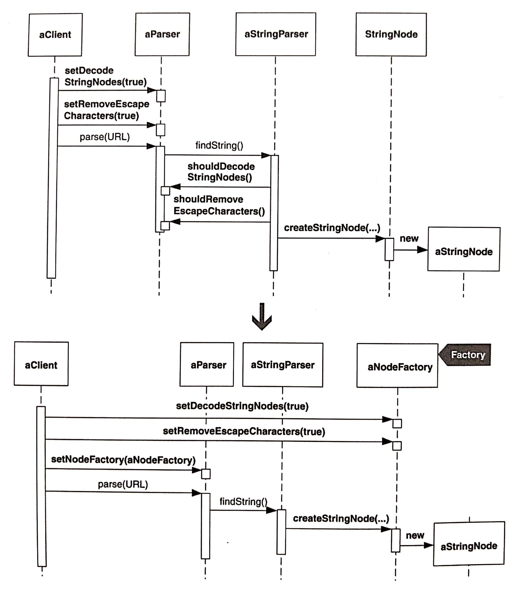
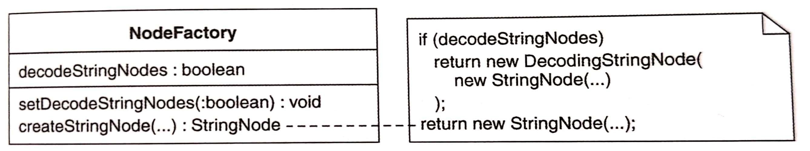
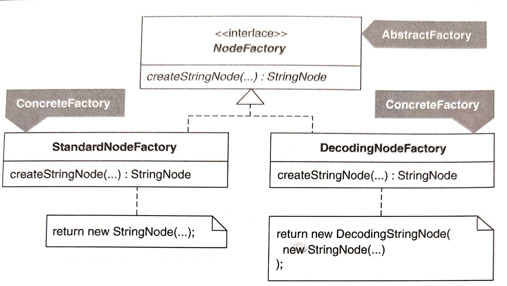
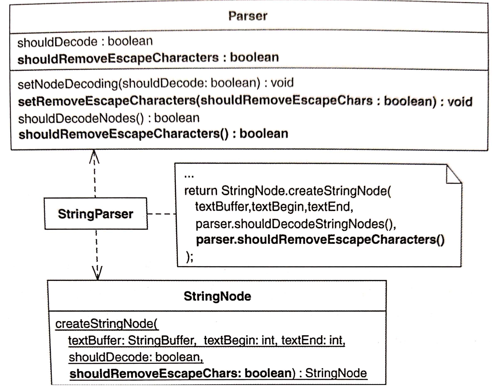

# Move Creation Knowledge to Factory

把創建知識（creation knowledge）搬到 **Factory**。



[[TOC]]

## 動機

如果物件的創建知識分散在多個 classes 內，便會出現 Creation Sprawl（創建碼蔓生）：<br >
不該在物件創建過程中扮演任何角色的 classes，其內出現創建職責（creational responsibility）。
- e.g. 客戶使用 configure 物件，但又無法存取 creation code
    - 解法：將 configure 物件傳入某個物件，再讓該物件傳入 creation code...但造成兩者相隔很遠。

**Factory**：以單一 class 封裝 creation 邏輯和 configure。



**Factory** 不必要用具體類別，也能用抽象類別。



:::tip 優點
- 可以整合 creation 邏輯和 configure
- 將客戶端和 creation 邏輯解耦

:::

::: warning 缺點
- 比直接創建更複雜一點

:::

## 作法

假設此 **Factory** 決定被實作成單一 class 而非 interface。

1. 所謂的 instantiator 是一個「與其他 classes 合作具現出某個 product」的 class。如果 instantiator 沒有使用 creation method 來具現 product，就修改它。若有需要也請修改 product class，讓具現過程透過 creation method 發生。
    - 編譯並測試
2. 產生一個即將成為 **Factory** 的 class。
    - 編譯
3. 使用 Move Method 把 creation method 移至 **Factory**。
    - 編譯
4. 令 instantiator 改而具現 **Factory**，然後呼叫 **Factory** 獲得一個 class 實體。
    - 編譯並測試 instantiator 是否運作正常
5. 把其他 classes 使用的都搬到 **Factory**，修改具現者和具現點

## 範例

HTML Parser



1. 第一步是應該讓 `StringParser` 以 creation method 創建 `StringNode` 物件，但 `StringParser` 已經這麼做了。
    ```java
    public class StringParser...
        public Node find(...) { 
            ...
            return StringNode.createStringNode( textBuffer, textBegin, textEnd, parser.shouldDecodeNodes( )); 
        }

    public class StringNode... 
        public static Node createStringNode( StringBuffer textBuffer, int textBegin, int textEnd, boolean shouldDecode) {
            if (shouldDecode) 
                return new DecodingStringNode( new StringNode(textBuffer, textBegin, textEnd) ); 
            
            return new StringNode(textBuffer, textBegin, textEnd); 
        }
    ```
2. 產生一個新的 Factory class
    ```java
    public class NodeFactory {
    }
    ```
3. Move
    ```java
    public class NodeFactory {
        public static Node createStringNode( StringBuffer textBuffer, int textBegin, int textEnd, boolean shouldDecode) {
            if (shouldDecode)
                return new DecodingStringNode( new StringNode(textBuffer, textBegin, textEnd));
            
            return new StringNode(textBuffer, textBegin, textEnd);
        }
    }
    
    public class StringNode... 
        // public static Node createStringNode
    ```
4. 修改 `StringParser` 讓他具現 `NodeFactory`，再由 `NodeFactory` 建立一個 `StringNode`
    ```java
    public class StringParser... 
        public Node find(...) { 
            ... 
            
            NodeFactory nodeFactory = new NodeFactory(); 
            return nodeFactory.createStringNode( textBuffer, textBegin, textEnd, parser.shouldDecodeNodes() ); 
        }
    ```
5. 將來自其他 classes 的創建碼移到 `NodeFactory`。這裡的 class 是 `Parser`，因為建立 `StringNode` 物件時，`StringParser` 會呼叫 `Parser` 來傳遞參數給 `NodeFactory`：
    ```java
    public class StringParser... 
    public Node find(...) { 
        ... 
        NodeFactory nodeFactory = new NodeFactory(); 
        return nodeFactory.createStringNode( textBuffer, textBegin, textEnd, parser.shouldDecodeNodes() ); 
    }
    ```

    因此，我們想把以下的 `Parser` 移到 `NodeFactory`：
    
    ```java
    public class Parser...
    private boolean shouldDecodeNodes = false; 
    public void setNodeDecoding(boolean shouldDecodeNodes) { 
        this.shouldDecodeNodes = shouldDecodeNodes; 
    } 
    public boolean shouldDecodeNodes() { 
        return shouldDecodeNodes; 
    }
    ```

    但是，我們不能只是把這些程式碼移過去，因為他們的客戶是 parser 的客戶，這些客戶呼叫 `Parser` 的各種函式來設定 parser，除此之外 `NodeFactory` 甚至不能直接被 parser 客戶端使用，因為 `NodeFactory` 是由 `StringParser` 具現出來的，他本身不能直接被 parser 的客戶使用。為此，我們執行以下步驟：
    1. 在「我希望它們最終與 `NodeFactory` 合併」的那些 `Parser` 程式碼使用 *Extract Class* [F] 來創造出 `StringNodeParsingOption`：
        ```java
        public class StringNodeParsingOption { 
            private boolean decodeStringNodes; 
            public boolean shouldDecodeStringNodes() { 
                return decodeStringNodes; 
            } 
            public void setDecodeStringNodes(boolean decodeStringNodes) { 
                this.decodeStringNodes = decodeStringNodes; 
            } 
        }
        ```

        這個新的 class 取代原本的 getter/setter：

        ```java
        public class Parser.... 
            private StringNodeParsingOption stringNodeParsingOption = new StringNodeParsingOption(); 
            
            // private boolean shouldDecodeNodes = false;
            // public void setNodeDecoding(boolean shouldDecodeNodes) { 
            //     this.shouldDecodeNodes = shouldDecodeNodes; 
            // } 
            // public boolean shouldDecodeNodes() { 
            //     return shouldDecodeNodes; 
            // } 
            public StringNodeParsingOption getStringNodeParsingOption() { 
                return stringNodeParsingOption; 
            } 
            public void setStringNodeParsingOption(StringNodeParsingOption option) { 
                stringNodeParsingOption = option; 
            }
        ```

        現在，讓 `Parser` 客戶端具現並組態 `StringNodeParsingOption` 實體，再把那個實體傳入 parser，用來開啟 `StringNode` 的 decoding 功能：
        ```java
        class DecodingNodeTest... 
            public void testDecodeAmpersand() { 
                ... 
                StringNodeParsingOption decodeNodes = new StringNodeParsingOption(); 
                decodeNodes.setDecodeStringNodes(true);
                parser.setStringNodeParsingOption(decodeNodes); 
                parser.setNodeDecoding(true); 
                ... 
            }
        ```

        同時 `StringParser` 也改用上面新的 class 取得 `StringNode` 的 decoding option 狀態：
        ```java
        public class StringParser... 
            ... 
            public Node find(...) { 
                NodeFactory nodeFactory = new NodeFactory(); 
                return nodeFactory.createStringNode( textBuffer, textBegin, textEnd, parser. getStringNodeParsingOption().shouldDecodeStringNodes() ); 
            }
        ```
    2. 使用 inline 合併 `NodeFactory` 和 `StringNodeParsingOption`：
        ```java
        public class StringParser... 
            public Node find(...) {
                ... 
                return parser.getStringNodeParsingOption().createStringNode( textBuffer, textBegin, textEnd
                // , parser.getStringNodeParsingOption().shouldDecodeStringNodes() 
                ); 
            }
        
        public class StringNodeParsingOption... 
            private boolean decodeStringNodes; 
            public Node createStringNode( StringBuffer textBuffer, int textBegin, int textEnd , 
            // boolean shouldDecode 
            ) { 
                if (decodeStringNodes) 
                    return new DecodingStringNode( new StringNode(textBuffer, textBegin, textEnd)); 
                
                return new StringNode(textBuffer, textBegin, textEnd); 
            }
        ```
    3. 最後一步是 rename：
        ```java
        // public class StringNodeParsingOption...
        public class NodeFactory ...

        public class Parser... 
            private NodeFactory nodeFactory = new NodeFactory(); 
            public NodeFactory getNodeFactory() { 
                return nodeFactory; 
            } 
            public void setNodeFactory(NodeFactory nodeFactory) { 
                this.nodeFactory = nodeFactory; 
            }
        ```
