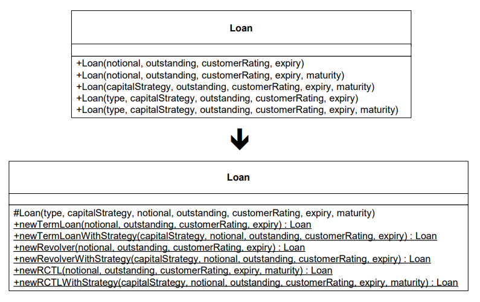
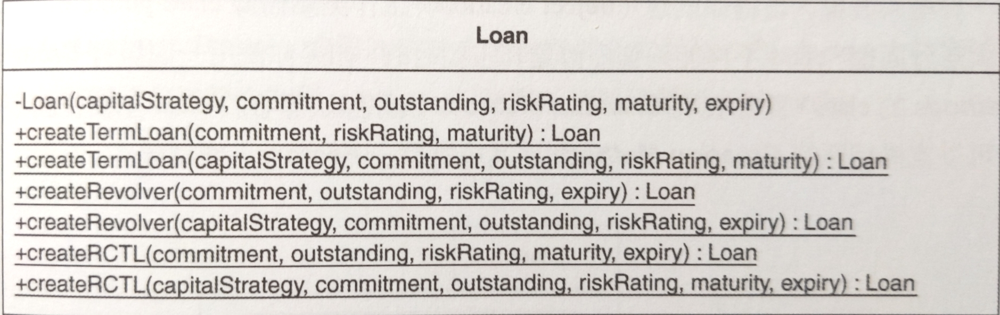
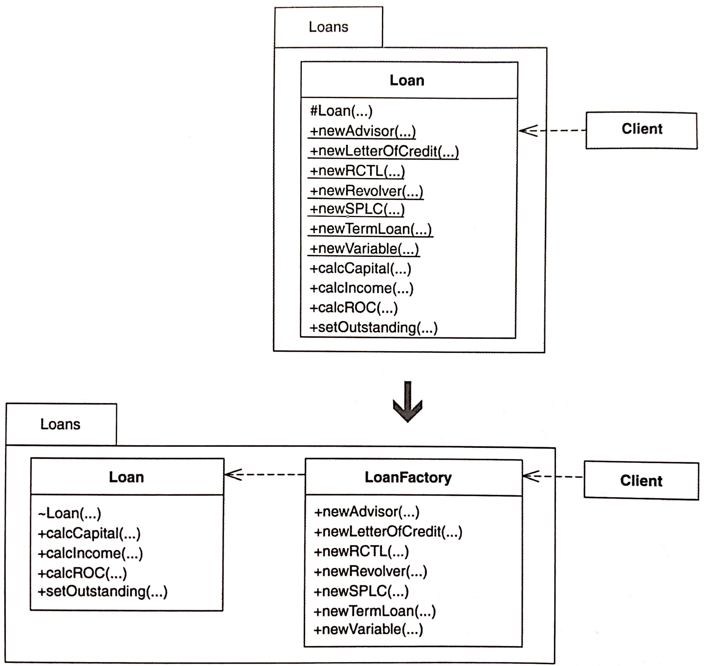

# Replace Constructors with Creation Methods

以「目的清楚、返回物件實體」的 **Creation Method** 取代建構式。



[[TOC]]

## 動機

建構式的問題：

- 客戶必須研究建構式的參數，在 source code 中摸索
- 建構式無法傳達目的
- 如果 class 已經存在相同簽名（signature）的建構式，則無法新增新的建構式
- 不再用到的建構式還苟延殘喘

**Creation Method** vs. **Factory Method**

**Creation Method**: 用來創建 class 物件實體的 static/nonstatic 函式。
意味著每個 **Factory Method** 都是 **Creation Method**，反之不必然成立。


::: tip 優點
- 比 constructors 更能有效表達可獲得哪一種物件實體。
- 突破 constructors 的限制。
- 更容易找出未使用的 creation code。

:::

::: warning 缺點
- 如果你的 classes 有些使用 new 有些使用 **Creation Method**，客戶必須學習如何使用不同的 classes 來創建。

:::


## 作法

在重構之前，先找出 catch-all 的建構式：一個功能完整的建構式，其他建構式會把工作委託給它。
如果沒有 catch-all，可以實施 *Chain Constructor* 做出一個。

1. 找出一個「為了創建某種性質的實體而呼叫 class 的建構式（假設是 `Ctor1`）」的客戶碼。對這個建構式實施 *Extract Method* [F]，建立起一個 public static 函式。這個新函式是個 *Creation Method*。
    再實施 *Move Method* [F] 將 **Creation Method** 移至內涵建構式 `Ctor1` 的那個 class 中。
    - 編譯並測試。
2. 找出建構式 `Ctor1`（其所創建的實體與 **Creation Method** 創建的實體是同一種）所有呼叫者，讓它們改而呼叫 **Creation Method**。
    - 編譯並測試。
3. 如果上述建構式 `Ctor1` 呼叫另一個建構式 `Ctor2`，就讓 **Creation Method** 轉而呼叫 `Ctor2`。
    透過「將建構式 inline 化」進行這個步驟。（類似 *Inline Method* [F]）
    - 編譯並測試
4. 對任何想要轉換成 **Creation Method** 的建構式，重複步驟 1--3。
5. 如果這些 class 建構式沒有 class 之外的呼叫者，把它們設為 non-public。
    - 編譯


## 範例

``` java
public class Loan {
    private static String TERM_LOAN = “TL”;
    private static String REVOLVER = “RC”;
    private static String RCTL = “RCTL”;
    private String type;
    private CapitalStrategy strategy;
    private float notional;
    private float outstanding;
    private int customerRating;
    private Date maturity;
    private Date expiry;
    public Loan(float notional, float outstanding, int customerRating, Date expiry) {
        this(TERM_LOAN, new TermROC(), notional, outstanding,
        customerRating, expiry, null);
    }
    public Loan(float notional, float outstanding, int customerRating, Date expiry,
Date maturity) {
        this(RCTL, new RevolvingTermROC(), notional, outstanding, customerRating,
        expiry, maturity);
    }
    public Loan(CapitalStrategy strategy, float notional, float outstanding, 
    int customerRating, Date expiry, Date maturity) {
        this(RCTL, strategy, notional, outstanding, customerRating,
        expiry, maturity);
    }
    public Loan(String type, CapitalStrategy strategy, float notional,
    float outstanding, int customerRating, Date expiry) {
        this(type, strategy, notional, outstanding, customerRating, expiry, null);
    }
    public Loan(String type, CapitalStrategy strategy, float notional,
    float outstanding, int customerRating, Date expiry, Date maturity) {
        this.type = type;
        this.strategy = strategy;
        this.notional = notional;
        this.outstanding = outstanding;
        this.customerRating = customerRating;
        this.expiry = expiry;
        if (RCTL.equals(type))
        this.maturity = maturity;
    }
}
```

`Loan` class 有七種貸款方式，這邊只討論其中三種：
- loan
- revolver
- RCTL

為何不把 `Loan` 當作 superclass，其他種類當作 subclass？
- 區別不同種類的貸款不是取決於欄位，而是根據數值。
    不想為了支援定期貸款的三種不同計算方式產生三種 class。
    較簡單的做法是支援一個 `Loan` class 並針對定期貸款有三種不同 Strategy class。（見 *Replace Conditional Logic with Strategy* (129) ）
- 使用 `Loan` 實體的應用程式有「轉換貸款種類」的需求。
    為了轉換工作容易些，我們希望只改變 `Loan` 實體的少量欄位，而不是將某個 `Loan` subclass 完全改成另一個。
    
    
## 開始重構

1. 找出客戶碼，在這裡是測試程式。
    ``` java
    public class CapitalCalculationTests... 
        public void testTermLoanNoPayments() { 
            ... 
            Loan termLoan = new Loan(commitment, riskRating, maturity); 
            ... 
        }
    ```

    使用 *Extract Method* [F] 成 `createTermLoan()`

    ``` java
            Loan termLoan = createTermLoan(commitment, riskRating, maturity) ;
    ```

    ``` java
    public static Loan createTermLoan(double commitment, int riskRating, Date maturity) {
        return new Loan(commitment, riskRating, maturity);
    }
    ```

    接下來在 creation method `createTermLoan()` 實施 *Move Method* 到 `Loan` 內：

    ``` java
    public class Loan... 
        public static Loan createTermLoan(double commitment, int riskRating, Date maturity) {
            return new Loan(commitment, riskRating, maturity);
        }
    
    public class CapitalCalculationTest...
        public void testTermLoanNoPayments() {
            ... 
            Loan termLoan = Loan.createTermLoan(commitment, riskRating, maturity); 
            ...
        }
    ```
    - 編譯並測試，確保正常。
2. 找出 `createTermLoan()` 呼叫的那個建構式所有的呼叫者，把它們改成 `createTermLoan()`。
3. `createTermLoan()` 是上述建構式的唯一呼叫者。
    由於這個建構式被連結到其他建構式，我們使用 *Inline Method* [F]（在這裡應該稱為 inline constructor）把連結解除。
    ```java
    public Loan(double commitment, int riskRating, Date maturity) {
            this(commitment, 0.00, riskRating, maturity, null);
        }
    ```
    ```java
    public class Loan...
        ... // 移除 public Loan(double commitment, int riskRating, Date maturity)
        public static Loan createTermLoan(double commitment, int riskRating, Date maturity) {
            return new Loan(commitment, 0.00, riskRating, maturity, null);
        }
    ```
    - 編譯並測試
4. 重複 1--3。例如以下
    ```java
    public class CapitalCalculationTest... 
        public void testTermLoanWithRiskAdjustedCapitalStrategy() {
            ...
            Loan termLoan = new Loan(riskAdjustedCapitalStrategy, commitment, outstanding, riskRating, maturity, null); 
            ...
        }
    ```
    傳 `null` 是不好的習慣，其降低可讀性，所以讓它們改用 creation method。
    ```java
    public class CapitalCalculationTest...
        public void testTermLoanWithRiskAdjustedCapitalStrategy() {
            ...
            Loan termLoan = Loan.createTermLoan (riskAdjustedCapitalStrategy, commitment, outstanding, riskRating, maturity);
            ...
        } 
        
    public class Loan...
        public static Loan createTermLoan(double commitment, int riskRating, Date maturity) {
            return new Loan(commitment, 0.00, riskRating, maturity, null);
        }
        public static Loan createTermLoan(CapitalStrategy riskAdjustedCapitalStrategy, 
    double commitment, double outstanding, int riskRating, Date maturity) {
            return new Loan(riskAdjustedCapitalStrategy, commitment, outstanding, riskRating, maturity, null);
        }
    ```
    為什麼選擇 overload `createTermLoan()` 而不再寫一個 create method 例如 `createTermLoanWithStrategy()`？
    因為 `CapitalStrategy` 參數的存在已經可以充分表達這兩個 `createTermLoan()` 的版本不同。
    ...（略）
    
5. 改變 `Loan` 可視性（visibility），改成 private，因為它已經沒有外部呼叫者了。
    ```java
    public class Loan... 
        private Loan(CapitalStrategy capitalStrategy, double commitment, double outstanding, int riskRating, Date maturity, Date expiry)
            ...
    ```


## 變種 Variations

### 參數化的 **Creation Method**

可能使用 *Replace Constructors with Creation Methods* 會產生數十種 **Creation Method** 來負責 class 每一種物件設定。為此可能決定不使用這項重構。
- 將最常見的設定撰寫 **Creation Method** 並在周圍留下 public constructor 以便處理其他狀況。
- 運用參數的變化來降低 **Creation Method** 的數量。


### Extract Factory

當一個 class 太多 **Creation Method** 會混淆 class 的主要任務，可以重構 **Creation Method** 成為單一 **Factory**



注意，這裡的 **Factory** 不是 **Abstract Factory** [DP]。**Abstract Factory** 可以在執行期被替換，**Factory** 比較沒那麼複雜，且通常實作成單一 class，不會使用繼承。
