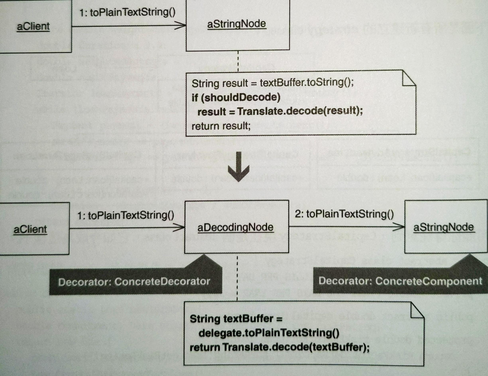
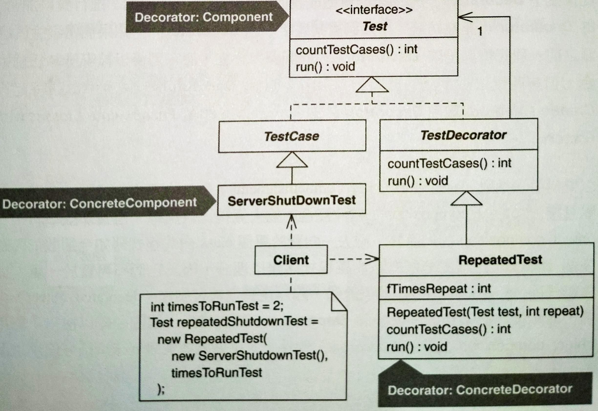
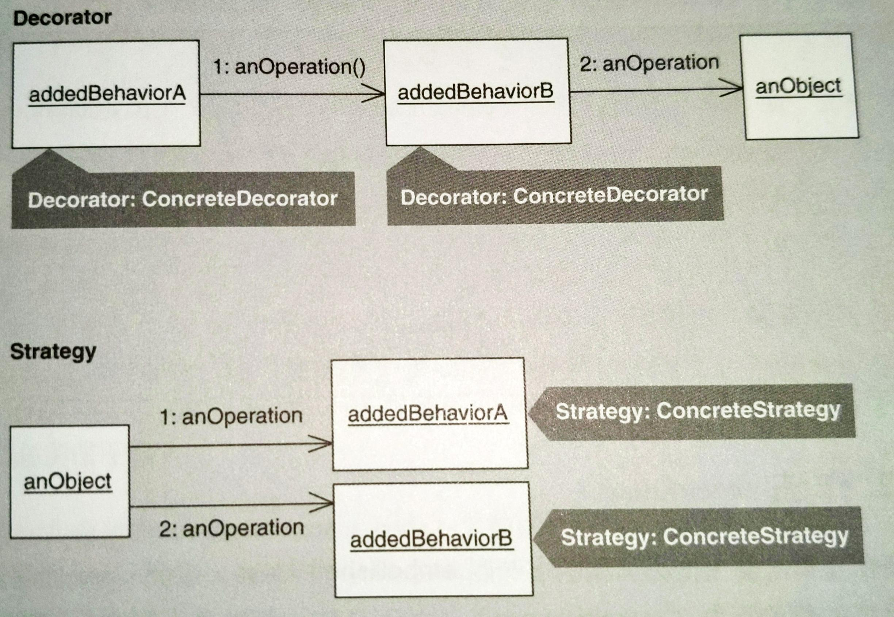
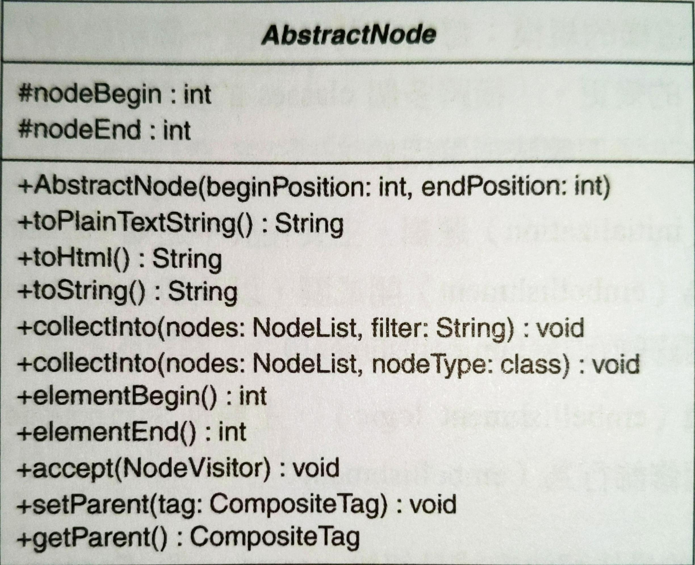
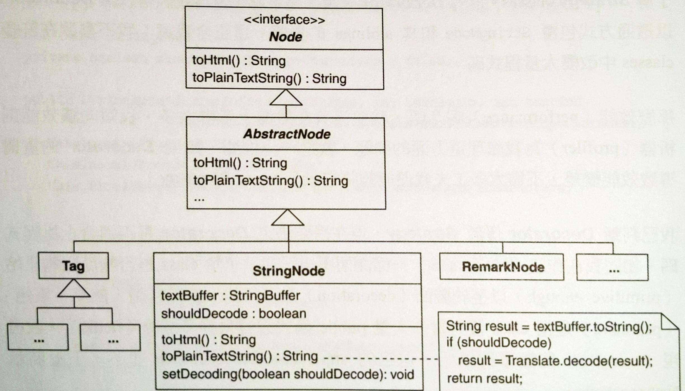
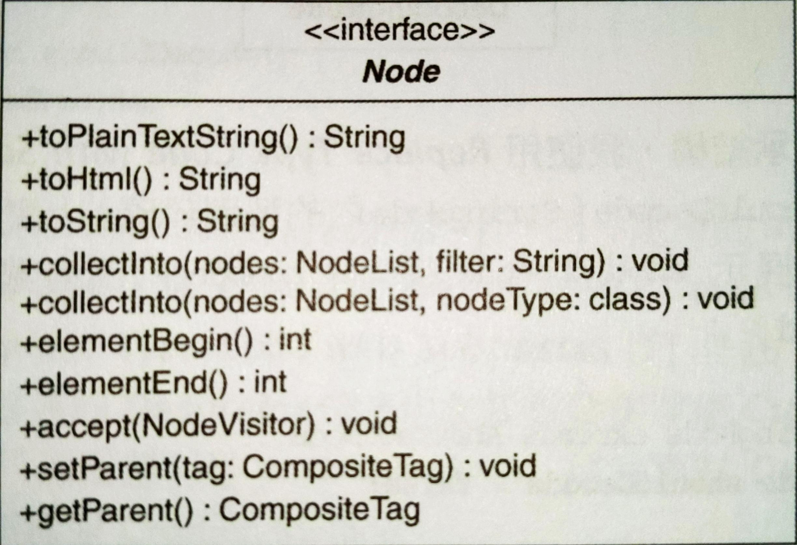
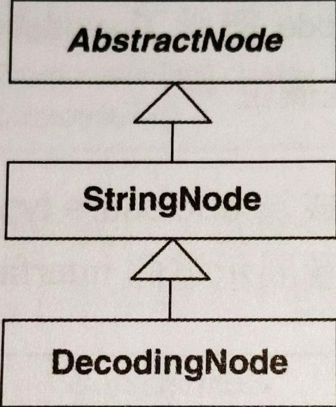
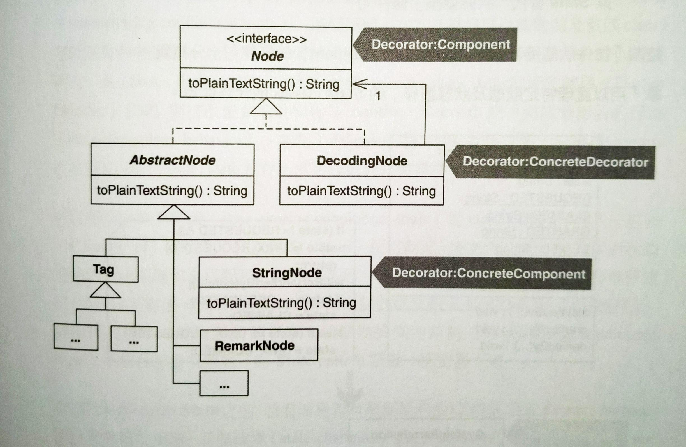

# Move Embellishment to Decorator

將修飾碼移動到 **Decorator**



## 動機

當系統需要新功能時，常見作法是為舊有的類別增加新的程式碼，這樣的程式碼經常用來修飾核心任務或是舊有類別的主要行為。這樣的修飾引入新的欄位、函式、新的邏輯使原本的類別（host classes）變得複雜。

**Decorator** pattern 提供很好的補救方法：令每個修飾碼成為一個新的類別，讓這個類別包覆（wrap）它所要修飾的物件型別。當客戶需要特殊行為時，就可以在執行期以這個修飾類別包覆它的目標物件。

JUnit 測試框架提供個好範例。JUnit 每個測試都是一個 `TestCase` 物件，有個簡單方法可以讓 JUnit 框架執行所有 `TestCase` 物件。但如果想要執行某個測試一次以上，你必須以 `RepeatedTest` **Decorator** 來修飾 `TestCase` 物件，如下圖：



如果想從「擁有多個 public 函式」的類別中移出修飾碼，你不能 refactor to **Decorator**。因為 **Decorator** 必須是《Design Patterns》所稱的「透明圍欄」（transparent enclosure）：它必須實作出它所修飾的類別的所有 public 函式（那就需要為「擁有多個 public 函式」的類別撰寫許多無用的程式碼）。當透明圍欄包覆物件時，對被包覆物來說是透明的，被修飾物並不知道他已經被修飾。

使用這個 pattern 的另一個考量是多重 **Decorators**。如果你為每個物件撰寫一個以上的 concrete **Decorators**，客戶就可以使用多個 **Decorators** 來修飾物件實體。有時候 **Decorators** 順序很重要，理想情況是讓它保持彼此間獨立，可以被任意排列。但有時候做不到，這時可以考慮封裝 **Decorators**，讓客戶透過特定的 **Creation Methods** 取用 **Decorators** 的安全組合（See [Encapsulate Classes with Factory](../ch6/encapsulate-classes-with-factory.md)）。

以重構手法抽離類別內的修飾碼（embellishments）會讓一個願意接受 object composition 的人覺得比較簡單。但對不願意接受的人，過去一向放在單一類別內的程式碼如今散佈在多個類別，這樣有可能讓程式碼難以理解。而且，程式碼位於不同物件也比較難除錯，除錯模組必須穿越一個或多個 **Decorators** 才能到達被修飾物。如果團隊難以接受使用 object composition 來修飾物件，這個團隊便是還沒準備好使用這個 pattern。

有時候修飾碼用來提供物件保護邏輯。這時候可以把修飾碼移到 Protection **Proxy**（See [Encapsulating Inner Classes](../ch6/encapsulate-classes-with-factory.md#變異-封裝-inner-classes)）。Protection **Proxy** 和 **Decorator** 結構一樣，不同的是目的。Protection **Proxy** 目的是保護物件，**Decorator** 目的是增加物件行為。

作者喜歡 **Decorator** pattern，但是發現並不常 refactor to **Decorator**，更常 refactor towards **Decorator**。不論多麼喜歡一個 pattern，請在確實需要用到時使用。

::: tip Decorator vs. Strategy

[Move Embellishment to Decorator](move-embellishment-to-decorator.md) 和 [Replace Conditional Logic with Strategy](../ch7/replace-conditional-logic-with-strategy.md) 是彼此互斥的重構手法。它們都可以消除與「特殊情況」或「非此即彼（alternative）的行為」相應的條件邏輯，作法是把那樣的行為從既有的類別中移到新類別內。但這兩個 patterns 中，新類別的用法並不同。**Decorator** 實體本身會包覆物件，而 **Strategy** 實體則是被用於某物件內，如下圖：



該在什麼時候 refactor to **Decorator** 或 **Strategy** 才合理？下決定之前要考慮許多問題：
- 你無法分享 **Decorator** 實體 -- 每個實體包覆一個物件。但你卻可以輕鬆利用 **Singleton** 或 **Flyweight** patterns 來分享 **Strategy** 實體。
- **Strategy** 可擁有它所要的任何 interface，**Decorator** 則必須符合它所修飾的類別的 interface。
- **Decorators** 能夠透明的對多個不同類別增加行為，只要類別和 **Decorators** 共用相同 interface。但是想使用 **Strategy** 物件的類別卻必須知道它們的存在，以及知道如何使用它們。
- 在「持有許多資料或實作許多 public 函式」的類別身上使用一個或多個 **Strategies** 是常見的實務作法。但如果 **Decorator** 類別運用許多資料和 public 函式來修飾類別，**Decorators** 會變得太笨重，而且需要過多記憶體。

:::

::: tip 優點
- 透過「從類別中移除修飾碼」的方式來簡化類別。
- 有效區別類別的「修飾碼」和「核心任務」。
- 有助於移除重複於幾個相關類別之間的修飾邏輯。

:::

::: warning 缺點
- 會變更被修飾物件的物件身份（object identity）。
- 程式碼會變得更難理解和除錯。
- 當 **Decorators** 之間的組合產生不良的互相影響時，設計會變得更複雜。

:::


## 作法

重構前先識別 embellished class，這個 class 內有對核心任務進行修飾行為。並不是每個內含「對核心任務進行修飾」的類別都是良好的被修飾候選。首先要確認 **Decorator** 需要實作的 public 函式不會太多。因為 **Decorator** 在修飾物周圍形成一個透明圍欄（transparent enclosure），客戶碼應該能夠像正常呼叫「原始物件身上的 public 函式」那樣呼叫修飾後的物件。如果 embellished class 宣告並繼承許多 public 函式，可以考慮減少數量，或是使用不同的重構方法，例如：[Replace Conditional Logic with Strategy](../ch7/replace-conditional-logic-with-strategy.md)。

1. 找出或建立 enclosure type，這是個 interface 或 class，宣告出 embellished class 的客戶所需的全部 public 函式。這個型別也是《Design Patterns》的 Decorator:Component。

    如果你有了一個 enclosure type，它可能是「由 embellished class 實作的 interface」或「embellished class 的 superclass」。有狀態的類別並不是好的 enclosure types，因為 **Decorators** 會繼承但不用。如果你沒有合適的 enclosure type，可以用 [Unify Interfaces](../ch11/unify-interfaces.md) 或 *Extract Interface* 建立一個。
2. 找出「在你的 embellished class 中加入修飾動作」的那個條件邏輯，實施 *Replace Conditional with Polymorphism* 移除。如果在修飾碼前後有「必須執行的邏輯」，可能需要先使用 [Form Template Method](../ch8/form-template-method.md)。
3. 步驟 2. 產出一個或多個 subclasses，實施 *Replace Inheritance with Delegation* 改造成 delegating classes。一定要遵守以下：
    - 讓每個 delegating classes 實作 enclosure type。
    - 讓 delegating classes 的 `delegate` 欄位（受託者）型別是 enclosure type。
    - 決定修飾碼該在 delegating classes 呼叫 `delegate` 欄位之前或之後執行。

    如果在步驟 2. 實施 *Form Template Method*，你的 delegating classes 可能需要呼叫「被你的 **Template Method** 引用的 delegate」（亦即 embellished class）的 non-public 函式。如果真是如此，把這些函式的可視度改成 public 並實施 [Unify Interfaces](../ch11/unify-interfaces.md)。

    如果你的 delegating classes 委託的那個「位於 embellished class 內」的函式回傳的是個 undecorated 的物件實體，請確定你的 delegating classes 把該實體傳給客戶之前先修飾它。
4. 每個 delegating classes 現在賦值其 delegate 欄位，使其指向 embellished class 的一份新的實體。讓 delegating classes 建構式完成這個賦值邏輯，然後實施 [Extract Parameter](../ch11/extract-parameter.md) 將「具現 embellished class」的賦值句抽取成一個參數。可能的話重複實施 *Remove Parameter* 移除任何不必要的建構式參數。

## 範例

範例來自 [HTML Parser](https://sourceforge.net/projects/htmlparser/)。HTML Parser 可以把 HTML 內容視為具體物件，遇上 tag 資料會轉譯成適當的 HTML 物件，如 `Tag`, `EndTag` 等等。

典型的 character reference decodings 包括：
- `&amp;` -> `&`
- `&divide;` -> `÷`
- `&lt;` -> `<`
- `&gt;` -> `>`

parser 的 `Translate` class 有一個 `decode(String dataToDecode)` 函式，能夠解譯廣泛的「數字和文字的 entity references」。上述解譯動作是個修飾行為，常用在 `StringNode` 實體被 parser 發現之後。例如：剖析一小段 HTML 然後迭代遍歷一群 `Node` 實體，解譯 `StringNode` 實體的那些節點：

```java{18}
public void testDecodingAmpersand() throws Exception { 
    String ENCODED_WORKSHOP_TITLE = "The Testing &amp; Refactoring Workshop"; 
    String DECODED_WORKSHOP_TITLE = "The Testing & Refactoring Workshop"; 
    assertEquals( "ampersand in string", DECODED_WORKSHOP_TITLE, parseToObtainDecodedResult(ENCODED_WORKSHOP_TITL E));
     
} 

private String parseToObtainDecodedResult(String stringToDecode) throws ParserException { 
    StringBuffer decodedContent = new StringBuffer(); 
    createParser(stringToDecode); 
    NodeIterator nodes = parser.elements(); 
    
    while (nodes.hasMoreNodes()) { 
        Node node = nodes.nextNode(); 
        if (node instanceof StringNode) { 
            StringNode stringNode = (StringNode) node; 
            decodedContent.append( 
                Translate.decode(stringNode.toPlainTextString())    // decoding step
            );
    
            if (node instanceof Tag) 
                decodedContent.append(node.toHtml()); 
        } 
    
    return decodedContent.toString(); 
}
```

解譯 `StringNode` 實體內的「文字和數字的 references」是客戶端有時候需要的功能，但客戶總是親自解譯，用相同的順序：
1. 迭代遍歷節點
2. 找出 `StringNode`
3. 解譯它們
其實應該在 parser 中建立這個解譯行為，把工作集中起來，而非強迫客戶重複相同的解譯步驟。

作者想了幾個方法，選了其中簡單的一個：直接在 `StringNode` 中增加解譯修飾行為，然後觀察程式後續發展。工作包括：
- 更新測試碼
- 改變 `Parser` class
- 改變 `StringParser` class (它用來具現 `StringNode`)
- 改變 `StringNode`

以下展示如何更新前述的測試碼：

```java{6}
public void testDecodingAmpersand() throws Exception { 
    String ENCODED_WORKSHOP_TITLE = "The Testing &amp; Refactoring Workshop"; 
    String DECODED_WORKSHOP_TITLE = "The Testing & Refactoring Workshop"; 
    StringBuffer decodedContent = new StringBuffer(); 
    Parser parser = Parser.createParser(ENCODED_WORKSHOP_TITLE); 
    parser.setNodeDecoding(true); // tell parser to decode StringNodes

    NodeIterator nodes = parser.elements(); 
    
    while (nodes.hasMoreNodes()) 
        decodedContent.append(nodes.nextNode().toPlainTextString()); 
        
    assertEquals("decoded content", DECODED_WORKSHOP_TITLE, decodedContent.toString() ); 
}
```

第一步是先擴展 `Parser` class，讓它擁有一個 flag 管理 `StringNode` 的解譯開關：

```java{3-7}
public class Parser {
    // ...
    private boolean shouldDecodeNodes = false; 
    
    public void setNodeDecoding(boolean shouldDecodeNodes) { 
        this.shouldDecodeNodes = shouldDecodeNodes;
    }
}
```

接下來 `StringParser` class 需要改變。它含有一個 `find(...)`，這個函式在剖析過程中定位、具現及回傳 `StringNode` 實體，如下：

```java
public class StringParser {
    // ...
    public Node find(NodeReader reader, String input, int position, boolean balance_quotes) { 
        // ... 
        return new StringNode(textBuffer, textBegin, textEnd); 
    }
}
```

作者變更程式碼來支援新的解譯選項：

```java{6}
public class StringParser {
    // ...
    public Node find(NodeReader reader, String input, int position, boolean balance_quotes) { 
        // ... 
        return new StringNode(textBuffer, textBegin, textEnd, 
        reader.getParser().shouldDecodeNodes());
    }
}
```

把 `shouldDecodeNodes()` 加入 `Parser` class 並建立一個新的 `StringNode` 建構式，讓它帶有一個 bool 參數：

```java{3-5,10-15}
public class Parser {
    // ...
    public boolean shouldDecodeNodes() { 
        return shouldDecodeNodes; 
    }  
}

public class StringNode extends Node {
    // ...
    private boolean shouldDecode = false; 
    
    public StringNode(StringBuffer textBuffer, int textBegin, int textEnd, boolean shouldDecode) { 
        this(textBuffer, textBegin, textEnd); 
        this.shouldDecode = shouldDecode; 
    }
}
```

最後，在 `StringNode` 撰寫解譯邏輯：

```java{6-7}
public class StringNode {
    // ...
    public String toPlainTextString() { 
        String result = textBuffer.toString(); 

        if (shouldDecode) 
            result = Translate.decode(result); 
            
        return result; 
    }
}
```

順利通過測試。觀察一下發現新增的解譯修飾行為沒有太過分膨脹程式碼。但是，一旦支援某個修飾行為，很容易找到其他值得支援的修飾行為。例如從 `StringNode` 移除跳脫字元（escape character），因此作者給 parser 一個修飾行為來移除跳脫字元。為此，要給 `Parser` class 增加一個 flag，還要修改 `StringParser` 讓它呼叫一個同時能處理解譯選項和跳脫字元移除選項的 `StringNode` 建構式，並在 `StringNode` 增加程式碼如下：

```java{3-9,17-18}
public class StringNode {
    // ...
    private boolean shouldRemoveEscapeCharacters = false; 
    
    public StringNode(StringBuffer textBuffer, int textBegin, int textEnd, boolean shouldDecode, boolean shouldRemoveEscapeCharacters) { 
        this(textBuffer, textBegin, textEnd); 
        this.shouldDecode = shouldDecode; 
        this.shouldRemoveEscapeCharacters = shouldRemoveEscapeCharacters; 
    } 
    
    public String toPlainTextString() { 
        String result = textBuffer.toString(); 
        
        if (shouldDecode) 
            result = Translate.decode(result); 
            
        if (shouldRemoveEscapeCharacters)
            result = ParserUtils.removeEscapeCharacters(result); 
            
        return result; 
    }
}
```

這兩個修飾行為簡化了 parser 的客戶碼。但是每次為了支援一個新的修飾行為就被迫橫跨多個 parser classes 的變更，這是壞味道 [解法蔓生（Solution Sprawl）](../ch4/README.md) 的徵兆。壞味道肇因於：
- 太多初始化邏輯。
- 太多修飾邏輯。

推論：初始化問題最佳解決方式是傳給 parser 一個 **Factory** 實體，這個實體會在執行期適當具現已經設定好的 `StringNode` 實體（見：[Move Creation Knowledge to Factory](../ch6/move-creation-knowledge-to-factory.md)。進一步推論：修飾邏輯的建立可以經由 refactor to **Decorator** or **Strategy** 的方式解決。

哪個 pattern 比較有用？探究 `StringNode` 的 sibling classes (e.g. `RemarkNode`) 發現它們也能得益於解譯行為和移除跳脫字元行為。如果把這些行為 refactor to **Strategy**，那麼 `StringNode` 的 sibling classes 必須改動，但對 **Decorator** 就不用，因為可以讓 Decorators 包覆 `StringNode` 和其 sibling classes。

效能上不考慮太多，作者傾向使用 profiler 處理這問題。如果 **Decorator** 效能太差，不需要太多工夫可以 refactor to **Strategy**。

現在需要決定 **Decorator** 是否適合上面的程式碼，要先了解類別是否夠簡單、夠原始（primitive），以至於 decoration 是可行的。簡單原始是指類別沒有實作大量 public 函式或是宣告許多欄位。作者發現 `StringNode` 夠簡單，但是 `AbstractNode` 並不是，如下圖：



總共 10 個 public 函式！

現在開始重構，目標是讓每個修飾行為自己佔用一個 `StringNode` **Decorator** 類別，以便把修飾邏輯從 `StringNode` 移出。如果需要支援多個修飾行為，在剖析之前可能要先設定 `StringNode` **Decorators** 的組合。

下圖說明 `StringNode` 在何處納入 `Node` 體系，還有解譯邏輯的長相：



以下開始重構 `StringNode` 的解譯邏輯為 **Decorator**：

1. 找出 enclosure type (class or interface)，它宣告 `StringNode` 和繼承者的全部 public 函式。好的 enclosure type 不含欄位。
    > 為何欄位重要？**Decorator** 在修飾的物件增加行為，但不需要複製一份物件內的欄位。
    
    接下來看 `AbstractNode` 的 interface -- `Node`：
    
    它沒有 `StringNode` 的兩個 public 函式 -- `getText()` 和 `setText(...)`。除此之外是個很好的 enclosure type。因此，把這兩個函式加入 `Node` 中。但是所有實作 `Node` 的 concrete classes 都必須實作 `getText()` 和 `setText(...)`，所以實施 [Unify Interfaces](../ch11/unify-interfaces.md) 增加 `getText()` 和 `setText(...)` 並提供如下給 `AbstractNode`：

    ```java
    public abstract class AbstractNode {
        // ...
        public String getText() { 
            return null; 
        } 
        
        public void setText(String text) { 
        }
    }
    ```
2. 進行 *Replace Conditional with Polymorphism* 替換 `StringNode 的解譯修飾行為，目標是獲得如下的繼承結構：
    
    

    為了建立這個結構，作者使用 *Replace Type Code with Subclass*。第一步是在 `shouldDecode` 實施 *Self-Encapsulate Field*。以下是 `shouldDecode` 在 `StringNode` 內部如何被使用：

    ```java{3,6,13}
    public class StringNode extends AbstractNode {
        // ...
        private boolean shouldDecode = false; 
        
        public StringNode(StringBuffer textBuffer, int textBegin, int textEnd, 
        boolean shouldDecode) { 
            this(textBuffer, textBegin, textEnd); 
            this.shouldDecode = shouldDecode; 
        } 
        
        public String toPlainTextString() { 
            String result = textBuffer.toString(); 
            if (shouldDecode) 
                result = Translate.decode(result); 

            return result; 
        }
    }
    ```

    為了達到 `shouldDecode` 自我封裝，作者進行下列改變：

    ```java{5,10,16-22}
    public class StringNode extends AbstractNode {
        // ...
        public StringNode( StringBuffer textBuffer, int textBegin, int textEnd, boolean shouldDecode) { 
            this(textBuffer, textBegin, textEnd); 
            setShouldDecode(shouldDecode); 
        } 
        
        public String toPlainTextString() { 
            String result = textBuffer.toString();
            if ( shouldDecode() ) 
                result = Translate.decode(result); 
                
            return result; 
        } 
        
        private void setShouldDecode(boolean shouldDecode) { 
            this.shouldDecode = shouldDecode; 
        } 
        
        private boolean shouldDecode() { 
            return shouldDecode; 
        }
    }
    ```

    幾乎要完成自我封裝，只差新的 `StringNode` 建構式，它以參數接受型別代碼 `shouldDecode`，必須以 Creation Method 取代這個建構式。作法一節也描述這個 Creation Method 回傳型別為 `Node`，這件事對 **Decorator** 實作非常重要。下面是 Creation Method：

    ```java{8-11}
    public class StringNode extends AbstractNode {
        // ...
        private StringNode( StringBuffer textBuffer, int textBegin, int textEnd, boolean shouldDecode) { 
            this(textBuffer, textBegin, textEnd); 
            setShouldDecode(shouldDecode); 
        } 
        
        public static Node createStringNode(
            StringBuffer textBuffer, int textBegin, int textEnd, boolean shouldDecode) { 
            return new StringNode(textBuffer, textBegin, textEnd, shouldDecode); 
        }
    }
    ```

    修改後，客戶端改呼叫 Creation Method：

    ```java{5-6}
    public class StringParser {
        // ...
        public Node find(
            NodeReader reader,String input,int position, boolean balance_quotes) { ...
            return StringNode.createStringNode( 
                textBuffer, textBegin, textEnd, reader.getParser().shouldDecodeNodes());
        }
    }
    ```

    編譯並測試無誤以後，*Replace Type Code with Subclasses* 第二步寫著：

    > 為 type code 每個數值建立一個相應的 subclass。在每個 subclass 中覆寫 type code 的 getter，使其傳回相應的 type code。

    Type code `shouldDecode` 有兩個值：`true` 和 `false`。作者決定讓 `StringNode` 自己處理 `false`（不解譯），並讓一個新的 subclass -- `DecodingNode` 來處理 `true`。先建立 `DecodingNode` 並覆寫 `shouldDecode()`：

    ```java{2-15}
    public class StringNode extends AbstractNode {
        protected boolean shouldDecode() {
            // ...
        }
    }

    public class DecodingNode extends StringNode { 
        public DecodingNode(StringBuffer textBuffer, int textBegin, int textEnd) { 
            super(textBuffer, textBegin, textEnd); 
        } 
        
        protected boolean shouldDecode() { 
            return true; 
        } 
    }
    ```

    變更 Creation Method 來根據 `shouldDecode` 建立適當物件：

    ```java{6-9}
    public class StringNode extends AbstractNode {
        // ...
        private boolean shouldDecode = false; 
        
        public static Node createStringNode(StringBuffer textBuffer, int textBegin, int textEnd, boolean shouldDecode) { 
            if (shouldDecode) 
                return new DecodingNode(textBuffer, textBegin, textEnd); 
                
            return new StringNode(textBuffer, textBegin, textEnd);
        }
    }
    ```

    編譯並測試無誤後，移除 type code `shouldDecode`、它的 setter、接受 `shouldDecode` 的建構式，用來簡化 `StringNode`。唯一要做的是：讓 `StringNode` 的 `shouldDecode()` 回傳 `false`：

    ```java{26}
    public class StringNode extends AbstractNode {
        // ... 
        // private boolean shouldDecode = false; 
        public StringNode(StringBuffer textBuffer,int textBegin,int textEnd) { 
            super(textBegin,textEnd); 
            this.textBuffer = textBuffer; 
        } 
        
        // private StringNode( StringBuffer textBuffer, int textBegin, int textEnd, boolean shouldDecode) { 
        //     this(textBuffer, textBegin, textEnd); 
        //     setShouldDecode(shouldDecode);
        // }

        public static Node createStringNode(StringBuffer textBuffer, int textBegin, int textEnd, boolean shouldDecode) { 
            if (shouldDecode) 
                return new DecodingNode(textBuffer, textBegin, textEnd); 
            
            return new StringNode(textBuffer, textBegin, textEnd); 
        } 
        
        // private void setShouldDecode(boolean shouldDecode) { 
        //     this.shouldDecode = shouldDecode; 
        // } 
        
        protected boolean shouldDecode() { 
            return false; 
        }
    }
    ```

    現在已經成功建立一個繼承結構，接著實施 *Replace Conditional with Polymorphism*。

    現在想讓 `StringNode` 去除 `toPlainTextString()` 內部的條件邏輯，以下是改變前：

    ```java
    public class StringNode extends AbstractNode {
        // ...
        public String toPlainTextString() { 
            String result = textBuffer.toString(); 
            
            if (shouldDecode()) 
                result = Translate.decode(result); 
            
            return result; 
        }
    }
    ```

    第一步是為 `DecodingNode` 提供一個 `toPlainTextString()` 覆寫版本：

    ```java{3-5}
    public class DecodingNode extends StringNode {
        // ...
        public String toPlainTextString() { 
            return Translate.decode(textBuffer.toString()); 
        }
    }
    ```

    再來，從 `StringNode` 拿掉已經複製給 `DecodingNode` 的邏輯：

    ```java{4-8}
    public class StringNode extends AbstractNode {
        // ...
        public String toPlainTextString() { 
            return textBuffer.toString(); 
            // String result = textBuffer.toString(); 
            // if (shouldDecode()) 
            //     result = Translate.decode(result); 
            // return result; 
        }
    }
    ```

    現在可以安全的在 `StringNode` 和 `DecodingNode` 中刪除 `shouldDecode()`：

    ```java{3-5,10-12}
    public class StringNode extends AbstractNode {
        // ...
        // protected boolean shouldDecode() { 
        //     return false; 
        // } 
    }
    
    public class DecodingNode extends StringNode {
        // ...
        // protected boolean shouldDecode() {
        //     return true; 
        // }
    }
    ```

    `DecodingNode` 也有些重複：它「呼叫 `textBuffer.toString()`」的行為和 `StringNode` 的 `toPlainTextString()` 函式內的行為一致。利用呼叫 superclass 來移除重複：
    ```java
    public class DecodingNode extends StringNode {
        // ...
        public String toPlainTextString() { 
            return Translate.decode( super.toPlainTextString() ); 
        }
    }
    ```

    現在 `StringNode` 不再有 type code `shouldDecode` 任何痕跡，且 `toPlainTextString()` 條件句由多型取代。
3. 實施 *Replace Inheritance with Delegation*。這個重構要先為 subclass `DecodingNode` 產生一個欄位，指向自己本身：

    ```java{3}
    public class DecodingNode extends StringNode {
        // ...
        private Node delegate = this;
    }
    ```

    讓 `delegate` 型別為 `Node` 而非 `DecodingNode`，因為 `DecodingNode` 很快就要變成 **Decorator**，而修飾對象（同時也是委託）必須實作相同的 interface -- `Node`。

    現在把直接對「繼承來的 `StringNode` 各函式」的呼叫式替換掉，改用委託。唯一「呼叫 superclass 函式」的 `DecodingNode` 函式是 `toPlainTextString()`：

    ```java
    public class DecodingNode extends StringNode {
        // ...
        public String toPlainTextString() {
            return Translate.decode(super.toPlainTextString()); 
        }
    }
    ```

    改用新欄位 `delegate`：

    ```java
    public class DecodingNode extends StringNode {
        // ...
        public String toPlainTextString() {
            return Translate.decode(delegate.toPlainTextString()); 
        }
    }
    ```

    編譯並測試，結果無窮迴圈！發現 Martin 在 *Replace Inheritance with Delegation* 作法中提到不能直接這樣改，只能破壞繼承關係。

    於是

    ```java{3,6}
    public class DecodingNode { // extends StringNode {
        // ...
        private Node delegate; // = this; 

        public DecodingNode(StringBuffer textBuffer, int textBegin, int textEnd) { 
            delegate = new StringNode(textBuffer, textBegin, textEnd); 
        }
    }
    ```

    這段編譯成功，但是以下卻失敗：

    ```java
    public class StringNode extends AbstractNode {
        // ...
        public static Node createStringNode( StringBuffer textBuffer, int textBegin, int textEnd, boolean shouldDecode) {
            if (shouldDecode) 
                return new DecodingNode(textBuffer, textBegin, textEnd); 
                
            return new StringNode(textBuffer, textBegin, textEnd); 
        }
    }
    ```

    問題在 `createStringNode()` 想要回傳「實作 `Node` interface」的物件，而 `DecodingNode` 卻不再實作那個 interface。解決方法是讓 `DecodingNode` 實作 `Node`：

    ```java
    public class DecodingNode implements Node {
        private Node delegate; 
        
        public DecodingNode(StringBuffer textBuffer, int textBegin, int textEnd) { 
            delegate = new StringNode(textBuffer, textBegin, textEnd); 
        } 
        
        public String toPlainTextString() { 
            return Translate.decode(delegate.toPlainTextString()); 
        } 
        
        public void accept(NodeVisitor visitor) {

        } 
        
        public void collectInto(NodeList collectionList, Class nodeType) { 

        } 
        // etc.
    }
    ```

    *Replace Inheritance with Delegation* 的最後步驟是讓剛才加到 `DecodingNode` 的每個函式呼叫 `delegate` 上相應函式：

    ```java{4,8}
    public class DecodingNode implements Node {
        // ...
        public void accept(NodeVisitor visitor) { 
            delegate.accept(visitor); 
        } 
        
        public void collectInto(NodeList collectionList, Class nodeType) { 
            delegate.collectInto(collectionList, nodeType); 
        }
        // etc.
    }
    ```
4. 現在，`DecodingNode` 差不多是個 **Decorator** 了。唯一問題是：`delegate` 欄位已經被具現，而不是經由建構式參數傳入。為了修正這件事，作者使用 [Extract Parameter](../ch11/extract-parameter.md) 和 *Remove Parameter*：

    ```java
    public class StringNode extends AbstractNode {
        // ...
        public static Node createStringNode( StringBuffer textBuffer, int textBegin, int textEnd, boolean shouldDecode) { 
            if (shouldDecode) 
                return new DecodingNode( new StringNode(textBuffer, textBegin, textEnd) ); 
                
            return new StringNode(textBuffer, textBegin, textEnd); 
        } 
        
        public class DecodingNode implements Node {
            // ...
            private Node delegate; 
            
            public DecodingNode( Node newDelegate ) { 
                delegate = newDelegate; 
            }
        }
    }
    ```

    現在 `DecodingNode` 終於成為 **Decorator**。下圖是它如何配合並融入繼承體系：

    
