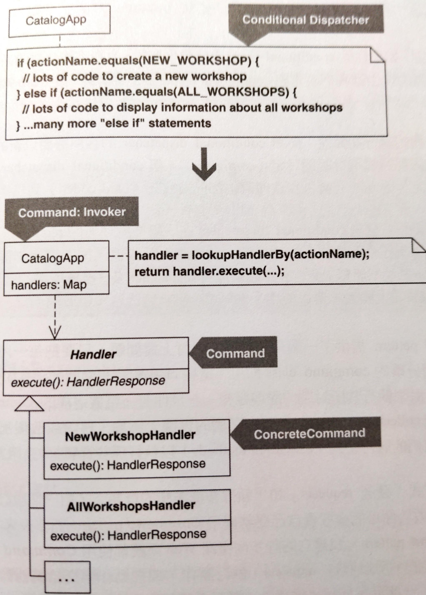

# Replace Conditional Dispatcher with Command

以 **Command** 取代條件式分派器。

條件邏輯被用來分派請求 (dispatch requests) 和執行行動 (execute actions)。

為每個行動產生一個 **Command**。把所有 **Command**s 儲存在集合 (collections) 中，並以「獲取 (fetch) 並執行 **Command**s」的程式碼取代條件邏輯。



- dispatch: [longman](https://www.ldoceonline.com/dictionary/dispatch) to send someone or something somewhere for a particular purpose


## 動機

Conditional dispatcher 是一個用來發送並處理 requests 的條件句。有些 conditinoal dispatcher 非常稱職，有些則否。

稱職的 conditional dispatchers 會把少量的 requests 發給小塊的處理邏輯，這樣的 dispatcher 小到可以在不須捲動螢幕的情況下看到所有程式碼。

重構 conditional dispatcher 為 **Command** 的時機：
1. 當 conditional dispatcher 缺乏執行期的彈性
    依賴 conditional dispatcher 的客戶需要以新的 requests 或新的處理邏輯進行設定。但 conditional dispatcher 的所有發送和處理邏輯都寫死到條件句，無法滿足此需求。
2. 程式碼膨脹
    有些 conditional dispatchers 在「需要處理新的 requests」或「處理邏輯因為新的任務變得更複雜」時變得龐大笨重。

**Command** pattern 解決以上問題：只要把每一段處理邏輯放進個別而分離的 command class 即可。這些類別都有共同的函式，例如: `execute`, `run` 來執行封裝處理邏輯。如果有一整族這樣的 commands，可以用 collections 來儲存和取出它們的實體，還有喚起它們的執行函式。

**Command** pattern 容易實作，不用考慮是否要先將程式碼設計成 **Command** pattern，等到需要的時候再來 refactor to Command patten 即可。

::: tip 優點
- 提供一個簡單的機制，以一致的方法執行多種多樣的行為
- 可以在執行期更改 要處理哪個請求 (requests) 和 如何處理
- 實作時需要一些瑣碎而淺薄的程式碼

:::

::: warning 缺點
- 當 conditional dispatcher 足以應付需求，這項重構會讓設計變得更複雜

:::


## 作法

1. 在含有 conditional dispatcher 的 class 上找出處理 request 的程式碼。對它進行 *Extract Method*，直到你有一個執行函式 (execution method) 為止。執行函式用來喚起程式碼的行為。
2. 重複步驟 1，把所有剩餘的 requests 處理抽取成執行函式。
3. 在每個執行函式上實施 *Extract Class* 來建立 concrete command。這是用來處理特定某個 request 的 class。(這個步驟意味著 concrete command 的執行函式要設定成 public) 如果新的 concrete command 內的執行函式太大或難以迅速理解，請實施 *Compose Method*。

    建立所有 concrete commands 後，尋找其中的重複碼，看看是否能實施 *Form Template Method* 來移除。
4. 定義一個 command，它是個 interface 或 abstract class，裡面宣告一個「在每個 concrete command 中都一樣的執行函式」。
    為了這麼做，需要分析 concrete commands 的相似和獨特之處：
    - 什麼參數必須傳給一個共同的執行函式？
    - 在一個 concrete command 建構過程中要傳入什麼參數？
    - 透過「對參數回呼 (calling back on a parameter)」而不是「讓資料直接傳入 concrete command」的方式，concrete command 可以得到什麼資訊？
    - 對於這些「在每個 concrete command 中都一樣的執行函式」，其最簡單的簽名式是什麼？

    考慮在 concrete command 上實施 *Extract Superclass* 或 *Extract Interface*，產生 command 早期版本。
5. 讓每個 concrete command 實現或繼承你的 command，並更新所有客戶碼，以便透過 command 類別來使用每個 concrete command。
6. 在含有 conditional dispatcher 的類別定義並加入一個 command map，這個 map 含有每個 concrete command 實體。Concrete command 實體在輸入時會搭配一個 UID (e.g. command 名稱)，這個 ID 會在執行期獲取 (fetch) command 時用到。

    如果有很多 concrete commands，你會有很多「把 concrete command 實體加入到 command map」的程式碼。這種情況可以考慮把 concrete commands 實作 **Plugin** pattern [Patterns of Enterprise Application Architecture]。這會讓它們只在提供適當設定資料時才會被載入。
7. 在含有 conditional dispatcher 的類別上，以「獲取 (fetch) 正確的 concrete command」的程式碼取代「分派 requests」的條件句程式碼，並呼叫被提取的 concrete command 的執行函式來執行。這個類別是個 Invoker。


## 範例

這個系統產生並編排 Industrial Logic 公司的 HTML-based 名錄。原本這系統早期大量使用 **Command** pattern，後來決定把使用 **Command** pattern 的部份改成不使用。產生了「體積浮腫且可望 **Command**」的程式碼。

修改後的程式碼有一個名為 `CatalogApp` 的類別負責分派和執行動作，以及返回回應 (responses)。這項工作在一個大型條件句中執行：

```java
public class CatalogApp {
    private HandlerResponse executeActionAndGetResponse(String actionName, Map parameters) {
        // ...
        if (actionName.equals(NEW_WORKSHOP)) { 
            String nextWorkshopID = workshopManager.getNextWorkshopID(); 
            StringBuffer newWorkshopContents = workshopManager.createNewFileFromTemplate(nextWorkshopID, workshopManager.getWorkshopDir(), workshopManager.getWorkshopTemplate());
            workshopManager.addWorkshop(newWorkshopContents);
            parameters.put("id",nextWorkshopID); 
            executeActionAndGetResponse(ALL_WORKSHOPS, parameters); 
        } else if (actionName.equals(ALL_WORKSHOPS)) { 
            XMLBuilder allWorkshopsXml = new XMLBuilder("workshops"); 
            WorkshopRepository repository = workshopManager.getWorkshopRepository(); 
            Iterator ids = repository.keyIterator(); 
            while (ids.hasNext()) { 
                String id = (String)ids.next(); 
                Workshop workshop = repository.getWorkshop(id); allWorkshopsXml.addBelowParent("workshop");
                allWorkshopsXml.addAttribute("id", workshop.getID()); 
                allWorkshopsXml.addAttribute("name", workshop.getName()); allWorkshopsXml.addAttribute("status", workshop.getStatus()); 
                allWorkshopsXml.addAttribute("duration", workshop.getDurationAsString()); 
            } 
            String formattedXml = getFormattedData(allWorkshopsXml.toString()); 
            return new HandlerResponse(new StringBuffer(formattedXml), ALL_WORKSHOPS_STYLESHEET); 
        } // ...many more "else if" statements
    }
}
```

整個條件句橫跨數頁。條件句第一部份處理新的工場的生成，第二部份被第一部份呼叫，返回 Industrial Logic 的所有工場摘要資訊的 XML。以下展示如何重構這段程式碼來使用 **Command**：

1. 先處理條件句第一部份。實施 *Extract Method* 產生執行函式 `getNewWorkshopResponse()`:
    ```java{6,12-18}
    public class CatalogApp {
        // ...
        private HandlerResponse executeActionAndGetResponse(String actionName, Map parameters) {
            // ...
            if (actionName.equals(NEW_WORKSHOP)) { 
                getNewWorkshopResponse(parameters); 
            } else if (actionName.equals(ALL_WORKSHOPS)) { 
                // ... 
            } // ...many more "else if" statements 
        }
        
        private HandlerResponse getNewWorkshopResponse(Map parameters) throws Exception { 
            String nextWorkshopID = workshopManager.getNextWorkshopID(); 
            StringBuffer newWorkshopContents = workshopManager.createNewFileFromTemplate(nextWorkshopID, workshopManager.getWorkshopDir(), workshopManager.getWorkshopTemplate()); 
            workshopManager.addWorkshop(newWorkshopContents); 
            parameters.put("id",nextWorkshopID); 
            return executeActionAndGetResponse(ALL_WORKSHOPS, parameters); 
        }
    }
    ```
2. 繼續抽取下一段的 request 處理程式碼：
    ```java{6,10-25}
    public class CatalogApp {
        private HandlerResponse executeActionAndGetResponse(String actionName, Map parameters) {
            if (actionName.equals(NEW_WORKSHOP)) { 
                getNewWorkshopResponse(parameters); 
            } else if (actionName.equals(ALL_WORKSHOPS)) { 
                getAllWorkshopsResponse(); 
            } // ...many more "else if" statements
        }

        public HandlerResponse getAllWorkshopsResponse() { 
            XMLBuilder allWorkshopsXml = new XMLBuilder("workshops"); 
            WorkshopRepository repository = workshopManager.getWorkshopRepository(); 
            Iterator ids = repository.keyIterator(); 
            while (ids.hasNext()) { 
                String id = (String)ids.next(); 
                Workshop workshop = repository.getWorkshop(id);
                allWorkshopsXml.addBelowParent("workshop"); 
                allWorkshopsXml.addAttribute("id", workshop.getID()); 
                allWorkshopsXml.addAttribute("name", workshop.getName()); 
                allWorkshopsXml.addAttribute("status", workshop.getStatus()); 
                allWorkshopsXml.addAttribute("duraction", workshop.getDurationAsString()); 
            }
            String formattedXml = getFormattedData(allWorkshopsXml.toString()); 
            return new HandlerResponse(new StringBuffer(formattedXml), ALL_WORKSHOPS_STYLESH EET); 
        }
    }
    ```
3. 現在開始產生 concrete commands。先在執行函式 `getAllWorkshopsResponse()` 上實施 *Extract Class*，產生一個 `NewWorkshopHandler` concrete command:
    ```java{1-19}
    public class NewWorkshopHandler { 
        private CatalogApp catalogApp; 

        public NewWorkshopHandler(CatalogApp catalogApp) { 
            this.catalogApp = catalogApp; 
        } 

        public HandlerResponse getNewWorkshopResponse(Map parameters) throws Exception { 
            String nextWorkshopID = workshopManager().getNextWorkshopID(); 
            StringBuffer newWorkshopContents = WorkshopManager().createNewFileFromTemplate(nextWorkshopID, workshopManager().getWorkshopDir(), workshopManager().getWorkshopTemplate()); 
            workshopManager().addWorkshop(newWorkshopContents); 
            parameters.put("id", nextWorkshopID); 
            catalogApp.executeActionAndGetResponse(ALL_WORKSHOPS, parameters); 
        } 

        private WorkshopManager workshopManager() { 
            return catalogApp.getWorkshopManager(); 
        } 
    }
    ```
    
    `CatelogApp` 具現並呼叫 `NewWorkshopHandler` 的一個實體，像這樣：
    
    ```java{4}
    public class CatalogApp {
        public HandlerResponse executeActionAndGetResponse(String actionName, Map parameters) throws Exception { 
            if (actionName.equals(NEW_WORKSHOP)) { 
                return new NewWorkshopHandler(this).getNewWorkshopResponse(parameters); 
            } else if (actionName.equals(ALL_WORKSHOPS)) { 
                // ... 
            } // ...
        }
    }
    ```
    
    注意：`executeActionAndGetResponse` 要設成 public，因為他被 `NewWorkshopHandler` 呼叫。

    繼續之前，先對 `NewWorkshopHandler` 的執行函式進行 *Compose Method*:

    ```java{1-17}
    public class NewWorkshopHandler {
        public HandlerResponse getNewWorkshopResponse(Map parameters) throws Exception {
            createNewWorkshop(parameters); 
            return catalogApp.executeActionAndGetResponse(CatalogApp.ALL_WORKSHOPS, parameters); 
        }

        private void createNewWorkshop(Map parameters) throws Exception { 
            String nextWorkshopID = workshopManager().getNextWorkshopID(); 
            workshopManager().addWorkshop(newWorkshopContents(nextWorkshopID)); 
            parameters.put("id",nextWorkshopID); 
        } 

        private StringBuffer newWorkshopContents(String nextWorkshopID) throws Exception { 
            StringBuffer newWorkshopContents = workshopManager().createNewFileFro mTemplate(nextWorkshopID, workshopManager().getWorkshopDir(), workshopManager().getWorkshopTemplate()); 
            return newWorkshopContents; 
        }
    }
    ```

    繼續對 `AllWorkshopsHandler` 的執行函式進行 *Compose Method*:

    ```java{1-21}
    public class AllWorkshopsHandler {
        private CatalogApp catalogApp; 
        private static String ALL_WORKSHOPS_STYLESHEET="allWorkshops.xsl"; 
        private PrettyPrinter prettyPrinter = new PrettyPrinter(); 
        
        public AllWorkshopsHandler(CatalogApp catalogApp) { 
            this.catalogApp = catalogApp; 
        } 
        
        public HandlerResponse getAllWorkshopsResponse() throws Exception { 
            return new HandlerResponse( new StringBuffer(prettyPrint(allWorkshopsData())), ALL_WORKSHOPS_STYLESHEET ); 
        } 
        
        private String allWorkshopsData() {
          // ...   
        }
        
        private String prettyPrint(String buffer) { 
            return prettyPrinter.format(buffer); 
        }
    }
    ```

    因為沒有太多重複，因此這裡不使用 *Form Template Method*。
4. 現在必須建立一個 command (interface 或 abstract class)。目前每個 concrete command 都有一個不同名的執行函式，且函式帶有不同數量的參數:

    ```java{2,4}
    if (actionName.equals(NEW_WORKSHOP)) { 
        return new NewWorkshopHandler(this).getNewWorkshopResponse(parameters); 
    } else if (actionName.equals(ALL_WORKSHOPS)) { 
        return new AllWorkshopsHandler(this).getAllWorkshopsResponse(); 
    } //...
    ```

    製造一個 command 需要決定:
    - 一個共同的執行函式名稱
    - 要傳入什麼資訊，以及從每一個處理者 (handler) 上取得什麼資訊

    這裡選擇的執行函式名稱為 `execute()` (雖然是 **Command** pattern 常見的名稱，但不一定要這樣取)。接下來要決定傳入什麼資訊，檢視一下 concrete command 得知:
    - 要求一個名為 `parameters` 的 `Map` 的所含資訊
    - 返回一個物件，型別為 `HandlerResponse`
    - 丟出一個異常 (Exception)

    這表示 command 必須包括一個具有以下特徵的執行函式:

    ```java
    public HandlerResponse execute(Map parameters) throws Exception 
    ```

    接下來實施 *Extract Superclass* 產生一個名為 `Handler` 的 abstract class:

    ```java{1-8,12}
    public abstract class Handler { 
        protected CatalogApp catalogApp; 
        public Handler(CatalogApp catalogApp) { 
            this.catalogApp = catalogApp;
        } 
    
        public abstract HandlerResponse execute(Map parameters) throws Exception; 
    } 
    
    public class NewWorkshopHandler extends Handler {
        public NewWorkshopHandler(CatalogApp catalogApp) { 
            super(catalogApp); 
        }
    }
    ```
5. 現在讓每個 handler 都繼承 `Handler` 和實作 `execute()`:

    ```java
    if (actionName.equals(NEW_WORKSHOP)) { 
        return new NewWorkshopHandler(this).execute(parameters);
    } else if (actionName.equals(ALL_WORKSHOPS)) { 
        return new AllWorkshopsHandler(this).execute(parameters); 
    }
    ```
6. `CatelogApp` 的條件句作用如同簡陋的 `Map`。更好的作法是使用真正的 `Map` 來儲存:

    ```java
    public class CatalogApp {
        private Map handlers; 
        
        public CatalogApp(...) { 
            // ... 
            createHandlers(); 
            // ... 
        }

        public void createHandlers() { 
            handlers = new HashMap(); 
            handlers.put(NEW_WORKSHOP, new NewWorkshopHandler(this)); 
            handlers.put(ALL_WORKSHOPS, new AllWorkshopsHandler(this)); 
            // ... 
        }
    }
    ```

    因為沒有太多的 handlers，所以不考慮使用 **Plugin** pattern。
7. 最後，以「依名稱尋找 handler 並執行」的程式碼取代大型條件句:

    ```java{3-4,7-9}
    public class CatalogApp {
        public HandlerResponse executeActionAndGetResponse(String handlerName, Map parameters) throws Exception { 
            Handler handler = lookupHandlerBy(handlerName); 
            return handler.execute(parameters); 
        }

        private Handler lookupHandlerBy(String handlerName) { 
            return (Handler)handlers.get(handlerName); 
        }
    }
    ```

    完成重構。現在這個 `CatelogApp` 使用 **Command** pattern 執行動作並取得回應。這個設計讓我們輕鬆宣告新的 handler、為它命名、以及登錄在 command map，以便讓它可以在執行期呼叫。
