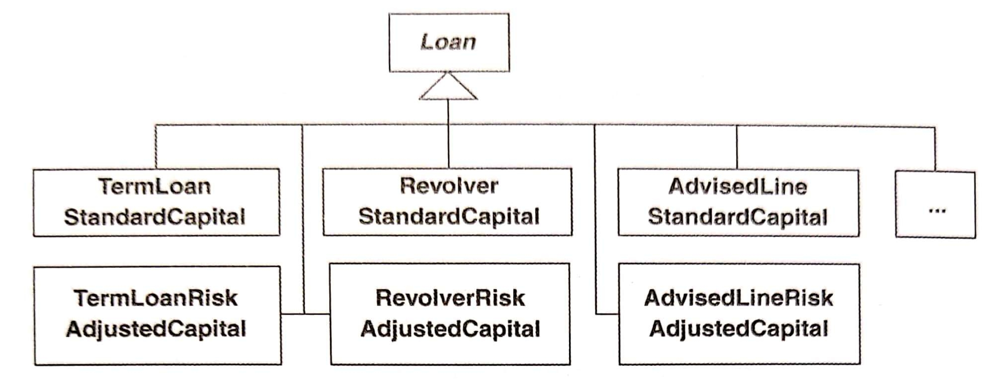
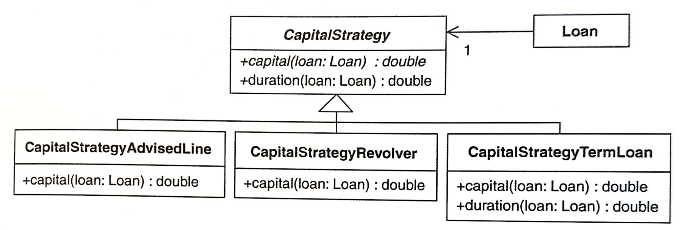

# Replace Conditional Logic with Strategy

以 Strategy 取代條件邏輯（Conditional Logic）。

為每個變體（variant）建立一個 Strategy 物件，然後將函式委派（delegate）給 Strategy 的實體。


## 動機

::: tip 優點
- 透過減少或移除條件邏輯的方式簡化
- 把演算法變異移給一個繼承體系，用來簡化類別
- 讓演算法可以在執行期轉換為另一個演算法

:::

::: warning 缺點
- 當「以繼承為基礎的解法」或來自 Simplifying Conditional Expression [F] 的解法更簡單時，會讓設計變得更複雜
- 會讓演算法從其 context class 中取資料的方式變得更複雜

:::


## 作法

找出 context：帶有一個包含許多條件邏輯的計算方法（calculation method）。
1. 建立一個 **Strategy**<br >
    以計算方法的行為為這個 **Strategy** 命名。

2. 使用 *Move Method* [F] 將計算方法移到 **Strategy**。<br >
    先在 context 上為這個計算方法保留一個簡易版本，context 會把實際工作委派給 **Strategy**。<br >
    為了實現這個委派，必須定義並具現一個 delegate 成為一個 context 的欄位，其 reference 指向 **Strategy**。
    如果 **Strategy** 需要存取資料，以下有兩個常見作法：
    - 把 context 當作參數傳給 **Strategy** 的建構式或計算方法。<br >
        這麼做需要把 context 設定為 public。請考慮只給 context 的資料提供最少的公開權限。
        - 優點：為 context 新增新的 public 函式時，不用更動很多程式碼，就可以被所有 concrete **Strategies** 使用。
        - 缺點：破壞資訊隱藏，本來只能給 context 看到的資料會讓其他類別看到。
    - 透過計算方法的參數，將需要的傳進 **Strategy**。
      - 優點：context 和 **Strategy** 之間形成最低耦合。
      - 缺點：資料會被傳進 **每個** concrete **Strategy**，不論它們是否需要這些資料。

    這些方法所面臨的挑戰，與所需要的資料量有關。如果參數太多，最好就把整個 context 以 reference 傳給 **Strategy**。也可以用 *Introduce Parameter Object* [F] 減少參數量。如果某些參數只為了某個特定的 concrete **Strategy** 需要，可以從參數列移除，改成透過建構式傳入。

    Context 中可能會有些輔助函式應該在 **Strategy** 上面，可以實作任何必要的 accessors，讓它將輔助函式從 context 移到 **Strategy**。

3. 讓客戶碼裝配 context，使它帶有 **Strategy** 實體。<br >
    作法是對 context 程式碼中「具現一個 concrete **Strategy** 並作為委派對象」的部份實施 *Extract Parameter* [F]。

4. 在 **Strategy** 計算方法上面使用 *Replace Conditional with Polymorphism* [F]。<br >
   為了這麼做，你必須使用 *Replace Type Code with Subclasses* [F] 或是 *Replace Type Code with State/Strategy* [F]，請選擇前者。如果計算方法上的條件邏輯辨識出特定計算型別，請使用條件邏輯代替顯式型別（explicit types）。

   一次只集中焦點建立一個 subclass。如果可以的話，請將 **Strategy** 變成 abstract class。


## 範例

範例是一個三種貸款的資金計算程式：
- 定期貸款（term loan）
- 循環信用貸款（revolver）
- 通知額度貸款（advised line）

`Loan` 需要完成下列事項：
- 針對各種貸款多樣化計算資金。<br >
    如果每種資金計算方式都要有一個 `Loan` subclass，那麼 `Loan` 會負擔過多 subclasses，如下圖：<br >
    
- 在執行期間改變資金計算方式，但不改變 `Loan` 實體的 class 型別。<br >
    「交換 `Loan` 物件的 **Strategy** 實體使成為另一個 **Strategy** 實體」比「改變整個 `Loan` 物件使它從某個 `Loan` subclass 改變成另一個 `Loan` subclass」更容易達成。


先找出 context: 在 `Loan` 類別中，有一個 `capital()` 的計算方法。

``` java
public class Loan {
    // ...
    public double capital() { 
        if (expiry == null && maturity != null) // 1
            return commitment * duration() * riskFactor(); 
        if (expiry != null && maturity == null) {
            if (getUnusedPercentage() != 1.0) // 2
                return commitment * getUnusedPercentage() * duration() * riskFactor();         
            else // 3
                return (outstandingRiskAmount() * duration() * riskFactor()) + (unusedRiskAmount() * duration() * unusedRiskFactor()); 
        } 
        return 0.0; // 4
    }
}
```

內含以下幾個輔助函式：

``` java
public class Loan {
    // ...
    private double outstandingRiskAmount() { 
        return outstanding; 
    } 
    private double unusedRiskAmount() { 
        return (commitment - outstanding); 
    }
    public double duration() { 
        if (expiry == null && maturity != null) 
            return weightedAverageDuration(); 
        else if (expiry != null && maturity == null) 
            return yearsTo(expiry); 
        return 0.0; 
    }
    private double weightedAverageDuration() { 
        double duration = 0.0; 
        double weightedAverage = 0.0;
        double sumOfPayments = 0.0;
        Iterator loanPayments = payments.iterator(); 
        while (loanPayments.hasNext()) { 
            Payment payment = (Payment)loanPayments.next(); 
            sumOfPayments += payment.amount(); 
            weightedAverage += yearsTo(payment.date()) * payment.amount();
        } 
        if (commitment != 0.0) 
            duration = weightedAverage / sumOfPayments;
         return duration; 
    }
    private double yearsTo(Date endDate) {
        Date beginDate = (today == null ? start : today); 
        return ((endDate.getTime() - beginDate.getTime()) / MILLIS_PER_DAY) /  DAYS_PER_YEAR;
    }
    private double riskFactor() { 
        return RiskFactor.getFactors().forRating(riskRating);
    }
    private double unusedRiskFactor() { 
        return UnusedRiskFactors.getFactors().forRating( riskRating); 
    }
}
```

1. 建立一個 `CapitalStrategy` 類別
    ``` java
    public class CapitalStrategy { 

    }
    ```
2. 用 *Move Method* [F] 把 `capital()` 計算工作移到 `CapitalStrategy`。這個步驟需要在 `Loan` 上留下一個簡單版的 `capital()`，用來把工作委派給一個 `CapitalStrategy` 的實體。

    首先宣告一個 `capital()`:
    ``` java
    public class CapitalStrategy {    
        public double capital() {   
            return 0.0; 
        } 
    }
    ```

    然後從 `Loan` 複製程式碼到 `CapitalStrategy`:
    ``` java
    public class CapitalStrategy {
        public double capital() { // copied from Loan 
            if (expiry == null && maturity != null) 
                return commitment * duration() * riskFactor();
            if (expiry != null && maturity == null) { 
                if (getUnusedPercentage() != 1.0) 
                    return commitment * getUnusedPercentage() * duration() * riskFactor(); 
                else
                    return (outstandingRiskAmount() * duration() * riskFactor()) + (unusedRiskAmount() * duration() * unusedRiskFactor());
                } 
            return 0.0;
        } 
        private double riskFactor() { // moved from Loan 
            return RiskFactor.getFactors().forRating(riskRating); 
        } 
        private double unusedRiskFactor() { // moved from Loan 
            return UnusedRiskFactors.getFactors().forRating(riskRating); 
        }
    }
    ```

    > 這時候發現，不能把 `duration()` 移到 `CapitalStrategy`，因為 `weightedAverageDuration` 也需要知道 `Loan` 的付款資訊。一旦我們讓 `CapitalStrategy` 可以取用付款資訊，就能夠把 `duration()` 和它的輔助函式移到 `CapitalStrategy`。很快的我就會做這件事。
    
    現在我們需要編譯被我複製到 `CapitalStrategy` 的程式碼，為此我們必須決定：
    - 要把 `Loan` reference 當作參數傳給 `capital()` 和它的輔助函式
    - 把資料當作參數傳給 `capital()`，讓 `capital()` 可以使用它們並且繼續傳給它的輔助函式

    `capital()` 需要以下這些來自 `Loan` 實體的訊息：
    - Expiry date
    - Maturity date
    - Duration
    - Commitment amount
    - Risk rating
    - Unused percentage
    - Outstanding risk amount
    - Unused risk amount

    如果能夠縮減這列表，就能使用資料傳遞法。<br >
    因此推測我們可以建立一個 `LoanRange` class 來儲存與 `Loan` 實體相關的日期。<br>
    或許還能把 Commitment amount、Outstanding risk amount 和 Unused risk amount 組成一個 `LoanRisk` class。<br >
    但我們還有其他函式需要從 `Loan` 移到 `CapitalStrategy`（e.g. `duraion()`），就放棄上面的想法。因為搬動那些函式需要更多的資訊給 `CapitalStrategy`。<br >
    因此，我們決定只傳遞 `Loan` reference 給 `CapitalStrategy`。

    ```java
    public class CapitalStrategy {
        public double capital(Loan loan ) { 
            if ( loan.getExpiry() == null && loan.getMaturity() != null)
                return loan.getCommitment() * loan .duration() * riskFactorFor(loan) ;
                if ( loan.getExpiry() != null && loan.getMaturity() == null) { 
                    if (loan.getUnusedPercentage() != 1.0) 
                        return loan.getCommitment() * loan.getUnusedPercentage() * loan. duration() * riskFactorFor(loan) ; 
                    else 
                        return (loan.outstandingRiskAmount() * loan.duration() * riskFactorFor(loan) ) + ( loan.unusedRiskAmount() * loan.duration() * unusedRiskFactorFor(loan) );
                } 
            return 0.0; 
        } 
        
        private double riskFactorFor(Loan loan) { 
            return RiskFactor.getFactors().forRating( loan.getRiskRating() ); 
        }

        private double unusedRiskFactorFor(Loan loan) { 
            return UnusedRiskFactors.getFactors().forRating(loan.getRiskRating()); 
        }
    }
    ```

    為此需要對 `Loan` 進行一些改動來取得資料：

    ```java
    public class Loan { 
        Date getExpiry() { 
            return expiry; 
        } 
        Date getMaturity() { 
            return maturity; 
        } 
        double getCommitment() {
            return commitment; 
        } 
        double getUnusedPercentage() { 
            return unusedPercentage; 
        } 

        // private 
        double outstandingRiskAmount() { 
            return outstanding; 
        }
        // private 
        double unusedRiskAmount() { 
            return (commitment - outstanding); 
        }
    }
    ```

    *Move Method* 下一步是讓 `Loan` 把資金計算的工作委託給 `CapitalStrategy`：    
    ```java
    public class Loan {
        public double capital() { 
            return new CapitalStrategy().capital(this); 
        }
    }
    ```

    執行以下測試，檢查是否可以正常運作：
    ```java
    public class CapitalCalculationTests extends TestCase { 
        public void testTermLoanSamePayments() { 
            Date start = november(20, 2003); 
            Date maturity = november(20, 2006); 
            Loan termLoan = Loan.newTermLoan(LOAN_AMOUNT, start, maturity, HIGH_RISK_RATING); 
            termLoan.payment(1000.00, november(20, 2004)); 
            termLoan.payment(1000.00, november(20, 2005)); 
            termLoan.payment(1000.00, november(20, 2006)); 
            assertEquals("duration", 2.0, termLoan.duration(), TWO_DIGIT_PRECISION); 
            assertEquals("capital", 210.00, termLoan.capital(), TWO_DIGIT_PRECISION); 
        }
    }
    ```

    通過測試以後，現在可以集中精力在資金計算相關特性從 `Loan` 移到 `CapitalStrategy`，完成後如下：
    ```java
    public class CapitalStrategy {
        private static final int MILLIS_PER_DAY = 86400000; 
        private static final int DAYS_PER_YEAR = 365; 
        public double capital(Loan loan) { 
            if (loan.getExpiry() == null && loan.getMaturity() != null) 
            return loan.getCommitment() * loan.duration() * riskFactorFor(loan); 
            
            if (loan.getExpiry() != null && loan.getMaturity() == null) { 
                if (loan.getUnusedPercentage() != 1.0) 
                    return loan.getCommitment() * loan.getUnusedPercentage() * loan.duration() * riskFactorFor(loan); 
                else 
                    return (loan.outstandingRiskAmount() * loan.duration() * riskFactorFor(loan)) + (loan.unusedRiskAmount() * loan.duration() * unusedRiskFactorFor(loan)); 
            } 
            
            return 0.0; 
        }
        private double riskFactorFor(Loan loan) { 
            return RiskFactor.getFactors().forRating(loan.getRiskRating()); 
        }
        private double unusedRiskFactorFor(Loan loan) { 
            return UnusedRiskFactors.getFactors().forRating(loan.getRiskRating()); 
        }
        public double duration(Loan loan) {
            if (loan.getExpiry() == null && loan.getMaturity() != null) 
                return weightedAverageDuration(loan);
            else if (loan.getExpiry() != null && loan.getMaturity() == null) 
                return yearsTo(loan.getExpiry(), loan);
            
            return 0.0;
        }
        private double weightedAverageDuration(Loan loan) { 
            double duration = 0.0; 
            double weightedAverage = 0.0; 
            double sumOfPayments = 0.0; 
            Iterator loanPayments = loan.getPayments().iterator(); 
            while (loanPayments.hasNext()) { 
                Payment payment = (Payment)loanPayments.next(); 
                sumOfPayments += payment.amount(); 
                weightedAverage += yearsTo(payment.date(), loan) * payment.amount(); 
            }
            if (loan.getCommitment() != 0.0) 
                duration = weightedAverage / sumOfPayments; return duration; 
        }
        private double yearsTo(Date endDate, Loan loan) {
            Date beginDate = (loan.getToday() == null ? loan.getStart() : loan.getToday());
            return ((endDate.getTime() - beginDate.getTime()) / MILLIS_PER_DAY) / DAYS_PER_YEAR;
        }
    }
    ```
    
    在改動過後， `Loan` 的資金和週期計算看起來像這樣：
    ```java
    public class Loan {
        public double capital() { 
            return new CapitalStrategy().capital(this); 
        }
        public double duration() {
            return new CapitalStrategy().duration(this); 
        }
    }
    ```

    雖說不打算太早對 `Loan` class 進行最佳化，但我們不放棄移除重複碼的機會。應該以 `Loan` 的 `CapitalStrategy` 欄位取代上面的 `new CapitalStrategy()...`：
    ```java
    public class Loan {
        private CapitalStrategy capitalStrategy; 
        private Loan(double commitment, double outstanding, Date start, Date expiry, Date maturity, int riskRating) { 
            capitalStrategy = new CapitalStrategy(); 
            //... 
        } 
        public double capital() { 
            return capitalStrategy.capital(this); 
        }
        public double duration() {
            return capitalStrategy.duration(this); 
        }
    }
    ```

    到目前為止實現了 *Move Method*。
3. 接下來實施 *Extract Parameter* 來設定委託值，在以下的 `new CapitalStrategy()` 地方。目前它是寫死的（hard-coded）。
    ```java
    public class Loan { 
        private Loan(..., CapitalStrategy capitalStrategy ) { 
            // ... 
            this.capitalStrategy = capitalStrategy; 
        }
        public static Loan newTermLoan(double commitment, Date start, Date maturity, int riskRating) { 
            return new Loan(commitment, commitment, start, null, maturity, riskRating, new CapitalStrategy()); 
        }
        public static Loan newRevolver(double commitment, Date start, Date expiry, int riskRating) { 
            return new Loan(commitment, 0, start, expiry, null, riskRating, new CapitalStrategy()); 
        } 
        public static Loan newAdvisedLine(double commitment, Date start, Date expiry, int riskRating) { 
            if (riskRating > 3) 
                return null; 
            Loan advisedLine = new Loan(commitment, 0, start, expiry, null, riskRating, new CapitalStrategy()); 
            advisedLine.setUnusedPercentage(0.1);
            return advisedLine; 
        }
    }
    ```
4. 在 `CapitalStrategy` 的 `capital()` 實施 *Replace Conditional with Polymorphism*。第一步是產生一個計算定期貸款資金的 subclass。這意味著讓 `CapitalStrategy`（以下未列出的）幾個函式成為 protected，並將幾個函式移到 `CapitalStrategyTermLoan` 的新 class 中，如下：
    ```java
    public class CapitalStrategyTermLoan extends CapitalStrategy { 
        public double capital(Loan loan) { 
            return loan.getCommitment() * duration(loan) * riskFactorFor(loan); 
        } 

        public double duration(Loan loan) { 
            return weightedAverageDuration(loan); 
        }

        private double weightedAverageDuration(Loan loan) { 
            double duration = 0.0; 
            double weightedAverage = 0.0; 
            double sumOfPayments = 0.0; 
            Iterator loanPayments = loan.getPayments().iterator(); 
            
            while (loanPayments.hasNext()) { 
                Payment payment = (Payment)loanPayments.next(); 
                sumOfPayments += payment.amount(); 
                weightedAverage += yearsTo(payment.date(), loan) * payment.amount(); 
            } 
            
            if (loan.getCommitment() != 0.0) 
                duration = weightedAverage / sumOfPayments; 
            
            return duration; 
        }
    ```
    
    為了測試它，我們要更新 `Loan` 如下：
    ```java
    public class Loan {
        public static Loan newTermLoan( double commitment, Date start, Date maturity, int riskRating) { 
            return new Loan( commitment, commitment, start, null, maturity, riskRating, new CapitalStrategyTermLoan() );
        }
    }
    ```

    測試通過以後，繼續實施 *Replace Conditional with Polymorphism* 建立另外兩種貸款類型：循環信用貸款（revolver）和通知額度（advised line） 的資金計算策略。
    ```java
    public class Loan { 
        public static Loan newRevolver( double commitment, Date start, Date expiry, int riskRating) { 
            return new Loan( commitment, 0, start, expiry, null, riskRating, new CapitalStrategyRevolver() ); 
        } 
        public static Loan newAdvisedLine( double commitment, Date start, Date expiry, int riskRating) { 
            if (riskRating > 3) 
                return null; 
            
            Loan advisedLine = new Loan( commitment, 0, start, expiry, null, riskRating, new CapitalStrategyAdvisedLine());
            advisedLine.setUnusedPercentage(0.1); 
            return advisedLine;
        }
    }
    ```

    下圖是所有 **Strategy** 的 classes：<br >
    

    `CapitalStrategy` class 現在是個 abstract class：
    ```java
    public abstract class CapitalStrategy { 
        private static final int MILLIS_PER_DAY = 86400000; 
        private static final int DAYS_PER_YEAR = 365;
        public abstract double capital(Loan loan); 
        protected double riskFactorFor(Loan loan) { 
            return RiskFactor.getFactors().forRating(loan.getRiskRating()); 
        } 
        public double duration(Loan loan) { 
            return yearsTo(loan.getExpiry(), loan); 
        } 
        protected double yearsTo(Date endDate, Loan loan) { 
            Date beginDate = (loan.getToday() == null ? loan.getStart() : loan.getToday()); 
            return ((endDate.getTime() - beginDate.getTime()) / MILLIS_PER_DAY) / DAYS_PER_YEAR; 
        } 
    }
    ```

    完成重構以後，現在資金計算改成以 concrete **Strategy** 執行。