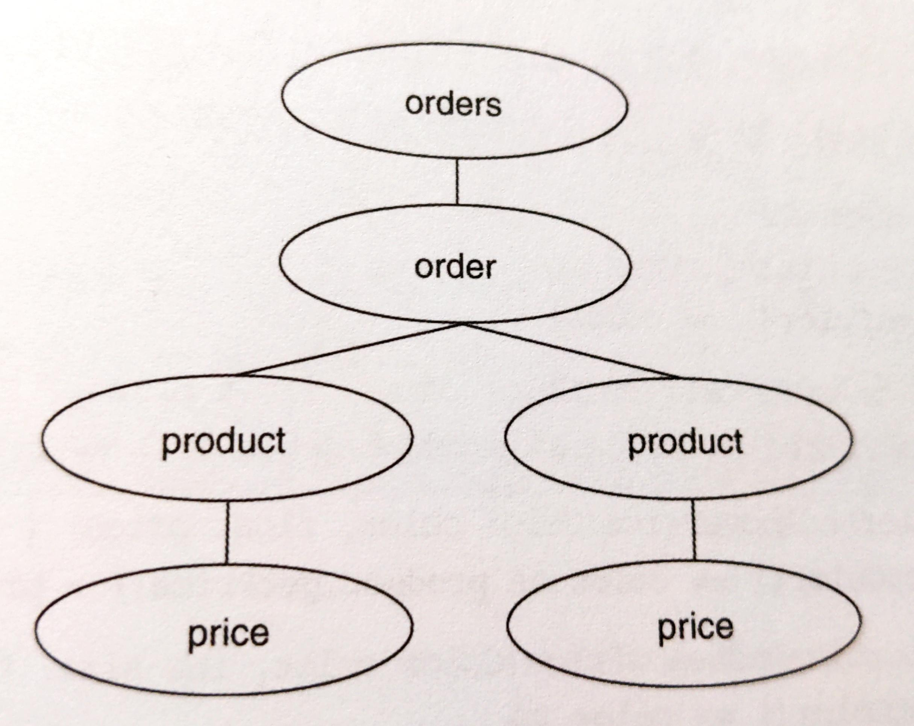

# Replace Implicit Tree with Composite

以 Composite 取代隱寓的樹狀結構。

你不自覺塑造出一個樹狀結構，採用原始表述（primitive representation）e.g. `String`。<br>
以 Composite 取代你的原始表述。


## 動機

資料或程式碼如果不是很明顯被建構成樹狀，但卻表現的像是樹狀，就是一種隱式樹狀結構。

```java
String expectedResult = 
    "<orders>" + 
        "<order id=’321’>" + 
            "<product id=’f1234’ color=’red’ size=’medium’>" + 
                "<price currency=’USD’>" + 
                    "8.95" + 
                "</price>" + 
                "Fire Truck" + 
                "</product>" + 
            "<product id=’p1112’ color=’red’>" + 
                "<price currency=’USD’>" + 
                    "230.0" + 
                "</price>" + 
                "Toy Porsche Convertible" + 
            "</product>" + 
        "</order>" +
    "</orders>"
```




條件邏輯也可以表達成樹，如下：

```java
public class ProductFinder... 
    public List belowPriceAvoidingAColor(float price, Color color) { 
        List foundProducts = new ArrayList(); 
        Iterator products = repository.iterator(); 
        while (products.hasNext()) { 
            Product product = (Product) products.next(); 
            if ( product.getPrice() < price && product.getColor() != color )
                foundProducts.add(product); 
        } 
        return foundProducts; 
    }
```


::: tip 優點
- 封裝反覆命令。例如：縮排、新增或移除節點。
- 提供一般化的方法來處理「相似邏輯擴散與激增」。
- 簡化客戶端的建構任務。

:::

::: warning 缺點
- 讓設計變得更複雜 -- 如果建構 implicit trees 比較簡單的話。

:::


## 作法

兩種作法：
- 在 implicit tree 上面重構：refactor to Composite
- 利用測試驅動開發來達成 refactor to Composite

如果 implicit tree 不適合重構，就可以用測試驅動開發。

1. 辨識出一個 implicit leaf，它是 implicit tree 的一部分，能用新的 class 來模塑。<br>
    利用 *Extract Class* 或是測試驅動開發來建立這個 class。<br>

    如果 implicit leaf 擁有屬性，請在 leaf node 中產生這些屬性。
2. 以 leaf node 的實體取代出現的每一個 implicit leaf，讓 implicit tree 依賴 leaf node 而非 implicit leaf。
3. 為 implicit tree 中的其他任何 implicit leaf 重複步驟 1&2。<br>
    想辦法確保你建立的 leaf node 共享同一個 interface，可以實施 *Extract Superclass* 或 *Extract Interface* 來建立這個 interface。
4. 類似 1. 的作法，找出 implicit parent。<br>
    - 客戶端必須能夠經由建構式或是 `add(...)` 在 parent node 中增加 leaf nodes。
    - parent node 必須對所有 children （經由其 interface）一視同仁。
    - parent node 不一定要實作共同 interface。
    - 如果客戶端有能力將 parent nodes 加到 parent nodes 中，或是如果你希望客戶碼對 leaf node 和 parent node 不分彼此（參考 Replace One/Many Distinctions with Composite 動機），那就讓 parent node 也實作那個共同的 interface。
5. 以「使用 parent node 實體並配備正確的 leaf node 實體」的程式碼取代每個 implicit parent。
6. 為其他 implicit parents 重複步驟 4&5。


## 範例

先使用 *Composite Method* 和 *Move Accumulation to Collecting Parameter* 把龐大的 `getContents` 切割成較小的函式：

```java
public class OrdersWriter { 
    private Orders orders; 

    public OrdersWriter(Orders orders) { 
        this.orders = orders; 
    }
    public String getContents() { 
        StringBuffer xml = new StringBuffer(); 
        writeOrderTo(xml); 
        return xml.toString(); 
    } 
    private void writeOrderTo(StringBuffer xml) { 
        xml.append("<orders>"); 
        for (int i = 0; i < orders.getOrderCount(); i++) { 
            Order order = orders.getOrder(i); 
            xml.append("<order"); 
            xml.append(" id=’"); 
            xml.append(order.getOrderId()); 
            xml.append("’>"); 
            writeProductsTo(xml, order); 
            xml.append("</order>"); 
        } 
        xml.append("</orders>"); 
    } 
    private void writeProductsTo(StringBuffer xml, Order order) { 
        for (int j=0; j < order.getProductCount(); j++) { 
            Product product = order.getProduct(j); 
            xml.append("<product"); 
            xml.append(" id=’"); 
            xml.append(product.getID());
            xml.append("’"); 
            xml.append(" color=’"); 
            xml.append(colorFor(product)); 
            xml.append("’"); 
            if (product.getSize() != ProductSize.NOT_APPLICABLE) { 
                xml.append(" size=’"); 
                xml.append(sizeFor(product)); 
                xml.append("’"); 
            } 
            xml.append(">"); 
            writePriceTo(xml, product); 
            xml.append(product.getName()); 
            xml.append("</product>"); 
        } 
    } 
    private void writePriceTo(StringBuffer xml, Product product) { 
        xml.append("<price"); 
        xml.append(" currency=’"); 
        xml.append(currencyFor(product)); 
        xml.append("’>"); 
        xml.append(product.getPrice()); 
        xml.append("</price>"); 
    }
```

為何要寫成 `writeOrderTo` `writeProductsTo` `writePriceTo`，而不直接從 domain objects 呼叫 `toXML()`？考慮以下範例：

```XML
<order id=’987’ totalPrice=’14.00’> 
    <product id=’f1234’ price=’9.00’ quantity=’1’> Fire Truck </product> 
    <product id=’f4321’ price=’5.00’ quantity=’1’> Rubber Ball </product> 
</order> 

<orderHistory> 
    <order date=’20041120’ totalPrice=’14.00’> 
        <product id=’f1234’> 
        <product id=’f4321’> 
    </order>
</orderHistory> 

<order id=’321’> 
    <product id=’f1234’ color=’red’ size=’medium’>
        <price currency=’USD’> 8.95 </price> 
        Fire Truck 
    </product> 
</order>
```

在每個 domain object 上使用單一的 `toXML()` 是很困難且棘手的工作，因為每個 XML 情況都不一樣。可行解法：
- 在 domain objects 外部進行 XML 轉譯。
- 使用 **Visitor** （參考 *Move Accumulation to Visitor*）


接下來開始本章的重構：
1. 找出 implicit leaf。
    ```java
    String expectedResult = 
    "<orders>" + 
        "<order id=’321’>" + 
            "<product id=’f1234’ color=’red’ size=’medium’>" + 
                "<price currency=’USD’>" + 
                    "8.95" + 
                "</price>" + 
                "Fire Truck" + 
            "</product>" + 
        "</order>" +
    "</orders>";
    ```
    考慮要將 `<price>...</price>` tag 當作 leaf 還是 `8.95`? 這裡選擇前者。
    觀察每個 XML tag 會有：
    - name
    - attribute
    - children (optional)
    - value (optional)

    所以可以用一個通用的 leaf node 表達所有 implicit leaves。
    
    接下來以測試驅動開發產生這個 class：
    ```java
    public class TagTests extends TestCase {
        private static final String SAMPLE_PRICE = "8.95"; 
        public void testSimpleTagWithOneAt tributeAndValue() { 
            TagNode priceTag = new TagNode("price"); 
            priceTag.addAttribute("currency", "USD"); 
            priceTag.addValue(SAMPLE_PRICE); 
            String expected = "<price currency=" + "’" + "USD" + "’>" + SAMPLE_PRICE + "</price>"; 
            assertEquals("price XML", expected, priceTag.toString()); 
        }
    }

    public class TagNode { 
        private String name = ""; 
        private String value = "";
        private StringBuffer attributes; 
        public TagNode(String name) { 
            this.name = name; 
            attributes = new StringBuffer(""); 
        } 
        public void addAttribute(String attribute, String value) { 
            attributes.append(" "); 
            attributes.append(attribute); 
            attributes.append("=`"); 
            attributes.append(value); 
            attributes.append("`" ); 
        } 
        public void addValue(String value) { 
            this.value = value; 
        } 
        public String toString() { 
            String result; 
            result = "<" + name + attributes + ">" + value + "</" + name + ">"; 
            return result;
        }
    }
    ```
2. 現在用 `TagNode` 取代 `getContents()` 中的 implicit leaf：
    ```java
    public class OrdersWriter {
        private void writePriceTo(StringBuffer xml, Product product) { 
            TagNode priceNode = new TagNode("price"); 
            priceNode.addAttribute("currency", currencyFor(product)); 
            priceNode.addValue(priceFor(product)); 
            xml.append(priceNode.toString()); 
            // xml.append("<price"); 
            // xml.append(" currency=’"); 
            // xml.append(currencyFor(product)); 
            // xml.append("’>"); 
            // xml.append(product.getPrice()); 
            // xml.append("</price>"); 
        }
    }
    ```
3. 由於 `TagNode` 模塑出 XML 的所有 implicit leaves，因此不需要重複步驟 1&2 進行轉換，也不需要確認所有新的 leaf nodes 是否共用相同 interface，因為它已經是了。
4. 現在要找出 implicit parent: `<product>`, `<price>`, `<order>`, ...
    由於這些每個都和 leaf 相似，可以藉由在 `TagNode` 中加入「支援 child-handling」來產生 parent node。以下利用測試驅動開發產生：
    ```java
    public void testCompositeTagOneChild() {
        TagNode productTag = new TagNode("product"); 
        productTag.add(new TagNode("price")); 
        String expected = "<product>" + "<price>" + "</price>" + "</product>";
        assertEquals("price XML", expected, productTag.toString()); 
    }

    public class TagNode {
        private List children; 
        public String toString() { 
            String result; 
            result = "<" + name + attributes + ">"; 
            Iterator it = children().iterator(); 
            while (it.hasNext()) { 
                TagNode node = (TagNode)it.next(); 
                result += node.toString(); 
            } 
            result += value;
            result += "</" + name + ">"; 
            return result; 
        } 
        
        private List children() { 
            if (children == null) 
                children = new ArrayList(); 
            
            return children; 
        } 
        public void add(TagNode child) { 
            children().add(child); 
        }
    }

    public void testAddingChildrenAndGrandchildren() { 
        String expected = "<orders>" + "<order>" + "<product>" + "</product>" + "</order>" + "</orders>";
        TagNode ordersTag = new TagNode("orders"); 
        TagNode orderTag = new TagNode("order"); 
        TagNode productTag = new TagNode("product"); 
        ordersTag.add(orderTag); 
        orderTag.add(productTag); 
        assertEquals("price XML", expected, ordersTag.toString()); 
    }
    ```
    
5. 現在，以「使用 parent node 實體並配置正確的 leaf node 實體」的程式碼取代出現的每個 implicit parent。例如：
    ```java
    public class OrdersWriter {
        private void writeProductsTo(StringBuffer xml, Order order) {
            for (int j=0; j < order.getProductCount(); j++) {
                Product product = order.getProduct(j); 
                TagNode productTag = new TagNode("product"); 
                productTag.addAttribute("id", product.getID()); 
                productTag.addAttribute("color", colorFor(product)); 
                
                if (product.getSize() != ProductSize.NOT_APPLICABLE) 
                    productTag.addAttribute("size", sizeFor(product));
                    
                writePriceTo(productTag, product); 
                productTag.addValue(product.getName()); 
                xml.append( productTag.toString() ); 
            } 
        } 
        private void writePriceTo(TagNode productTag, Product product) {
            TagNode priceTag = new TagNode("price"); 
            priceTag.addAttribute("currency", currencyFor(product)); 
            priceTag.addValue(priceFor(product)); 
            productTag.add(priceTag); 
        }
    }
    ```
6. 重複 4&5。
    ```java
    public class OrdersWriter {
        public String getContents() { 
            StringBuffer xml = new StringBuffer(); 
            writeOrderTo(xml); 
            return xml.toString(); 
        } 
        private void writeOrderTo(StringBuffer xml) { 
            TagNode ordersTag = new TagNode("orders"); 
            for (int i = 0; i < orders.getOrderCount(); i++) { 
                Order order = orders.getOrder(i); 
                TagNode orderTag = new TagNode("order"); 
                orderTag.addAttribute("id", order.getOrderId()); 
                writeProductsTo(orderTag, order); 
                ordersTag.add(orderTag); 
            } 
            xml.append(ordersTag.toString()); 
        }
        private void writeProductsTo(TagNode orderTag, Order order) { 
            for (int j=0; j < order.getProductCount(); j++) { 
                Product product = order.getProduct(j); 
                TagNode productTag = new TagNode("product"); 
                productTag.addAttribute("id", product.getID()); 
                productTag.addAttribute("color", colorFor(product)); 
                if (product.getSize() != ProductSize.NOT_APPLICABLE) 
                    productTag.addAttribute("size", sizeFor(product)); 
                    
                writePriceTo(productTag, product);
                productTag.addValue(product.getName()); 
                orderTag.add(productTag); 
            } 
        } 
        private void writePriceTo(TagNode productTag, Product product) { 
            TagNode priceNode = new TagNode("price"); 
            priceNode.addAttribute("currency", currencyFor(product)); 
            priceNode.addValue(priceFor(product)); 
            productTag.add(priceNode); 
        }
    }
    ```
