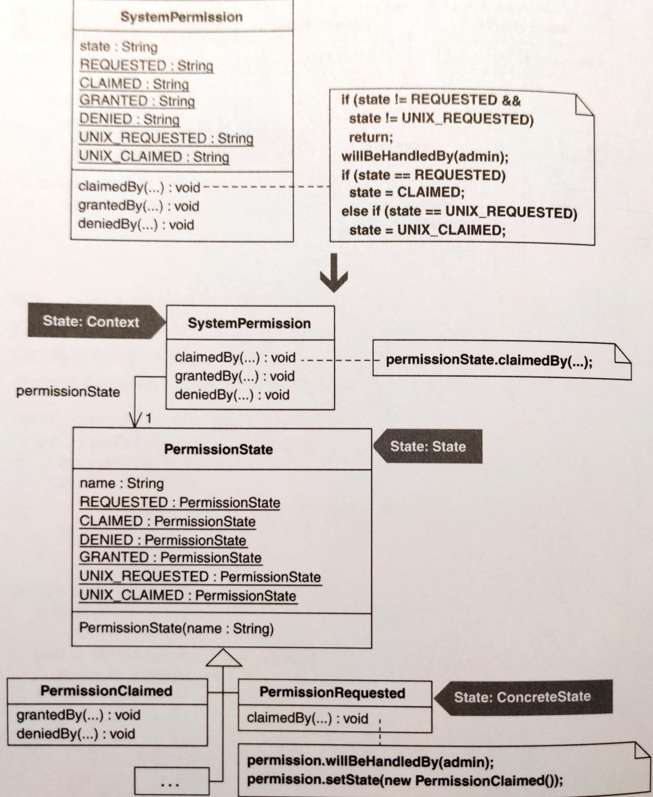
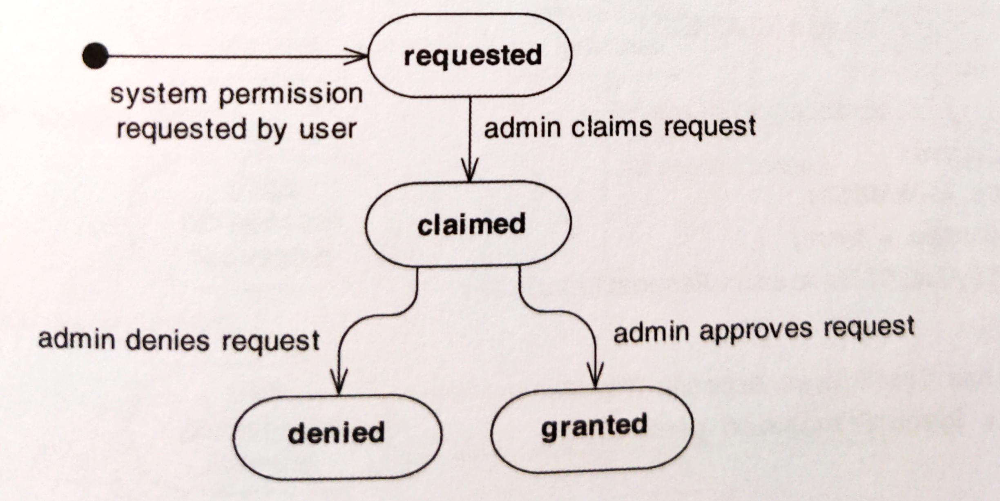
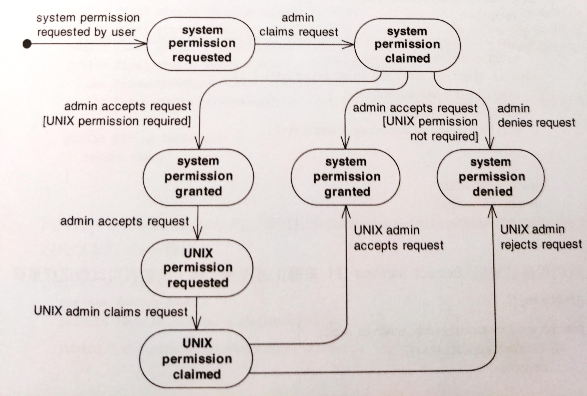
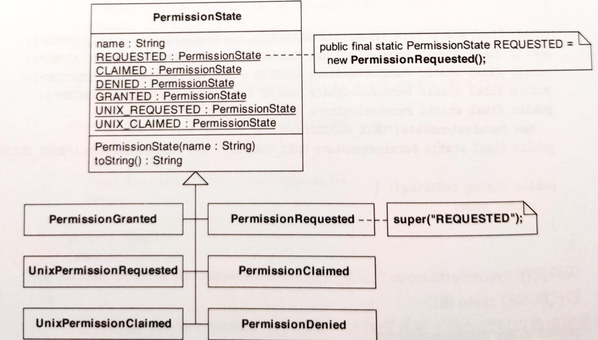

# Replace State-Altering Conditionals with State

以 State 替代「狀態變換」條件句。

控制「物件的狀態轉移」條件句很複雜。因此，拿「用來處理特定狀態和狀態轉移」的 **State** 類別取代條件句。



## 動機

Refactor to **State** pattern 的主要動機是簡化過度複雜的狀態轉換邏輯。這個邏輯（其本身容易把自己擴散到整個類別）控制著物件的狀態，也控制著如何轉換到其他狀態。實作 **State** pattern 時你需要建立一些類別來表達物件的 特定狀態 和 狀態間的轉換。Design Patterns 把 狀態被改變的物件 稱為 context。Context 把「與狀態相依的行為」委託（delegate）給 state 物件去做。只要讓 context 在執行期指向不同的 state 物件，就可以造成狀態轉移。

把狀態轉換邏輯從類別中移出，導入一系列可表現不同狀態的類別，就可以創造出較簡單的設計，提供對狀態轉移的全局觀點。但另一方面，如果你能輕鬆了解類別的狀態轉移邏輯，也許就不需要 refactor to **State** pattern，除非計劃未來要增加更多的狀態轉移。

在進行 refactor to **State** 之前，先看看是否有較簡單的重構方法（e.g. *Extract Method*）能夠幫忙梳理狀態轉換條件邏輯。

*Replace State-Altering Conditionals with State* 不同於 Martin Fowler 的 *Replace Type Code with State/Strategy*，因為：
- **State** 和 **Strategy** 之間存在差異：**State** pattern 對「必須在一系列 state 類別的實體之間輕鬆轉換」的類別有益，而 **Strategy** pattern 則是有助於讓類別把演算法執行任務委託給「一系列 **Strategy** 類別的某個實體」。由於這些差異，造成兩個模式為重構目標的動機和作法有所不同（請見：[Replace Conditional Logic with Strategy](../ch7/replace-conditional-logic-with-strategy.md)）。
- 完整的作法：Martin 刻意不寫 refactor to **State** pattern 的全部作法，因為他完整實作有賴於他寫的另一項重構：*Replace Conditional with Polymorphism*。

如果你的 state 物件沒有 instance 變數（也就是它們是無狀態的，stateless），你可以讓 context 物件共享這個「stateless state 實體」，讓記憶體用量最佳化。**Flyweight** 和 **Singleton** patterns 經常用來實現共享（sharing，請見 [Limit Instantiation with Singleton](../ch9/limit-instantiation-with-singleton.md)）。然而當你的用戶體驗過系統延遲，效能剖析器向你指出 state-instantiation code 是主要瓶頸時，你最好加上 state-sharing code。

::: tip 優點
- 減少或移除 state-changing 條件邏輯。
- 簡化複雜的 state-changing 邏輯。
- 為 state-changing 邏輯提供良好的全局觀點。

:::

::: warning 缺點
- 如果狀態轉移邏輯已經很容易被領會，這樣做會讓設計變得更複雜。

:::


## 作法

1. 所謂的 context 是指含有原始狀態欄位的那個類別，在狀態轉移中，該欄位被賦予或比對一整系列的常數。在這個欄位上實施 [Replace Type Code with Class](../ch9/replace-type-code-with-class.md)，便可以使其型別成為一個類別。我們把這個新類別稱為 state superclass。

    context 類別是 Design Patterns 中的 State:Context，而 state superclass 就是 Design Patterns 中的 State:State。
2. 上述的 state superclass 內的每一個常數現在都指涉一個 state superclass 實體。
    1. 實施 *Extract Subclass* 針對每個常數產生一個子類別（i.e. State:ConcreteState）。
    2. 然後，更新 state superclass 中的所有常數，使每一個常數都指涉 state superclass 的一個正確的子類別實體。
    3. 最後，將 state superclass 宣告為 abstract。
3. 找出一個會依據「狀態轉移邏輯」改變「原始狀態欄位值」的 context 類別函式。把這個函式複製到 state superclass，做盡可能簡單的改變，讓新函式運作起來。常見的簡單改變是把 context 類別傳給該函式以便該函式能呼叫 context 類別的各個函式。最後再以一個「對新函式的委託呼叫」取代剛才的 context 類別函式的本體。

    針對每一個依據「狀態轉移邏輯」改變「原始狀態欄位值」的 context 類別函式，重複執行此步驟。
4. 選擇一個 context 類別可進入的狀態，然後找出是哪個 state superclass 函式讓這個狀態轉移到其他狀態。如果有，把找到的函式複製到與上述所選狀態相關的子類別，並移除所有無關的邏輯。

    此處所謂無關邏輯往往包括「當前狀態驗證」或「轉移到無關狀態」的邏輯。

    針對 context 類別可進入的每個狀態，重複進行上述的步驟。
5. 刪除步驟 3. 期間複製到 state superclass 的每一個函式的原先本體，為每個函式產生一份空實作。

## 範例

想了解 refactor to **State** pattern 的合理時機，先研究一個「不需要 **State** pattern 的複雜機制就能管理其狀態」的類別應該可以帶來幫助。`SystemPermission` 就是這樣的類別，他以簡單的條件邏輯記錄「某一個軟體系統的許可申請」狀態。在 `SystemPermission` 物件生命期間，一個名為 `state` 的 instance 變數會在 requested（用戶申請）、claimed（管理員提議）、denied（否決）和 granted（同意）等狀態之間切換。以下是狀態圖：



以下是 `SystemPermission` 的程式碼和展示這個類別用法的測試片段：

```java
public class SystemPermission {
    // ...
    private SystemProfile profile; 
    private SystemUser requestor; 
    private SystemAdmin admin; 
    private boolean isGranted; 
    private String state; 
    public final static String REQUESTED = "REQUESTED"; 
    public final static String CLAIMED = "CLAIMED";
    public final static String GRANTED = "GRANTED"; 
    public final static String DENIED = "DENIED"; 
    
    public SystemPermission(SystemUser requestor, SystemProfile profile) { 
        this.requestor = requestor; 
        this.profile = profile; 
        state = REQUESTED; 
        isGranted = false; 
        notifyAdminOfPermissionRequest(); 
    } 
    
    public void claimedBy(SystemAdmin admin) { 
        if (!state.equals(REQUESTED)) 
            return; 
            
        willBeHandledBy(admin); 
        state = CLAIMED; 
    } 
    
    public void deniedBy(SystemAdmin admin) { 
        if (!state.equals(CLAIMED)) 
            return; 
            
        if (!this.admin.equals(admin)) 
            return; 
        
        isGranted = false; 
        state = DENIED; 
        notifyUserOfPermissionRequestResult(); 
    }

    public void grantedBy(SystemAdmin admin) { 
        if (!state.equals(CLAIMED)) 
            return; 
            
        if (!this.admin.equals(admin)) 
            return; 
            
        state = GRANTED; 
        isGranted = true; 
        notifyUserOfPermissionRequestResult(); 
    }
}

public class TestStates extends TestCase {
    // ...
    private SystemPermission permission; 
    
    public void setUp() { 
        permission = new SystemPermission(user, profile); 
    } 
    
    public void testGrantedBy() { 
        permission.grantedBy(admin); 
        assertEquals("requested", permission.REQUESTED, permission.state()); 
        assertEquals("not granted", false, permission.isGranted()); 
        permission.claimedBy(admin); 
        permission.grantedBy(admin); 
        assertEquals("granted", permission.GRANTED, permission.state()); 
        assertEquals("granted", true, permission.isGranted()); 
    }
}
```

注意，當用戶呼叫特定的某個 `SystemPermission` 函式時，instance 變數 `state` 是如何被賦予不同的值。現在看看 `SystemPermission` 的整個條件邏輯，這個邏輯有責任狀態轉移，但不是非常複雜，因此不需要 **State** pattern 那麼複雜的機制。

但是當更多行為添加到 `SystemPermission` 類別時，上面的狀態改變邏輯有可能很快就變得難以領會。例如，我之前曾經協助設計一個安全系統，用戶在獲得某個給定的軟體系統的一般性許可之前必須先獲得 UNIX 或 database 許可。「UNIX 許可必須先於一般性許可」的狀態轉移邏輯可能看起來像這樣：



增加「對 UNIX permission 的支援」會讓 `SystemPermission` 的狀態改變邏輯變得複雜。考慮以下程式碼：

```java
public class SystemPermission {
    // ...
    public void claimedBy(SystemAdmin admin) {
        if (!state.equals(REQUESTED) && !state.equals(UNIX_REQUESTED)) 
            return; 
            
        willBeHandledBy(admin); 
        if (state.equals(REQUESTED)) 
            state = CLAIMED; 
        else if (state.equals(UNIX_REQUESTED)) 
            state = UNIX_CLAIMED; 
        
    } 
    
    public void deniedBy(SystemAdmin admin) { 
        if (!state.equals(CLAIMED) && !state.equals(UNIX_CLAIMED)) 
            return; 
            
        if (!this.admin.equals(admin)) 
            return; 
            
        isGranted = false; 
        isUnixPermissionGranted = false; 
        state = DENIED; 
        notifyUserOfPermissionRequestResult(); 
    } 
    
    public void grantedBy(SystemAdmin admin) { 
        if (!state.equals(CLAIMED) && !state.equals(UNIX_CLAIMED)) 
            return; 
            
        if (!this.admin.equals(admin)) 
            return; 
        
        if (profile.isUnixPermissionRequired() && state.equals(UNIX_CLAIMED))
            isUnixPermissionGranted = true; 
        else if (profile.isUnixPermissionRequired() && !isUnixPermissionGranted()) { 
            state = UNIX_REQUESTED; 
            notifyUnixAdminsOfPermissionRequest(); 
            return; 
        } 
        state = GRANTED; 
        isGranted = true; 
        notifyUserOfPermissionRequestResult(); 
    }
}
```

我們可以嘗試實施 *Extract Method* 來簡化這些程式碼，例如：

```java{2,8,10}
public void grantedBy(SystemAdmin admin) { 
    if ( !isInClaimedState() ) 
        return; 
    
    if (!this.admin.equals(admin)) 
        return; 
    
    if ( isUnixPermissionRequestedAn dClaimed() ) 
        isUnixPermissionGranted = true;
    else if ( isUnixPermisionDesiredButNotRequested() ) { 
        state = UNIX_REQUESTED; 
        notifyUnixAdminsOfPermissionRequest(); 
        return; 
    } 
// ...
```

雖然這是一個改進，但 `SystemPermission` 仍有許多狀態特定的布林邏輯，例如 `isUnixPermissionRequestedAndClaimed()`，而且 `grantedBy` 還是不夠簡單。該是考慮 refactor to **State** pattern 的時候了。

1. `SystemPermission` 有一個 `state` 欄位，其型別是 `String`。第一步是實施 [Replace Type Code with Class](../ch9/replace-type-code-with-class.md)，把 `state` 的型別改成一個類別。這會獲得以下新類別：

    ```java
    public class PermissionState { 
        private String name;
        
        private PermissionState(String name) { 
            this.name = name; 
        } 
        
        public final static PermissionState REQUESTED = new PermissionState("REQUESTED"); 
        public final static PermissionState CLAIMED = new PermissionState("CLAIMED"); 
        public final static PermissionState GRANTED = new PermissionState("GRANTED"); 
        public final static PermissionState DENIED = new PermissionState("DENIED"); 
        public final static PermissionState UNIX_REQUESTED = new PermissionState("UNIX_REQUESTED"); 
        public final static PermissionState UNIX_CLAIMED = new PermissionState("UNIX_CLAIMED"); 
        public String toString() { 
            return name; 
        } 
    }
    ```

    同時我在 `SystemPermission` 內以型別為 `PermissionState` 的 `permissionState` 欄位取代原本的 `state` 欄位：

    ```java
    public class SystemPermission {

        private PermissionState permissionState;
        
        public SystemPermission(SystemUser requestor, SystemProfile profile) { 
            // ... 
            setState(PermissionState.REQUESTED); 
            // ... 
        } 
        
        public PermissionState getState() { 
            return permissionState ; 
        } 
        
        private void setState(PermissionState state) { 
            permissionState = state; 
        } 
        
        public void claimedBy(SystemAdmin admin) { 
            if (!getState().equals(PermissionState.REQUESTED) && !getState().equals(PermissionState.UNIX_REQUESTED)) 
                return; 
            
            // ...     
        }
    }
    ```
2. 現在 `PermissionState` 有六個常數，都是 `PermissionState` 實體。為了讓這些常數都成為 `PermissionState` 的某個子類別實體，我實施六次 *Extract Subclass* 產生下圖：

    

    因為不再有客戶需要具現 `PermissionState`，所以我把它宣告為 abstract：

    ```java
    public abstract class PermissionState...
    ```
3. 接下來尋找 `SystemPermission` 中的某個函式，該函式會依據狀態轉移邏輯改變 `permissionState` 的值。有三個這樣的函式：`claimedBy()`、`deniedBy()`、`grantedBy()`。先從 `claimedBy()` 開始，我必須把這個函式複製給 `PermissionState` 類別並進行足夠的改變讓它編譯成功，然後以「呼叫新完成的 `PermissionState` 版本」取代原本的 `claimedBy()` 函式本體：

    ```java{2,8,11-13,16-27}
    public class SystemPermission {
        // private 
        void setState(PermissionState state) { // now has package-level visibility 
            permissionState = state; 
        } 
        
        public void claimedBy(SystemAdmin admin) {
            permissionState.claimedBy(admin, this); 
        } 
        
        void willBeHandledBy(SystemAdmin admin) { 
            this.admin = admin; 
        } 
    }
    abstract class PermissionState {
        public void claimedBy(SystemAdmin admin, SystemPermission permission) { 
            if (!permission.getState().equals(REQUESTED) && !permission.getState().equals(UNIX_REQUESTED)) 
                return; 
                
            permission.willBeHandledBy(admin); 
 
            if (permission.getState().equals(REQUESTED)) 
                permission.setState(CLAIMED); 
            else if (permission.getState().equals(UNIX_REQUESTED)) { 
                permission.setState(UNIX_CLAIMED); 
            } 
        } 
    }
    ```

    編譯並測試，檢查這些改變的運作情況。然後對 `deniedBy()` 和 `grantedBy()` 重複進行這個步驟。
4. 現在，選一個「`SystemPermission` 可進入狀態」，找出哪些 `PermissionState` 函式把這個狀態轉換為其他狀態。我從 `REQUESTED` 狀態開始，他只能轉換到 `CLAIMED` 狀態，發生於 `PermissionState.claimedBy()` 內。我把這個函式複製到 `PermissionRequested` 類別：

    ```java
    class PermissionRequested extends PermissionState {
        public void claimedBy(SystemAdmin admin, SystemPermission permission) { 
            if (!permission.getState().equals(REQUESTED) && !permission.getState().equals(UNIX_REQUESTED)) 
                return; 
            
            permission.willBeHandledBy(admin); 

            if (permission.getState().equals(REQUESTED)) 
                permission.setState(CLAIMED); 
            else if (permission.getState().equals(UNIX_REQUESTED)) { 
                permission.setState(UNIX_CLAIMED); 
            } 
        } 
    }
    ```

    這個函式內的許多邏輯都不再需要，例如任何與 `UNIX_REQUESTED` 狀態有關的東西，因為在 `PermissionRequested` 我們只關心 `REQUESTED` 狀態。也不再需要檢查目前狀態是否為 `REQUESTED`。因此可以把程式碼簡寫成這樣：

    ```java
    class PermissionRequested extends PermissionState {
        public void claimedBy(SystemAdmin admin, SystemPermission permission) { 
            permission.willBeHandledBy(admin); 
            permission.setState(CLAIMED);
        } 
    }
    ```

    `CLAIMED` 狀態可以轉換為 `DENIED`、`GRANTED`、或是 `UNIX_REQUESTED`。負責處理這些轉換的是 `deniedBy()` 和 `grantedBy()`，因此我把這些函式複製到 `PermissionClaimed` 類別，並刪除不再需要的邏輯：

    ```java
    class PermissionClaimed extends PermissionState {
        // ...
        public void deniedBy(SystemAdmin admin, SystemPermission permission) { 
            // if (!permission.getState().equals(CLAIMED) && !permission.getState().equals(UNIX_CLAIMED)) 
            //     return; 
            
            if (!permission.getAdmin().equals(admin)) 
                return; 
            
            permission.setIsGranted(false); 
            permission.setIsUnixPermissionGranted(false); 
            permission.setState(DENIED); 
            permission.notifyUserOfPermissionRequestResult(); 
        } 
        
        public void grantedBy(SystemAdmin admin, SystemPermission permission) { 
            // if (!permission.getState().equals(CLAIMED) && !permission.getState().equals(UNIX_CLAIMED))
            //     return; 
            
            if (!permission.getAdmin().equals(admin)) 
                return; 
            
            // if (permission.getProfile().isUnixPermissionRequired() && permission.getState().equals(UNIX_CLAIMED)) 
            //     permission.setIsUnixPermissionGranted(true); 
            // else 
            if (permission.getProfile().isUnixPermissionRequired() && !permission.isUnixPermissionGranted()) { 
                permission.setState(UNIX_REQUESTED); 
                permission.notifyUnixAdminsOfPermissionRequest(); 
                return; 
            } 
            permission.setState(GRANTED); 
            permission.setIsGranted(true); 
            permission.notifyUserOfPermissionRequestResult(); 
        }
    }
    ```

    至於 `PermissionGranted`，我的工作很輕鬆，一旦 `SystemPermission` 變成 `GRANTED` 狀態就再也不能進入到其他狀態。因此這個類別不需要實作任何像 `claimedBy()` 那樣的轉換函式。他只需要繼承轉換函式的空實作。
5. 回到 `PermissionState`，現在可以刪除 `claimedBy()`、`deniedBy()`、和 `grantedBy()` 函式本體，程式碼剩這樣：

    ```java
    abstract class PermissionState { 
        public String toString(); 
        public void claimedBy(SystemAdmin admin, SystemPermission permission) {}
        public void deniedBy(SystemAdmin admin, SystemPermission permission) {} 
        public void grantedBy(SystemAdmin admin, SystemPermission permission) {} 
    }
    ```
