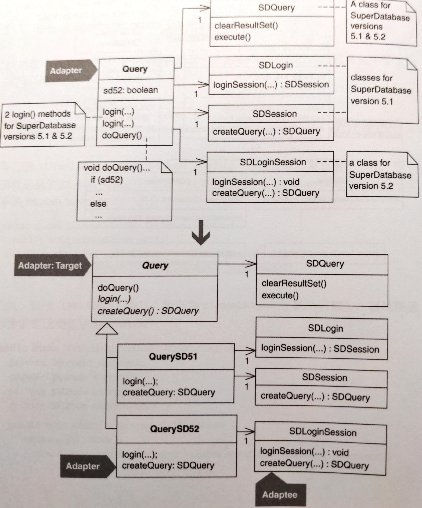
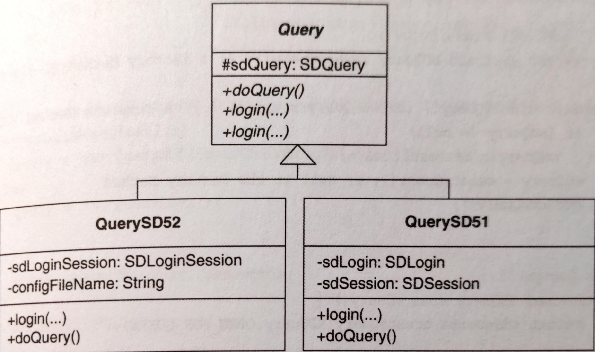

# Extract Adapter




## 動機

軟體時常因為支援某個版本的 component, library 或是 API，設計特定版本的類別和函式。版本眾多的時候這些程式碼就會顯得雜亂。

**Adapter** pattern 可以解決版本問題，方法是讓每個版本的類別各自實作一個共有的介面（通常只有一個）。如此一來，每個類別負責一個版本，客戶碼也很容易切換不同版本的 library 和 API。

**Adapter** 可能會過度配接（adapt too much）。例如客戶碼需要取用 adaptee 的行為卻無能為力，因為客戶只能透過 **Adapter** 來取用 adaptee。這種情況下需要重新設計 **Adapter**。

::: tip Adapter 和 Facade

**Adapter** 和 **Facade** 經常混淆。兩者處理的層次不同，**Adapt** 配接物件，**Facade** 配接整個子系統。

**Facade** 通常用在和既有的系統進行溝通。例如：一個含有上百萬行複雜程式碼的舊系統，它難以擴充或維護。此時可以利用 **Facade** 物件讓新舊系統溝通。團隊可以實作 **Facade** 來重寫舊系統，過程如下：
1. 找出既有系統的子系統
2. 撰寫這個子系統的 **Facade**
3. 撰寫新的客戶端程式，讓他依賴「對 **Facade** 的呼叫」
4. 為每個 **Facade** 產生「使用新技術」的新版本
5. 測試新舊 **Facade** 功能是否相同
6. 更新客戶碼，改用 **Facade**
7. 讓下一個子系統重複這些步驟

:::

::: tip 優點
- 隔離 component, library 和 API 的版本差異
- 讓類別只配接某個東西的一個版本
- 隔離經常變動的程式碼

:::

::: warning 缺點
- 如果 **Adapter** 不提供的話，客戶端就無法取用某些重要行為

:::


## 作法

這項重構有幾種不同作法，取決於程式碼的長相。
- 如果你有一個類別採用許多 **條件邏輯** 來處理多重版本，可以考慮反覆使用 *Replace Conditional with Polymorphism* 建立對應每個版本的 **Adapter**s。
- 如果是一個既有的 **Adapter** 類別以版本專屬的變數和函式支援 library 多重版本，就要用不同方法提取多個 **Adapter**s。針對這種情況，以下是大略作法：

1. 找出一個過度負荷的 adapter，這個類別配接某個東西太多版本
2. 利用 *Extract Subclass* 或 *Extract Class* 建立一個新的 adapter，為了「過度負荷的 adapter」所支援的其中一個服務。將此版本才會用到的每個 instance 變數和函式都複製或搬移到新的 adapter。<br>
    為此可能需要把「過度負荷的 adapter」的幾個 private 成員改成 public 或 protected，也可能需要透過新的 adapter 建構式來初始化某些 instance 變數，並修改新建構式的呼叫者。
3. 重複步驟 2. 直到「過度負荷的 adapter」不再有版本專屬的程式碼為止
4. 使用 *Pull Up Method* 和 [Form Template Method](form-template-method.md) 移除新的 adapters 的任何重複。


## 範例


這是一個真實的專案，使用第三方程式庫來處理資料庫搜尋工作。為了避免侵權，將程式庫名稱改成 `SD` (SuperDatabase)。

1. 先找出過度負荷的 adapter，在這裡是 `Query` 類別支援 SuperDatabase 的 5.1 版和 5.2 版。以下的程式碼要注意與版本有關的 instance 變數、重複的 `login()` 還有 `doQuery()` 中的條件句：

    ```java
    public class Query {
        private SDLogin sdLogin; // needed for SD version 5.1 
        private SDSession sdSession; // needed for SD version 5.1 
        private SDLoginSession sdLoginSession; // needed for SD version 5.2 
        private boolean sd52; // tells if we’re running under SD 5.2 
        private SDQuery sdQuery; // this is needed for SD versions 5.1 & 5.2 
        
        // this is a login for SD 5.1 
        // NOTE: remove this when we convert all aplications to 5.2 
        public void login(String server, String user, String password) throws QueryException { 
            sd52 = false; 
            try { 
                sdSession = sdLogin.loginSession(server, user, password); 
            } 
            catch (SDLoginFailedException lfe) { 
                throw new QueryException(QueryException.LOGIN_FAILED, "Login failure\n" + lfe, lfe); 
            } 
            catch (SDSocketInitFailedException ife) { 
                throw new QueryException(QueryException.LOGIN_FAILED, "Socket fail\n" + ife, ife); 
            } 
        }

        // 5.2 login 
        public void login(String server, String user, String password, String sdConfigFileName) throws QueryException { 
            sd52 = true; 
            sdLoginSession = new SDLoginSession(sdConfigFileName, false); 
            try { 
                sdLoginSession.loginSession(server, user, password); 
            } 
            catch (SDLoginFailedException lfe) { 
                throw new QueryException(QueryException.LOGIN_FAILED, "Login failure\n" + lfe, lfe); 
            } 
            catch (SDSocketInitFailedException ife) { 
                throw new QueryException(QueryException.LOGIN_FAILED, "Socket fail\n" + ife, ife); 
            } 
            catch (SDNotFoundException nfe) { 
                throw new QueryException(QueryException.LOGIN_FAILED, "Not found exception\n" + nfe, nfe); 
            } 
        } 
        
        public void doQuery() throws QueryException { 
            if (sdQuery != null) 
                sdQuery.clearResultSet(); 
            
            if (sd52) 
                sdQuery = sdLoginSession.createQuery(SDQuery.OPEN_FOR_QUERY); 
            else 
                sdQuery = sdSession.createQuery(SDQuery.OPEN_FOR_QUERY); 
            
            executeQuery();
        }
    }
    ```
2. 由於 `Query` 還沒有 subclasses，決定使用 *Extract Subclass* 來區隔「處理 SuperDatabase 5.1 查詢工作」的程式碼。第一步是定義 subclass 並為它產生一個建構式：

    ```java{1-5}
    class QuerySD51 extends Query { 
        public QuerySD51() { 
            super(); 
        } 
    }
    ```

    接下來尋找客戶碼對 `Query` 建構式的每個呼叫，改成 `QuerySD51` 建構式。例如：

    ```java
    public void loginToDatabase(String db, String user, String password) {
        query = new Query(); 
        try { 
            if (usingSDVersion52()) { 
                query.login(db, user, password, getSD52ConfigFileName()); // Login to SD 5.2 
            } else {
               query.login(db, user, password); // Login to SD 5.1 
            } 
            // ... 
        } catch(QueryException qe) {
            // ...
        }
    }
    ```

    改成：

    ```java{2,5,8}
    public void loginToDatabase(String db, String user, String password) {
        // query = new Query(); 
        try { 
            if (usingSDVersion52()) { 
                query = new Query(); 
                query.login(db, user, password, getSD52ConfigFileName()); // Login to SD 5.2 
            } else { 
                query = new QuerySD51(); 
                query.login(db, user, password); // Login to SD 5.1 
            } 
            // ... 
        } catch(QueryException qe) {
            // ...
        }
    }
    ```

    接下來使用 *Push Down Method* 和 *Push Down Field* 讓 `QuerySD51` 擁有所需的函式和 instance 變數。這個步驟需要小心考慮呼叫 public `Query` 函式的客戶碼，因為如果把 public 函式從 `Query` 移到 `QuerySD51`，呼叫者將無法在呼叫它。除非把型別改成 `QuerySD51`，但在這邊不想這麼做，因此小心的修改和複製 public 函式。不用擔心難免產生重複碼，會在重構的最後再消除它。

    ```java{2-5,7-9,14-17,23-34,40-43}
    class Query {
        // ...
        // private SDLogin sdLogin; 
        // private SDSession sdSession; 
        protected SDQuery sdQuery; // this is a login for SD 5.1 

        public void login(String server, String user, String password) throws QueryException { 
            // I make this a do-nothing method 
        } 
        public void doQuery() throws QueryException { 
            if (sdQuery != null) 
                sdQuery.clearResultSet();
            
            // if (sd52) 
            sdQuery = sdLoginSession.createQuery(SDQuery.OPEN_FOR_QUERY); 
            // else 
            //     sdQuery = sdSession.createQuery(SDQuery.OPEN_FOR_QUERY); 
            
            executeQuery(); 
        } 

        class QuerySD51 { 
            private SDLogin sdLogin; 
            private SDSession sdSession; 
            public void login(String server, String user, String password) throws QueryException { 
                // sd52 = false; 
                try { 
                    sdSession = sdLogin.loginSession(server, user, password); 
                } catch (SDLoginFailedException lfe) { 
                    throw new QueryException(QueryException.LOGIN_FAILED, "Login failure\n" + lfe, lfe); 
                } catch (SDSocketInitFailedExceptio n ife) { 
                    throw new QueryException(QueryException.LOGIN_FAILED, "Socket fail\n" + ife, ife); 
                } 
            } 
        
            public void doQuery() throws QueryException { 
                if (sdQuery != null)
                    sdQuery.clearResultSet(); 
                
                // if (sd52) 
                //     sdQuery = sdLoginSession.createQuery(SDQuery.OPEN_FOR_QUERY); 
                // else 
                sdQuery = sdSession.createQuery(SDQuery.OPEN_FOR_QUE RY); 
                
                executeQuery(); 
            } 
        }
    }
    ```
3. 接下來，重複步驟 2. 產生 `QuerySD52`。順著做下去可以把 `Query` 類別設定成 abstract 並帶有 `doQuery()`，如下圖：

    

    此時 `Query` 不再有版本專屬的程式碼，卻存在重複碼。
4. 這一步要消除重複碼。例如在 `doQuery()` 中：
   
    ```java{10,20}
    abstract class Query {
        public abstract void doQuery() throws QueryException;
    }

    class QuerySD51 {
        public void doQuery() throws QueryException { 
            if (sdQuery != null) 
                sdQuery.clearResultSet();

            sdQuery = sdSession.createQuery(SDQuery.OPEN_FOR_QUERY); 
            executeQuery();        
        } 
    }

    class QuerySD52 {
        public void doQuery() throws QueryException { 
            if (sdQuery != null) 
                sdQuery.clearResultSet(); 
            
            sdQuery = sdLoginSession.createQuery(SDQuery.OPEN_FOR_QUERY); 
            executeQuery(); 
        }
    }
    ```

    這兩個函式以不同方式初始化 `sdQuery` 實體，可以實施 [Introduce Polymorphic Creation with Factory Method](../ch6/introduce-polymorphic-creation-with-factory-method.md) 和 [Form Template Method](../ch8/form-template-method.md) 為 `doQuery()` 建立 superclass 中的單一版本。

    ```java
    public abstract class Query {
        protected abstract SDQuery createQuery(); // a Factory Method [DP] 
        public void doQuery() throws QueryException { 
            // a Template Method [DP] 
            if (sdQuery != null) 
                sdQuery.clearResultSet(); 
            
            sdQuery = createQuery(); // call to the Factory Method 
            executeQuery(); 
        }
    }

    class QuerySD51 {
        protected SDQuery createQuery() { 
            return sdSession.createQuery(SDQuery.OPEN_FOR_QUERY); 
        } 
    }
    
    class QuerySD52 {
        protected SDQuery createQuery() { 
            return sdLoginSession.createQuery(SDQuery.OPEN_FOR_QUERY); 
        }
    }
    ```

    `Query` 仍然內含 SD 5.1 和 5.2 的 `login()` 函式，即使它們已經不再做任何事情。這兩個簽名式幾乎相同，只差在其中一個多了一個參數：

    ```java
    // SD 5.1 login 
    public void login(String server, String user, String password) throws QueryException... 
    
    // SD 5.2 login 
    public void login(String server, String user, String password, String sdConfigFileName ) throws QueryException...
    ```

    我決定讓 `login()` 簽名式相同，作法是經由 `QuerySD52` 建構式提供 `sdConfigFileName` 資訊給 `QuerySD52`：

    ```java
    class QuerySD52 {
        private String sdConfigFileName; 
        public QuerySD52(String sdConfigFileName) { 
            super(); 
            this.sdConfigFileName = sdConfigFileName; 
        }
    }
    ```

    現在 `Query` 只有一個 abstract `login()`：

    ```java
    abstract class Query {
        public abstract void login(String server, String user, String password) throws QueryException...
    }
    ```

    客戶碼更新如下：

    ```java
    public void loginToDatabase(String db, String user, String password) {
        if (usingSDVersion52()) 
            query = new QuerySD52(getSD52ConfigFileName()); 
        else 
            query = new QuerySD51(); 
            
        try { 
            query.login(db, user, password); 
            // ... 
        } catch(QueryException qe) {
            // ...  
        }
    }
    ```

    幾乎要完成了。由於 `Query` 是一個抽象類別，因此改名成 `AbstractQuery` 更反映它的本質。但是改名之後，客戶碼勢必改成宣告型別 `AbstractQuery` 而非 `Query`。為了不這麼做，在 `AbstractQuery` 實施 *Extract Interface* 獲得一個可讓 `AbstractQuery` 實作的 `Query` interface：

    ```java
    interface Query { 
        public void login(String server, String user, String password) throws QueryException; 
        public void doQuery() throws QueryException; 
    }
    
    abstract class AbstractQuery implements Query {
        // public abstract void login(String server, String user, String password) throws QueryException ...
    }
    ```

    現在，`AbstractQuery` 的子類別實作 `login()`，而 `AbstractQuery` 甚至不需要宣告 `login()`，因為它是個 abstract class。此時每個 SuperDatabase 版本都完成配接工作。程式碼變小，且用更一致的方法處理每個版本，讓以下更容易進行：
    - 檢查版本相似與相異
    - 移除對「舊有、不再使用的版本」的支援
    - 增加對新版本的支援


## 變體

### 以 Anonymous Inner Classes 完成配接

Java 第一版 JDK 1.0 有一個 `Enumeration` 的 interface，主要用來遍歷群集（collections），例如 `Vector` 和 `Hashtable`。

後來的 JDK 加入更多更好的 collections 類別和一個 `Iterator` 的新 interface。

為了讓新版的 JDK 能夠和「用 `Enumeration` 寫成的程式碼」互相操作， JDK 提供下列 Creation Method，使用 anonymous inner classes 完成「用 `Enumeration` 配接 `Iterator`」：

```java
public class Collections {
    public static Enumeration enumeration(final Collection c) { 
        return new Enumeration() { 
            Iterator i = c.iterator(); 
            
            public boolean hasMoreElements() { 
                return i.hasNext(); 
            } 
            
            public Object nextElement() { 
                return i.next(); 
            }
        }
    }
}
```
