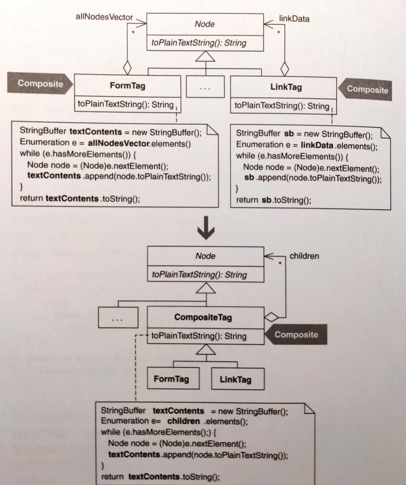

# Extract Composite

抽出一個 superclass，由 subclasses 來實作 **Composite**。




## 動機

這項重構本質上和 *Extract Superclass* 一樣：如果有兩個特徵接近的 class，可以把共同部份抽取成為 superclass 來移除重複碼。如果有很多行為可以抽取成 superclass，但與 **Composite** 無關，則可以使用上提邏輯（pull-up logic）。

::: tip 優點
- 消除重複的 child-storage 和 child-handling 邏輯。
- 有效傳達「child-handling 邏輯可被繼承」的事實。

:::


## 作法

以下作法建立在 *Extract Superclass* 的作法基礎上。

1. 建立一個 composite，其命名必須反映出它打算包含哪一種 children。
2. 讓某個 child container 都成為 composite 的 subclass。
    - Child container：繼承體系的某個 class，含有重複的 child-handling 程式碼。
3. 在 child container 內找出 child-processing 函式，它在 child containers 之間全部重複或部份重複。
    - 全部重複：在 child containers 內擁有相同的函式本體，但函式名稱不一定相同。
        1. 使用 *Pull Up Field* 將函式用到的 child collection 欄位移到前面建立的 composite 內。
        2. 如果名稱並非對所有 child containers 都有意義，就改變名稱。
        3. 實施 *Pull Up Method* 將函式上移到 composite。
        4. 如果該函式倚賴 child containers 內的建構式，就把建構式內的程式碼上移到 composite 內的建構式。
    - 部份重複：在 child containers 內有共同和非共同的程式碼，函式名稱也不一定相同。
        1. 先看看是否能用 *Substitute Algorithm* 讓其函式本體在所有 child containers 中一致。
        2. 如果可以，就把它重構成全部重複函式。
        3. 如果不行，就用 *Extract Method* 把所有 child containers 中共同程式碼 *Pull Up Method* 到 composite。
        4. 如果函式本體遵循相同的步驟順序，但其中幾個實作不相同，看看能不能用 *Form Template Method*。
4. 對 child containers 中「全部重複或部份重複」的程式碼的 child-processing 函式重複進行步驟 3.
5. 檢查每個 child container 的每個客戶，看看能不能用 composite 介面來和 child container 溝通。如果可以就這樣做。


## 範例

範例是 HTML Parser。例如：

```html
<HTML>
    <BODY> Hello, and welcome to my Web page! I work for 
        <A HREF="http://industriallogic.com"> 
             
        </A> 
    </BODY> 
</HTML>
```

將由 parser 產生以下型別的物件：
- `Tag`
- `StringNode`
- `LinkTag`

每個標籤都有 child，它們都是 child containers。原本程式碼：

```java
public class LinkTag extends Tag {
    // ...
    private Vector nodeVector; 
    public String toPlainTextString() { 
        StringBuffer sb = new StringBuffer(); 
        Node node; 
        for (Enumeration e = linkData(); e.hasMoreElements();) {
            node = (Node)e.nextElement();
            sb.append(node.toPlainTextString()); 
        } 
        return sb.toString(); 
    }
}

public class FormTag extends Tag {
    // ...
    protected Vector allNodesVector; 
    public String toPlainTextString() { 
        StringBuffer stringRepresentation = new StringBuffer(); 
        Node node; 
        for (Enumeration e = getAllNodesVector().elements(); e.hasMoreElements();) { 
            node = (Node)e.nextElement(); 
            stringRepresentation.append(node.toPlainTextString()); 
        } 
        return stringRepresentation.toString(); 
    }
}
```

觀察：
- 它們都有 children，所以都有 `Vector` 來放置物件。
- 它們都有 `toPlainTextString()` 來輸出文字。

這導致了重複碼。

以下開始重構：

1. 建立一個 abstract class：
    ```java
    public abstract class CompositeTag extends Tag { 
        public CompositeTag(int tagBegin, int tagEnd, String tagContents, String tagLine) { 
            super(tagBegin, tagEnd, tagContents, tagLine); 
        }
    }
    ```
2. 讓 child containers 成為 `CompositeTag` 的 subclasses：
    ```java
    public class LinkTag extends CompositeTag {...}
    public class FormTag extends CompositeTag {...}
    ```
3. 在所有 child containers 中尋找完全重複的函式：`toPlainTextString()`。將用來儲存 child 的 `Vector` 往上提：
    ```java
    public abstract class CompositeTag extends Tag { 
        protected Vector nodeVector; // pulled-up field  
    }

    public class LinkTag extends CompositeTag {
        // private Vector nodeVector; // deleted
    }

    public class FormTag extends CompositeTag {
        // protected Vector nodeVector; // deleted
    }
    ```

    因為 `nodeVector` 名稱太爛，所以 rename：

    ```java
    public abstract class CompositeTag extends Tag {
        // protected Vector nodeVector; 
        protected Vector children;
    }
    ```

    現在要對 `toPlainTextString()` 往上提取：

    ```java
    public class LinkTag extends CompositeTag {
        public Enumeration linkData() { 
            return children.elements(); 
        } 
        public String toPlainTextString() {
            // ...
            for (Enumeration e = linkData(); e.hasMoreElements();) 
                // ...
        } 
    }
    
    public class FormTag extends CompositeTag {
        public Vector getAllNodesVector() { 
            return children; 
        } 
        public String toPlainTextString() {
            // ...
            for (Enumeration e = getAllNodesVector().elements(); e.hasMoreElements();) 
                // ...
        }
    }
    ```

    問題：兩個並非完全相同，`LinkTag` 使用 `linkData()` 取得 children 迭代器，而 `FormTag` 使用 `getAllNodesVector()`。

    為此先建立一個一致的函式來存取 children：

    ```java{3-5}
    public abstract class CompositeTag extends Tag {
        // ...
        public Enumeration children() { 
            return children.elements();
        }
    }
    ```

    接著再讓 `LinkTag` 和 `FormTag` 實作它。
4. 針對其他能從 child containers 上提到 composite 的函式重複步驟 3。以下以 `toHTML()` 為例。

    以下是 `LinkTag` 如何實作：
    ```java
    public class LinkTag extends CompositeTag {
        public String toHTML() { 
            StringBuffer sb = new StringBuffer();
            putLinkStartTagInto(sb); 
            Node node; 
            for (Enumeration e = children(); e.hasMoreElements();) { 
                node = (Node)e.nextElement(); 
                sb.append(node.toHTML()); 
            } 
            sb.append("</A>"); 
            return sb.toString(); 
        } 
        
        public void putLinkStartTagInto(StringBuffer sb) { 
            sb.append("<A "); 
            String key, value; 
            int i = 0; 
            for (Enumeration e = parsed.keys(); e.hasMoreElements();) { 
                key = (String)e.nextElement(); 
                i++; 
                if (key!=TAGNAME) { 
                    value = getParameter(key); 
                    sb.append(key + "=\"" + value + "\""); 

                    if (i < parsed.size()-1) 
                        sb.append(" "); 
                } 
            } 
            sb.append(">"); 
        }
    }
    ```

    以下是 `FormTag` 如何實作：
    ```java
    public class FormTag extends CompositeTag {
        public String toHTML() { 
            StringBuffer rawBuffer = new StringBuffer(); 
            Node node,prevNode = ; 
            rawBuffer.append("<FORM METHOD=\"" + formMethod + "\" ACTION=\"" + formURL + "\""); 
            
            if (formName!=null && formName.length()>0) 
                rawBuffer.append(" NAME=\"" + formName + "\""); 
            
            Enumeration e = children.elements(); 
            node = (Node)e.nextElement(); 
            Tag tag = (Tag)node;
            Hashtable table = tag.getParsed(); 
            String key, value; 
            for (Enumeration en = table.keys(); en.hasMoreElements();) { 
                key = (String)en.nextElement(); 
                if (!(key.equals("METHOD") || key.equals("ACTION") || key.equals("NAME") || key.equals(Tag.TAGNAME))) { 
                    value = (String)table.get(key); 
                    rawBuffer.append(" " + key + "=" + "\"" + value + "\""); 
                } 
            } 
            rawBuffer.append(">"); 
            rawBuffer.append(lineSeparator); 
            
            for (;e.hasMoreElements();) { 
                node = (Node)e.nextElement(); 
                if (prevNode != null) { 
                    if (prevNode.elementEnd() > node.elementBegin()) { 
                        // It’s a new line 
                        rawBuffer.append(lineSeparator); 
                    } 
                } 
                
                rawBuffer.append(node.toHTML()); 
                prevNode = node; 
            }

            return rawBuffer.toString(); 
        }
    }
    ```

    這兩段不完全相同，因此考慮看看能不能使用 *Substitute Algorithm*。結果是可以，因為這兩個 `toHTML()` 本質上做了相同的三件事：
    1. 輸出帶有任意屬性的 start 標籤
    2. 輸出任意 child 標籤
    3. 輸出 close 標籤

    因此，寫一個用來處理 start 標籤的共同函式，並且 *Pull Up* 到 `CompositeTag`：
    ```java{2-18,24,32}
    public abstract class CompositeTag extends Tag {
        public void putStartTagInto(StringBuffer sb) { 
            sb.append("<" + getTagName() + " ");
            String key, value; 
            int i = 0; 
            for (Enumeration e = parsed.keys(); e.hasMoreEle ments();) { 
                key = (String)e.nextElement(); 
                i++; 
                if (key != TAGNAME) { 
                    value = getParameter(key); 
                    sb.append(key + "=\"" + value + "\""); 
                    
                    if (i < parsed.size()) 
                        sb.append(" "); 
                } 
            } 
            sb.append(">"); 
        }
    }
        
    public class LinkTag extends CompositeTag {
        public String toHTML() { 
            StringBuffer sb = new StringBuffer();
            putStartTagInto(sb); 
            // ...
        }
    }

    public class FormTag extends CompositeTag {
        public String toHTML() { 
            StringBuffer rawBuffer = new StringBuffer();
            putStartTagInto(rawBuffer);
            // ...
        }
    }
    ```

    繼續重複類似步驟，最後如下：
    ```java
    public abstract class CompositeTag extends Tag {
        public String toHTML() { 
            StringBuffer htmlContents = new StringBuffer(); 
            putStartTagInto(htmlContents); 
            putChildrenTagsInto(htmlContents); 
            putEndTagInto(htmlContents); 
            return htmlContents.toString(); 
        }
    }
    ```
5. 最後的步驟要檢查客戶碼來看看是否能用 `CompositeTag` 介面來和 child containers 溝通。本例沒有這種情況，因此完成重構。
