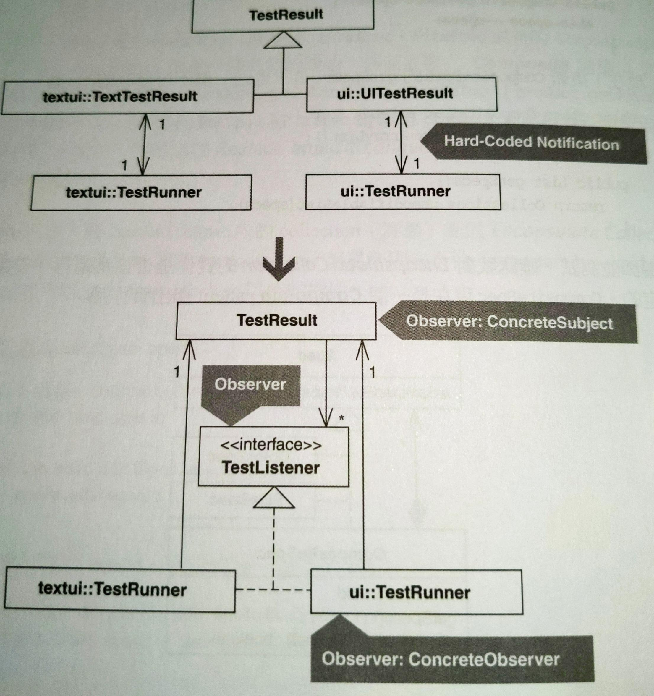
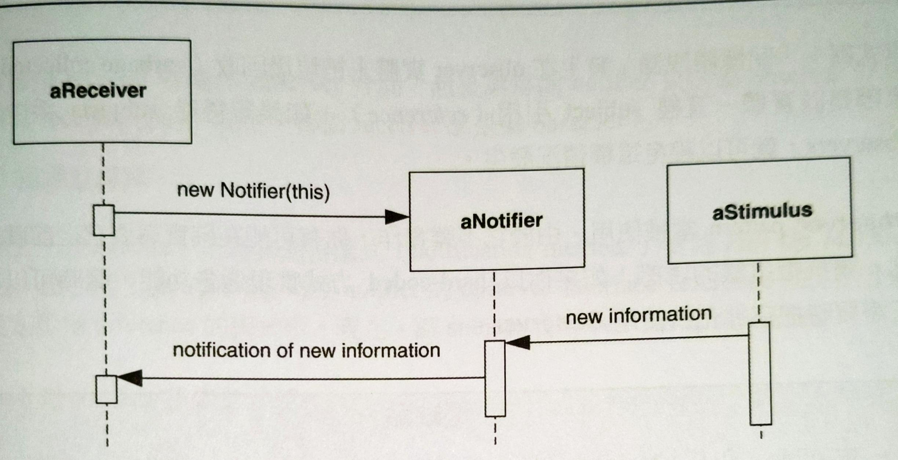

# Replace Hard-Coded Notifications with Observer

以 **Observer** pattern 取代寫死的通知行為。

問題：子類別 hard-coded 通知另一個類別的單一實體。

解法：移除子類別，方式是讓它們的超類別能夠通知「實現 **Observer** 介面」的任何類別的一個或多個實體。




## 動機

何時不需要 **Observer**？考慮以下情況：`Receiver` 類別的單個實體在 `Notifier` 類別實體有改變的同時變更，如下圖：



此例的 `Notifier` 實體持有一個 `Receiver` reference，並且被寫死為「當收到新資訊時就通知那個 reference」。當一個 `Notifier` 實體必須通知唯一一個 `Receiver` 實體時，上述 `Notifier` 和 `Receiver` 之間的緊密耦合（tight coupling）是合理的。但如果 `Notifier` 實體需要通知多個 `Receiver` 實體時，這個設計必須改善。

**Observer** pattern 的實作讓 subject 和其 observers 之間保持鬆散耦合（loose coupling）。任何類別如果想被告知新的資訊，只需要實作 **Observer** 介面並將自己註冊到 subject。Subject 內部持有一群「實現了 **Observer** 介面」的實體，一旦發生變更就依序通知它們。

扮演 subject 角色的類別必須提供「允許外界加入 observers」的函式，但可以自由決定是否提供「移除現有 observers」的函式。如果 subject 實體存活期間從來不需要移除 observers，當然不需要實作那樣的函式。這個基本常識卻讓許多程式設計師掉入陷阱，完全以他們看到的類別圖結構來實現它。

如果涉及串聯式通知（cascading notification）和記憶體洩漏（memory leak），請注意兩個常見的 **Observer** 實作問題。
- 「串聯式通知」發生在 subject 通知 observer 而那個 observer 又扮演 subject 的角色通知其他 observers。這會造成設計過度複雜且難以除錯。
  - 實作一個 **Mediator** 有助於改善這樣的程式碼。
- 「記憶體洩漏」發生在 observer 實體沒有被回收，原因是該實體一直被 subject 引用。如果記得從 subjects 手中移除 observers，就可以避免這種情況發生。

**Observer** pattern 常被使用。由於它不難實作，你有可能在確實需要它之前就用上。請抗拒這樣的誘惑！如果你以寫死的方式實現通知功能，隨時可以在需要時把它重構成 **Observer**。

::: tip 優點
- 讓 subject 和其 observers 之間形成鬆散耦合的關係。
- 支援一個或多個 observers。

:::

::: warning 缺點
- 如果 hard-coded 通知就滿足需求，這會讓設計變得更複雜。
- 如果你有串聯式通知，這會讓設計變得更複雜。
- 如果沒從 subjects 中移除 observers，會導致記憶體洩漏。

:::


## 作法

定義：
- Notifier：「指涉並通知另一個類別」的類別。
- Receiver：「將自己註冊到 notifier 並從其中接收訊息」的類別。

這項重構詳述幾個步驟，用來消除不必要的 notifier，方法是讓這些 notifiers 的 superclass 變成一個 subject (ConcreteSubject)，以及把 receivers 變成 observers (ConcreteObservers)。

 1. 如果 notifier 對其 receiver 進行自訂行為而不是執行單純的通知邏輯，請實施 *Move Method* 將此行為移到 notifier 的 receiver 中。完成後的 notifier 只包含通知函式（用來通知 receiver）。對所有 notifiers 重複此步驟。
 2. 在 receiver 身上實施 *Extract Interface* 產生一個 observer 介面，只挑選那些被 notifier 呼叫的函式放上去。如果其他 notifiers 並非透過 observer 介面來呼叫 receiver 的某些函式，就把那些函式加到 observer 介面，以便這個介面能被所有 receivers 用上。
 3. 讓每個 receiver 都實作 observer 介面。然後讓每個 notifier 只透過 observer 介面與其 receiver 聯絡。現在，每個 receiver 都是個 observer。
 4. 選出一個 notifier，並為它的通知函式（notification methods）實施 *Pull Up Method*，這包括 pulling up notifier 的 observer interface reference，還有用來設定那個 reference 的程式碼。現在，讓 subject 成為 notifier 的 superclass。為所有 notifiers 重複此步驟。
 5. 讓每一個 notifier 的 observer 改成向 subject 註冊並與 subject 交流，而不是與 notifier 交流，然後刪除 notifier。
 6. 重構 subject，讓它持有一群 observers 而不是只持有一個 observer。這包括更新「observers 把自己註冊到 subject」的函式。
    常見作法是在 subject 身上建立一個函式用來增加 observers（e.g. `addObserver(Observer observer)`）。最後，更新 subject，讓其通知函式通知他的 observers collection 內的所有 observers。


## 範例


JUnit 2.x 作者定義了兩個 `TestResult` 子類別，分別是 `UITestResult` 和 `TextTestResult`。兩者都是 **Collecting Parameters**（請參考：[*Move Accumulation to Collecting Parameter*](../ch10/move-accumulation-to-collecting-parameter.md)）。

`TestResult` 子類別用來從 test case 物件中蒐集資訊（測試通過或失敗等等），為的是回報資訊給 `TestRunner`，這是一個用來將測試結果顯示在螢幕的類別。`UITestResult` 類別被寫死成「將資訊回報給一個 Java Abstract Window Toolkit (AWT) `TestRunner`」，`TextTestResult` 則被寫死成「將資訊回報給一個 console-based `TestRunner`」。下面是 `UITestResult` 類別的部份內容，還有它和 `TestRunner` 之間的連結關係：

```java{2-4,8,19,24,25,30}
class UITestResult extends TestResult { 
    private TestRunner fRunner; UITestResult( TestRunner runner ) {
        fRunner= runner; 
    } 
    
    public synchronized void addFailure(Test test, Throwable t) { 
        super.addFailure(test, t); 
        fRunner.addFailure(this, test, t); // notification to TestRunner 
    } 
    // ... 
} 
```

```java
package ui; 

public class TestRunner extends Frame { // TestRunner for AWT 
    private TestResult fTestResult; 
    // ... 
    protected TestResult createTestResult() { 
        return new UITestResult(this); // hard-coded to UITestResult 
    } 
    
    synchronized public void runSuite() { 
        // ... 
        fTestResult = createTestResult(); 
        testSuite.run( fTestResult ); 
    } 
    
    public void addFailure(TestResult result, Test test, Throwable t) { 
        // ... 
        // display the failure in a graphical AWT window 
    } 
}
```

這個設計十分簡單又美好。在 JUnit 發展階段中如果「`TestResult`/`TestRunner` 通知」採用 **Observer** pattern 來設計，會造成較多不必要的設計複雜度。然而當 JUnit 用戶要求能夠在執行期以多物件同時監測（觀察）一個 `TestResult` 時，情況有了改變。這時 `TestRunner` 實體和 `TestResult` 實體之間寫死的關係不再能夠勝任。為了讓 `TestResult` 實體支援多個 observers，實作 **Observer** pattern 是必要的。

這個改變是一種重構還是強化？
- 讓 JUnit 的 `TestRunner` 實體依賴一份 **Observer** pattern 實作而不是以寫死的方式依賴特定 `TestResult` 子類別，並不會改變 `TestRunner` 實體的行為，只會讓它們與 `TestResult` 之間保持更鬆散耦合。
- 從另一個角度看，讓 `TestResult` 類別持有一組 observers 而非只是單一 observer，會產生新的行為。因此在這個範例中，**Observer** pattern 的實作既是重構也是強化。然而此處實質上是進行重構，強化純粹是導入 **Observer** pattern 的結果

1. 第一步是要確認每個 notifier 都只實作通知函式，而不是對 receiver 執行自訂行為。`UITestResult` 是如此，但 `TextTestResult` 卻不是，它呼叫 Java 的 `System.out.println()` 把測試結果顯示在 console，而非通知 `TestRunner`：

    ```java{5,10}
    public class TextTestResult extends TestResult {
        // ...
        public synchronized void addError(Test test, Throwable t) { 
            super.addError(test, t); 
            System.out.println("E"); 
        } 
        
        public synchronized void addFailure(Test test, Throwable t) { 
            super.addFailure(test, t); 
            System.out.print("F"); 
        }
    }
    ```

    實施 *Move Method*，讓 `TextTestResult` 擁有純粹的通知函式，同時將自訂行為移到相應的 `TestRunner` 中：

    ```java{5,7-9,13}
    package textui; 
    
    public class TextTestResult extends TestResult {
        // ... 
        private TestRunner fRunner; 
        
        TextTestResult( TestRunner runner ) { 
            fRunner= runner; 
        } 
        
        public synchronized void addError(Test test, Throwable t) { 
            super.addError(test, t); 
            fRunner.addError(this, test, t); 
        }
    }
    ```
    
    ```java{9-12}
    package textui;

    public class TestRunner {
        // ...
        protected TextTestResult createTestResult() { 
            return new TextTestResult( this ); 
        } 
        
        // moved method 
        public void addError(TestResult testResult, Test test, Throwable t) { 
            System.out.println("E"); 
        }
    // ...
    }
    ```

    現在，`TextTestResult` 通知其 `TestRunner`，而 `TestRunner` 把資訊顯示在螢幕。
2. 現在，我想建立一個名叫 `TestListener` 的 observer interface。為了建立它，我在「與 `TextTestResult` 相應」的 `TestRunner` 上實施 *Extract Interface*。為了決定這個新的 interface 涵蓋哪些函式，我必須知道 `TextTestResult` 呼叫 `TestRunner` 的哪些函式：

    ```java{4,9,14}
    class TextTestResult extends TestResult {
        public synchronized void addError(Test test, Throwable t) { 
            super.addError(test, t); 
            fRunner.addError(this, test, t); 
        } 
        
        public synchronized void addFailure(Test test, Throwable t) { 
            super.addFailure(test, t); 
            fRunner.addFailure(this, test, t); 
        } 
        
        public synchronized void startTest(Test test) { 
            super.startTest(test); 
            fRunner.startTest(this, test); 
        }
    }
    ```

    給定這些資訊，我抽取出這樣的 interface:

    ```java
    public interface TestListener { 
        public void addError(TestResult testResult, Test test, Throwable t); 
        public void addFailure(TestResult testResult, Test test, Throwable t); 
        public void startTest(TestResult testResult, Test test);
    } 

    public class TestRunner implements TestListener ...
    ```

    現在，檢視其他 notifier (`UITestResult`)，看會不會繞過 `TestListener` interface 呼叫其他 `TestRunner` 函式。結果有，它覆寫了一個名叫 `endTest(...)` 的 `TestResult` 函式：

    ```java{7}
    package ui; 
    
    class UITestResult extends TestResult {
        // ...
        public synchronized void endTest(Test test) { 
            super.endTest(test); 
            fRunner.endTest(this, test); 
        }
    }
    ```

    這讓我去更新 `TestListener`：

    ```java
    public interface TestListener {
        // ...
        public void endTest(TestResult testResult, Test test);
    }
    ```

    進行編譯發現失敗，因為 `TextTestResult` 的 `TestRunner` 實作 `TestListener` 介面卻沒有宣告 `endTest(...)`。把這個函式加入 `TestRunner` 就能搞定：

    ```java{3,4}
    public class TestRunner implements TestListener {
        // ...
        public void endTest(TestResult testResult, Test test) { 
        }
    }
    ```
3. 現在，我必須讓 `UITestResult` 相應的 `TestRunner` 實作出 `TestListener`，並且讓 `TextTestResult` 和 `UITestResult` 都使用 `TestListener` 介面來和它們的 `TestRunner` 介面交流：
    ```java
    public class TestRunner extends Frame implements TestListener {
        // ...
    } 
        
    class UITestResult extends TestResult {
        // ...
        protected TestListener fRunner;

        UITestResult( TestListener runner) { 
            fRunner= runner; 
        }
    }

    public class TextTestResult extends TestResult {
        // ...
        protected TestListener fRunner; 
        
        TextTestResult( TestListener runner) { 
            fRunner = runner; 
        }
    }
    ```
4. 現在，對 `TextTestResult` 和 `UITestResult` 的每個通知函式實施 *Pull Up Method*。這不好處理，因為要 pull up 的函式已經存在 `TestResult`，而 `TestResult` 是 `TextTestResult` 和 `UITestResult` 的超類別。
    
    為了正確進行，我必須將 `TestResult` 子類別的程式碼合併到 `TestResult`：

    ```java{3,5-8,19,24,28,33}
    public class TestResult {
        // ... 
        protected TestListener fRunner; 
        
        public TestResult(TestListener runner) { 
            this(); 
            fRunner = runner;
        } 

        public TestResult() { 
            fFailures= new Vector(10); 
            fErrors = new Vector(10); 
            fRunTests= 0; 
            fStop = false; 
        } 
        
        public synchronized void addError(Test test, Throwable t) { 
            fErrors.addElement(new TestFailure(test, t)); 
            fRunner.addError(this, test, t); 
        } 
        
        public synchronized void addFailure(Test test, Throwable t) { 
            fFailures.addElement(new TestFailure(test, t)); 
            fRunner.addFailure(this, test, t); 
        } 
        
        public synchronized void endTest(Test test) { 
            fRunner.endTest(this, test); 
        } 
        
        public synchronized void startTest(Test test) { 
            fRunTests++; 
            fRunner.startTest(this, test); 
        }
    }
    ```

    ```java
    package ui;

    class UITestResult extends TestResult {
    } 
    ```

    ```java
    package textui; 

    class TextTestResult extends TestResult {
    }
    ```
5. 現在，我可以更新 `TestRunner` 實體，讓它們直接和 `TestResult` 運作。例如下面對 `textui.TestRunner` 所作的變更：

    ```java{5-7,11}
    package textui; 

    public class TestRunner implements TestListener {
        // ...
        protected TestResult createTestResult() { 
            return new TestResult(this) ; 
        } 
        
        protected void doRun(Test suite, boolean wait) {
            // ...
            TestResult result = createTestResult();
        }
    }
    ```

    對 `ui.TestRunner` 進行類似的變更。最後，刪除 `TextTestResult` 和 `UITestResult`。編譯成功，測試卻失敗。除錯之後發現 `fRunner` 沒有初始化時，對 `TestResult` 所做的變更會導致 `NullPointerException`。這個情況只在呼叫 `TestResult` 的原本建構式時發生，因為那個建構式沒有初始化 `fRunner`。修正方式是以條件邏輯隔離所有對 `fRunner` 的呼叫：

    ```java{5,11}
    public class TestResult {
        // ...
        public synchronized void addError(Test test, Throwable t) { 
            fErrors.addElement(new TestFailure(test, t)); 
            if (null != fRunner) 
                fRunner.addError(this, test, t); 
        } 
        
        public synchronized void addFailure(Test test, Throwable t) { 
            fFailures.addElement(new TestFailure(test, t)); 
            if (null != fRunner) 
                fRunner.addFailure(this, test, t); 
        }
    }
    ```

    順利通過測試，兩個 `TestRunner` 都成為 `TestResult` 的 observers。這時候可以刪除 `TextTestResult` 和 `UITestResult`，因為它們都不會再被用到。
6. 更新 `TestResult`，讓它能夠持有並通知一個或多個 observers。方式如下：

    先建立一個 `ArrayList`：

    ```java
    public class TestResult {
        // ...
        private List observers = new ArrayList();
    }
    ```

    提供一個函式，讓所有 observers 以這個函式註冊：

    ```java{3-5}
    public class TestResult {
        // ...
        public void addObserver(TestListener testListener) { 
            observers.add(testListener); 
        }
    }
    ```

    更新 `TestResult` 的通知函式，讓它們與 observers 共同運作：

    ```java{5-8}
    public class TestResult {
        // ...
        public synchronized void addError(Test test, Throwable t) { 
            fErrors.addElement(new TestFailure(test, t)); 
            for (Iterator i = observers.iterator(); i.hasNext();) { 
                TestListener observer = (TestListener)i.next(); 
                observer.addError(this, test, t); 
            } 
        }
    }
    ```

    最後，更新 `TestRunner` 實體，讓它們使用新的 `addObserver()` 而不是呼叫 `TestResult` 建構式：

    ```java{6-8}
    package textui; 
    
    public class TestRunner implements TestListener {
        // ...
        protected TestResult createTestResult() { 
            TestResult testResult = new TestResult(); 
            testResult.addObserver(this); 
            return testResult; 
        }
    }
    ```

    確定它們都運作正常後，刪除 `TestResult` 不再用到的建構式：

    ```java
    public class TestResult {
        // ...
        // public TestResult(TestListener runner) { 
        //     this(); 
        //     fRunner = runner; 
        // }
    }
    ```

    完成重構，`TestResult` 不再以寫死的方式通知特定的某個 `TestRunner` 實體，而 `TestResult` 可以管理多個 observers。
