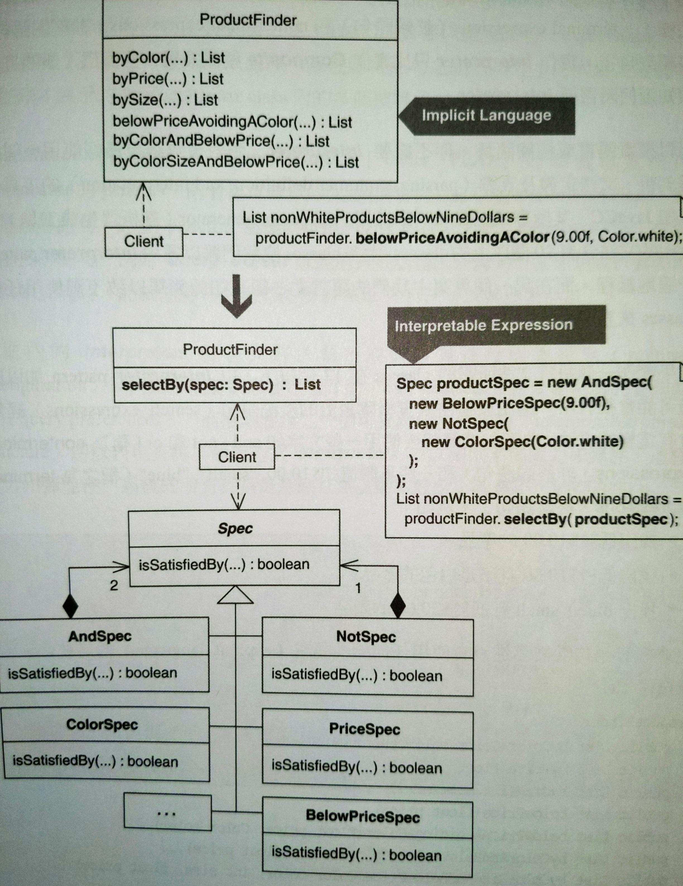
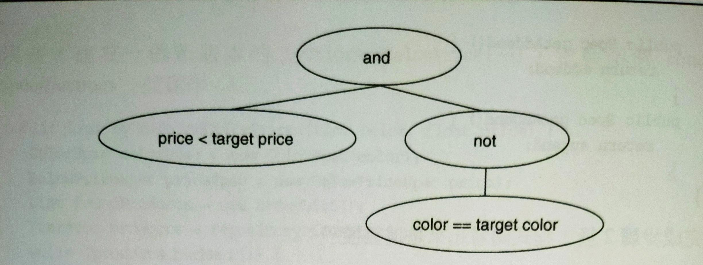

# Replace Implicit Language with Interpreter

以直譯器模式取代隱性語言

類別內的函式具有隱藏的語言規則，將這些規則定義成類別，再以直譯器模式來取代。




## 動機

**Interpreter** pattern 對於簡單的語言規則很有用。簡單語言的文法可以由少量的類別構成。簡單語言的句子（sentence）和表達式（expression）透過文法類別的實體組合而成，通常採用 **Composite**。實作 **Interpreter** 只比 **Composite** 複雜一些，訣竅是必須知道何時需要 **Interpreter**。

極簡或複雜語言不需要 **Interpreter** pattern。複雜語言最好使用支援剖析、文法定義和直譯的工具（e.g. JavaCC）。如果類別數量在 12 個以下，**Interpreter** pattern 會很有用。

隱性語言：

```java
class ProductFinder {
    public List byColor(Color colorOfProductToFind)... 
    public List byPrice(float priceLimit)... 
    public List bySize(int sizeToFind)... 
    public List belowPrice(float price)... 
    public List belowPriceAvoidingAColor(float price)... 
    public List byColorAndBelowPrice(Color color, float price)... 
    public List byColorSizeAndBelowPrice(Color color, int size, float price)...
}
```

問題：

- 為搜尋目標每種組合建立一個新的函式
- 產品搜尋會重複搜尋碼

如果用 **Interpreter** 可以支援多種產品查詢形式，只需要不多的類別數量，而且不會有重複碼。

*Refactor to **Interpreter*** 初始階段需要定義文法類別（grammer classes），並且要修改客戶碼來形成上述的類別實體來呈現表達式。

**Specification** [Evans] 和 **Query Object** [Fowler, PEAA] 是兩個重度使用 **Interpreter** 的 patterns，兩個都以簡單的文法和物件組合（objects compositions）來塑造搜尋語句。**Query Object** 以通用方式塑造查詢句，能讓你的查詢句轉換成 SQL 語法。

系統內的 **Interpreter** 往往允許在執行期對行為進行組態設定，例如：透過使用者介面接受使用者的查詢偏好，之後動態建立可以直譯的物件結構用來查詢，**Interpreter** 以此方式提供某種威力和彈性。


::: tip 優點
- 在支援「語言元素的組合」比隱性語言做得更好。
- 不需要新的程式碼來支援語言元素的新組合。
- 允許對行為進行執行期組態設定。

:::

::: warning 缺點
- 初始階段需要額外定義文法並修改客戶碼來使用。
- 當你語言很複雜的時候，這方法需要太多編程工作。
- 當你語言很簡單的時候，這方法會讓設計變得更複雜。

:::


## 作法

這裡把重心放在 **Specification** 和 **Query Object** patterns 情境中對 **Interpreter** 的使用，因為作者寫過或遇過大部份的 **Interpreter** 都出自這兩個 patterns。這個情境中的隱性語言是由多個「物件選擇函式」（object selection methods）塑造，每個函式都會巡訪集合（collections）之後選出一群物件。

1. 找出一個「物件選擇函式」，這種函式藉由一個條件參數找出一群物件。
    - 為「用來表示搜尋準則的參數」（criterion argument）產生一個 concrete specification class，這個類別在建構式接收參數，且提供 getter。
    - 在「物件選擇函式」中，宣告並具現一個型別為 concrete specification 的變數，並修改函式來讓它經由 concrete specification 的 getter 來取用 criterion。
      - 要根據 concrete specification 的行為來命名。
      - 如果物件選擇函式依賴多個準則來搜尋物件，把 1. 2. 步驟實施在每個準則上。步驟 4. 會把 concrete specifications 組合成 composite specifications。
2. 在物件選擇函式的條件句實施 *Extract Method*，建立一個 `isSatisfiedBy` 函式。
    - 實施 *Move Method* 搬到 concrete specification。
    - 在 concrete specification 實施 *Extract Superclass*，把這個 superclass 設定為 abstract，並讓它為 `isSatisfiedBy(...)` 宣告一個單獨的 abstract 函式。
3. 對類似的物件選擇函式重複步驟 1. 2.。
4. 如果你有一個物件選擇函式依賴多個 concrete specifications，請為它實施步驟 1. 的修正版，建立一個 composite specification，這個類別由「物件選擇函式具現出來的 concrete specifications」合成。
    - 可以經由 concrete specifications 的建構式將 concrete specifications 傳給 composite specification
    - 或是如果有多的 concrete specifications，可以由 concrete specifications 提供一個 `add(...)` 函式。
    - 然後，在物件選擇函式的條件句實施步驟 2.，把邏輯移到 composite specification 的 `isSatisfyBy(...)` 之內，讓 composite specification 繼承 specification class。
5. 現在，每個物件選擇函式都和一個 specification 共同運作。而且物件選擇函式都相同 —— 除了 specification 的生成碼。
    - 對每個物件選擇函式內的相同碼實施 *Extract Method*，移除重複。
    - 將抽取出的函式命名為 `selectBy(...)`，並且接受型別為 specification interface 的參數，回傳一群物件。
    - 調整每個物件選擇函式，讓它們改呼叫 `selectBy(...)`。
6. 對每個物件選擇函式實施 *Inline Method*。


## 範例

範例來自庫存管理系統。這個系統的 `Finder` 類別罹患了組合爆炸的壞味道，因此需要 *refactor to Specification*。

一開始作者先研究測試碼，還有這項重構所需的 `ProductFinder` 程式碼。在任何測試開跑前，需要一個 `ProductRepository` 來裝各種 `Product` 物件，還有知道 `ProductRepository` 的 `ProductFinder` 物件：

```java
public class ProductFinderTests extends TestCase {
    // ...
    private ProductFinder finder; 
    private Product fireTruck = new Product("f1234", "Fire Truck", Color.red, 8.95f, ProductSize.MEDIUM); 
    private Product barbieClassic = new Product("b7654", "Barbie Classic", Color.yellow, 15.95f, ProductSize.SMALL); 
    private Product frisbee = new Product("f4321", "Frisbee", Color.pink, 9.99f, ProductSize.LARGE); 
    private Product baseball = new Product("b2343", "Baseball", Color.white, 8.95f, ProductSize.NOT_APPLICABLE); 
    private Product toyConvertible = new Product("p1112", "Toy Porsche Convertible", Color.red, 230.00f, ProductSize.NOT_APPLICABLE); 
    
    protected void setUp() { 
        finder = new ProductFinder(createProductRepository()); 
    } 
    
    private ProductRepository createProductRepository() { 
        ProductRepository repository = new ProductRepository(); 
        repository.add(fireTruck); 
        repository.add(barbieClassic); 
        repository.add(frisbee); 
        repository.add(baseball); 
        repository.add(toyConvertible); 
        return repository; 
    }
}
```

上面測試正常運作。

現在看以下的簡單測試還有實作：

```java
public class ProductFinderTests extends TestCase {
    // ...
    public void testFindByColor() { 
        List foundProducts = finder.byColor(Color.red); 
        assertEquals("found 2 red products", 2, foundProducts.size()); 
        assertTrue("found fireTruck", foundProducts.contains(fireTruck)); 
        assertTrue("found Toy Porsche Convertible", foundProducts.contains(toyConvertible)); 
    } 
    
    public void testFindByPrice() { 
        List foundProducts = finder.byPrice(8.95f); 
        assertEquals("found products that cost $8.95", 2, foundProducts.size()); 
        for (Iterator i = foundProducts.iterator(); i.hasNext();) { 
            Product p = (Product) i.next();
            assertTrue(p.getPrice() == 8.95f); 
        } 
    }
}
```

```java
public class ProductFinder {
    // ...
    private ProductRepository repository; 
    
    public ProductFinder(ProductRepository repository) { 
        this.repository = repository; 
    } 
    
    public List byColor(Color colorOfProductToFind) { 
        List foundProducts = new ArrayList(); 
        Iterator products = repository.iterator(); 
        while (products.hasNext()) { 
            Product product = (Product) products.next(); 
            if (product.getColor().equals(colorOfProductToFind)) 
                foundProducts.add(product); 
        } 
        return foundProducts; 
    } 
    
    public List byPrice(float priceLimit) { 
        List foundProducts = new ArrayList(); 
        Iterator products = repository.iterator(); 
        while (products.hasNext()) {
            Product product = (Product) products.next(); 
            if (product.getPrice() == priceLimit) 
                foundProducts.add(product); 
        } 
        return foundProducts; 
    }
}
```

這兩個函式有很多重複。以下測試「用顏色、尺寸、價格（小於...）來尋找 `Product` 實體」，另一個測試「用顏色和價格（大於...）來尋找 `Product` 實體」：

```java
public class ProductFinderTests extends TestCase {
    public void testFindByColorSizeAndBelowPrice() { 
        List foundProducts = finder.byColorSizeAndBelowPrice(Color.red, ProductSize.SMALL, 10.00f); 
        assertEquals("found no small red products below $10.00", 0,foundProducts.size()); 
        
        foundProducts = finder.byColorSizeAndBelowPrice(Color.red, ProductSize.MEDIUM, 10.00f); 
        assertEquals("found firetruck when looking for cheap medium red toys", fireTruck, foundProducts.get(0));
    } 
    
    public void testFindBelowPriceAvoidingAColor() { 
        List foundProducts = finder.belowPriceAvoidingAColor(9.00f, Color.white); 
        assertEquals("found 1 non-white product < $9.00", 1, foundProducts.size()); 
        assertTrue("found fireTruck", foundProducts.contains(fireTruck)); 
        
        foundProducts = finder.belowPriceAvoidingAColor(9.00f, Color.red);
        assertEquals("found 1 non-red product < $9.00", 1, foundProducts.size()); 
        assertTrue("found baseball", foundProducts.contains(baseball)); 
    }
}
```

```java
public class ProductFinder {
    public List byColorSizeAndBelowPrice(Color color, int size, float price) { 
        List foundProducts = new ArrayList(); 
        Iterator products = repository.iterator(); 
        while (products.hasNext()) { 
            Product product = (Product) products.next(); 
            if (product.getColor() == color && product.getSize() == size && product.getPrice() < price) 
                foundProducts.add(product); 
        } 
        return foundProducts; 
    } 
    
    public List belowPriceAvoidingAColor(float price, Color color) { 
        List foundProducts = new ArrayList(); 
        Iterator products = repository.iterator(); 
        while (products.hasNext()) { 
            Product product = (Product) products.next(); 
            if (product.getPrice() < price && product.getColor() != color) 
                foundProducts.add(product); 
        }
        return foundProducts; 
    }
}
```

有很多重複碼，因為每個特定的 finder 函式都巡訪同個儲存庫，並且只選擇符合挑選準則的 `Product` 實體。以下開始重構：

1. 找出物件選擇函式，`ProductFinder` 的 `byColor(Color colorOfProductToFind)` 符合條件：

    ```java
    public class ProductFinder {
        public List byColor(Color colorOfProductToFind) { 
            List foundProducts = new ArrayList(); 
            Iterator products = repository.iterator(); 
            while (products.hasNext()) { 
                Product product = (Product) products.next(); 
                if (product.getColor().equals(colorOfProductToFind)) 
                    foundProducts.add(product); 
            } 
            return foundProducts; 
        }
    }
    ```

    作者為 criterion 參數 `Color colorOfProductToFind` 建立一個 concrete specification 類別：`ColorSpec`，接收 `Color` 參數，並建立 getter。

    ```java{1-11}
    public class ColorSpec { 
        private Color colorOfProductToFind; 
        
        public ColorSpec(Color colorOfProductToFind) { 
            this.colorOfProductToFind = colorOfProductToFind; 
        } 
        
        public Color getColorOfProductToFind() { 
            return colorOfProductToFind; 
        } 
    }
    ```

    現在可以把型別為 `ColorSpec` 的變數加到 `byColor(...)` 中，並以 getter 取代直接使用 `colorOfProductToFind` 參數：

    ```java{2,7}
    public List byColor(Color colorOfProductToFind) { 
        ColorSpec spec = new ColorSpec(colorOfProductToFind); 
        List foundProducts = new ArrayList();
        Iterator products = repository.iterator(); 
        while (products.hasNext()) { 
            Product product = (Product) products.next(); 
            if (product.getColor().equals(spec.getColorOfProductToFind())) 
                foundProducts.add(product);
        } 
        return foundProducts; 
    }
    ```

    以下是測試：

    ```java
    public void testFindByColor() { 
        List foundProducts = finder.byColor(Color.red); 
        assertEquals("found 2 red products", 2, foundProducts.size()); 
        assertTrue("found fireTruck", foundProducts.contains(fireTruck)); 
        assertTrue("found Toy Porsche Convertible", foundProducts.contains(toyConver tible)); 
    }
    ```
2. 實施 *Extract Method*，把 while 的條件句抽取成 `isSatisfiedBy(...)`：

    ```java{7,13-15}
    public List byColor(Color colorOfProductToFind) { 
        ColorSpec spec = new ColorSpec(colorOfProductToFind);
        List foundProducts = new ArrayList(); 
        Iterator products = repository.iterator(); 
        while (products.hasNext()) { 
            Product product = (Product) products.next(); 
            if (isSatisfiedBy(spec, product)) 
                foundProducts.add(product);
        } 
        return foundProducts; 
    } 
    
    private boolean isSatisfiedBy(ColorSpec spec, Product product) { 
        return product.getColor().equals(spec.getColorOfProductToFind()); 
    }
    ```

    再以 *Move Method* 將 `isSatisfiedBy(...)` 移動到 `ColorSpec` 內：

    ```java{8,16-18}
    public class ProductFinder {
        public List byColor(Color colorOfProductToFind) { 
            ColorSpec spec = new ColorSpec(colorOfProductToFind);
            List foundProducts = new ArrayList(); 
            Iterator products = repository.iterator(); 
            while (products.hasNext()) { 
                Product product = (Product) products.next(); 
                if (spec.isSatisfiedBy(product)) 
                    foundProducts.add(product); 
            }
            return foundProducts; 
        } 
    }

    public class ColorSpec {
        public boolean isSatisfiedBy(Product product) {
            return product.getColor().equals(getColorOfProductToFind()); 
        }
    }
    ```

    最後，在 `ColorSpec` 實施 *Extract Superclass* 建立一個 specification superclass：

    ```java
    public abstract class Spec { 
        public abstract boolean isSatisfiedBy(Product product); 
    }

    public class ColorSpec extends Spec {
        // ...
    }
    ```
3. 對類似的物件選擇函式重複步驟 1. 和 2.。包括「多個挑選準則一起運作」的函式，例如 `byColorAndBelowPrice(...)` 接受兩個參數：

    ```java
    public List byColorAndBelowPrice(Color color, float price) { 
        List foundProducts = new ArrayList(); 
        Iterator products = repository.iterator();
        while (products.hasNext()) {
            Product product = (Product)products.next();
            if (product.getPrice() < price && product.getColor() == color) 
                foundProducts.add(product);
        } 
        return foundProducts; 
    }
    ```

    實施步驟 1. 和 2. 之後，得到一個 `BelowPriceSpec` 類別：

    ```java
    public class BelowPriceSpec extends Spec { 
        private float priceThreshold;
        
        public BelowPriceSpec(float priceThreshold) { 
            this.priceThreshold = priceThreshold; 
        } 
        
        public boolean isSatisfiedBy(Product product) {
            return product.getPrice() < getPriceThreshold();
        } 
        
        public float getPriceThreshold() {
            return priceThreshold; 
        } 
    }
    ```

    現在，建立一個新版的 `byColorAndBelowPrice(...)`，它和兩個 concrete specifications 一起運作：

    ```java{2,3,8}
    public List byColorAndBelowPrice(Color color, float price) { 
        ColorSpec colorSpec = new ColorSpec(color);
        BelowPriceSpec priceSpec = new BelowPriceSpec(price);
        List foundProducts = new ArrayList(); 
        Iterator products = repository.iterator();
        while (products.hasNext()) { 
            Product product = (Product)products.next();
            if (colorSpec.isSatisfiedBy(product) && priceSpec.isSatisfiedBy(product)) 
                foundProducts.add(product); 
        }
        return foundProducts; 
    }
    ```
4. 函式 `byColorAndBelowPrice(...)` 在物件選擇邏輯使用兩個挑選準則。作者想讓這個函式和其他類似函式使用 composite specification 而不是個別的 specifications。為此，進行步驟 1. 修訂版和步驟 2.。下面是步驟 1. 完成後的面貌：

    ```java{4,9}
    public List byColorAndBelowPrice(Color color, float price) { 
        ColorSpec colorSpec = new ColorSpec(color);
        BelowPriceSpec priceSpec = new BelowPriceSpec(price);
        AndSpec spec = new AndSpec(colorSpec, priceSpec);
        List foundProducts = new ArrayList(); 
        Iterator products = repository.iterator();
        while (products.hasNext()) {
            Product product = (Product)products.next();
            if (spec.getAugend().isSatisfiedBy(product) && spec.getAddend().isSatisfiedBy(product)) 
                foundProducts.add(product);
        } 
        return foundProducts; 
    }
    ```

    `AndSpec`：

    ```java
    public class AndSpec {
        private Spec augend, addend;
        
        public AndSpec(Spec augend, Spec addend) {
            this.augend = augend;
            this.addend = addend;
        } 
        
        public Spec getAddend() { 
            return addend;
        } 
        
        public Spec getAugend() { 
            return augend; 
        } 
    }
    ```

    完成步驟 2. 後：

    ```java{12-17}
    public List byColorAndBelowPrice(Color color, float price) { 
        // ... 
        AndSpec spec = new AndSpec(colorSpec, priceSpec);
        while (products.hasNext()) {
            Product product = (Product)products.next(); 
            if (spec.isSatisfiedBy(product)) 
                foundProducts.add(product);
        }
        return foundProducts; 
    }
    
    public class AndSpec extends Spec {
        // ...
        public boolean isSatisfiedBy(Product product) { 
            return getAugend().isSatisfiedBy(product) && getAddend().isSatisfiedBy(product); 
        }
    }
    ```

    現在有一個 composite specification，利用 AND 結合兩個 concrete specifications。在另一個物件選擇函式 `belowPriceAvoidingAColor(...)` 有更複雜的條件邏輯：

    ```java
    public class ProductFinder {
        public List belowPriceAvoidingAColor(float price, Color color) { 
            List foundProducts = new ArrayList(); 
            Iterator products = repository.iterator();
            while (products.hasNext()) {
                Product product = (Product) products.next();
                if (product.getPrice() < price && product.getColor() != color) 
                    foundProducts.add(product);
            } 
            return foundProducts; 
        }
    }
    ```
    
    這個程式碼需要兩個 composite specifications（`AndProductSpecification` 和 `NotProductSpecification`）和兩個 concrete specifications，如下圖：

    

    第一個任務是建立 `NotSpec`：

    ```java
    public class NotSpec extends Spec { 
        private Spec specToNegate; 

        public NotSpec(Spec specToNegate) { 
            this.specToNegate = specToNegate;
        }
        
        public boolean isSatisfiedBy(Product product) {
            return !specToNegate.isSatisfiedBy(product); 
        } 
    }
    ```

    然後修改條件邏輯，改用 `AndSpec` 和 `NotSpec`：

    ```java{2}
    public List belowPriceAvoidingAColor(float price, Color color) { 
        AndSpec spec = new AndSpec(new BelowPriceSpec(price), new NotSpec(new ColorSpec(color))); 
        List foundProducts = new ArrayList();
        Iterator products = repository.iterator();
        while (products.hasNext()) {
            Product product = (Product) products.next();
            if (spec.isSatisfiedBy(product)) 
                foundProducts.add(pro duct);
        } 
        return foundProducts; 
    }
    ```

    這樣就處理好 `belowPriceAvoidingAColor(...)`。繼續取代物件選擇函式中的邏輯，讓它們群不都使用某個 concrete specification 或某個 composite specification。
5. 現在，所有物件選擇函式的本體都相同了，除了 specification 的生成邏輯：

    ```java{1}
    Spec spec = ... // create some spec 
    List foundProducts = new ArrayList(); 
    Iterator products = repository.iterator(); 
    while (products.hasNext()) { 
        Product product = (Product) products.next(); 
        if (spec.isSatisfiedBy(product)) 
            foundProducts.add(product); 
    } 
    
    return foundProducts;
    ```

    這意味我們可以對任何物件選擇函式內的任何東西（除了 specification 生成邏輯）實施 *Extract Method*，建立起 `selectBy(...)`：

    ```java{3,6-15}
    public List belowPrice(float price) { 
        BelowPriceSpec spec = new BelowPriceSpec(price); 
        return selectBy(spec); 
    } 
    
    private List selectBy(ProductSpecification spec) { 
        List foundProducts = new ArrayList(); 
        Iterator products = repository.iterator(); 
        while (products.hasNext()) { 
            Product product = (Product)products.next(); 
            if (spec.isSatisfiedBy(product)) 
                foundProducts.add(product);
        } 
        return foundProducts; 
    }
    ```

    現在讓其他 `ProductFinder` 物件選擇函式都呼叫同一個 `selectBy(...)`，例如：

    ```java{3}
    public List belowPriceAvoidingAColor(float price, Color color) { 
        ProductSpec spec = new AndProduct(new BelowPriceSpec(price), new NotSpec(new ColorSpec(color))); 
        return selectBy(spec); 
    }
    ```
6. 現在，對每個物件選擇函式實施 *Inline Method*：

    ```java
    public class ProductFinder {
        // ...
        // public List byColor(Color colorOfProductToFind) { 
        //     ColorSpec spec = new ColorSpec(colorOfProductToFind)); 
        //     return selectBy(spec);
        // } 
    }

    public class ProductFinderTests extends TestCase {
        // ...
        public void testFindByColor() {
            // ...
            // List foundProducts = finder.byColor(Color.red); 
            ColorSpec spec = new ColorSpec(Color.red));
            List foundProducts = finder.selectBy(spec);
        }
    }
    ```

    對每個物件選擇函式都重複步驟 6.，結束這項重構。
