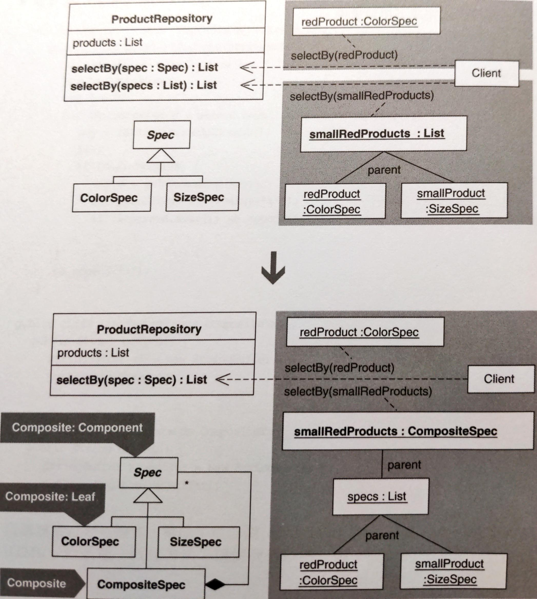
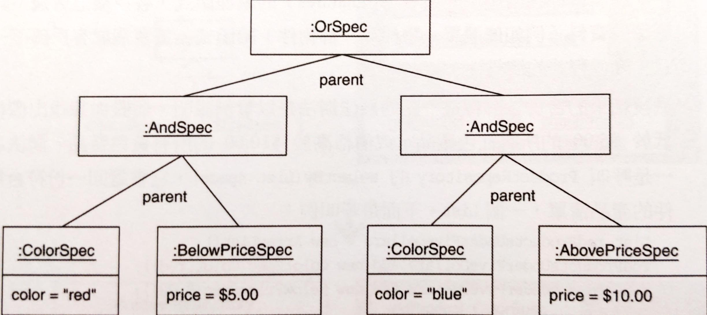
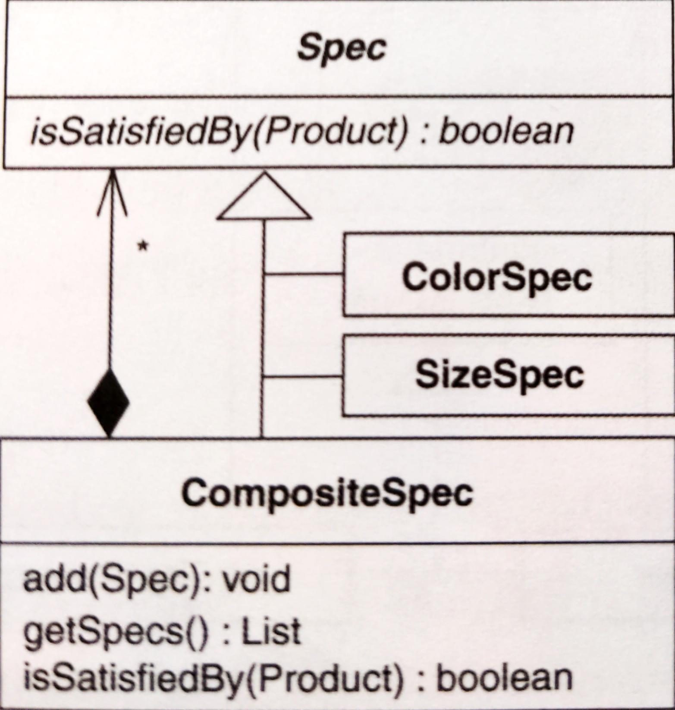

# Replace One/Many Distinctions with Composite

以 **Composite** 取代單/多差異，建立「能處理單物件和多物件」的程式碼。



## 動機

當有個類別用來處理「單物件」的函式，又有一個用來處理「多物件」的函式，此時 one/many distinctions 便存在，造成：
- 重複碼
- 客戶碼不一致：兩個函式 signatures 不一樣，客戶碼寫法也就不一樣。
- 最後結果的合併
    實例：假設你想找出價格低於 $5.00 的所有紅色商品，或價格高於 $10.00 的所有藍色商品，方法是呼叫 `ProductRepository` 的 `selectBy(List specs)`，它會回傳型別為 `List` 的商品清單，如下：

    ```java
    List redProductsUnderFiveDollars = new ArrayList();
    redProductsUnderFiveDollars.add(new ColorSpec(Color.red));
    redProductsUnderFiveDollars.add(new BelowPriceSpec(5.00));
    List foundRedProductsUnderFiveDollars = productRepository.selectBy(redProductsUnderFiveDollars);
    ```

    但是 `selectBy(List specs)` 無法處理 OR 條件。因此必須分別呼叫再手動合併：

    ```java
    List foundRedProductsUnderFiveDollars = productRepository.selectBy(redProductsUnderFiveDolla rs);
    List foundBlueProductsAboveTenDollars = productRepository.selectBy(blueProductsAboveTenDollars);

    List foundProducts = new ArrayList();
    foundProducts.addAll(foundRedProductsUnderFiveDollars);
    foundProducts.addAll(foundBlueProductsAboveTenDollars);
    ```

以 **Composite** 解決的好處：
- 沒有重複碼：因為只有一個函式，不管被處理的物件為一個或多個。
- 客戶端透過一致的方式與函式溝通。
- 客戶端透過一次呼叫就可以得到整個樹狀物件的處理結果：



缺點跟型別安全性 (type safety) 有關。為了防止客戶把無效物件加入 **Composite**，其程式碼必須在執行期檢查。

::: tip 優點
- 將重複碼移除
- 處理單/多物件的方式一致
- 有叫豐富的多物件處理方式

:::

::: warning 缺點
- **Composite** 建構期間要在執行期檢查型別

:::


## 作法

單物件處理函式：one-object method
多物件處理函式：many-object method

1. many-object method 應該接受一個集合 (collection) 作為參數。
    所以，
    - 建立一個新類別，以 collection 為參數，並為此 collection 提供 getter。
        此類別為 **Composite**。
    - 在 many-object method 中為你的 composite 宣告並具現一個實體。
    - 找出 many-object method 中對 collection 的所有引用點，改寫成讓它透過 composite 的 getter 函式來取得 collection。
2. 找出 many-object method 中觸及 collection 的程式碼，實施 *Extract Method*。抽出來的函式設定為 public，再實施 *Move Method* 移到 composite 內。
3. 現在 many-object method 和 one-object method 幾乎相同。主要差在前者具現出你的 composite。
    如果還有其他不同，請以重構來消除。
4. 修改 many-object method，讓它只包含一行程式碼：呼叫 one-object method 並將你的 composite 實體當作參數傳入。
    你需要讓 composite 共享「one-object method 所使用的 interface 或 superclass」。
    - 為此，考慮讓 composite 成為 one-object method 所用的型別的 subclass，或是用 *Extract Interface* 建立新的 interface，把 composite 和所有物件傳入 one-object method 的實作中。
5. many-object method 現在只剩一行，可對它實施 *Inline Method*。
6. 對你的 composite 實施 *Encapsulate Collection*。這會在 composite 產生一個 `add(...)` 函式。
    讓客戶端呼叫它，而不是把 collection 傳給 composite 的建構式。
    現在 collection 的 getter 回傳一個不可變的 collection。


## 範例

先寫測試開始。

```java
public class ProductRepositoryTest extends TestCase {
    private ProductRepository repository;
    private Product fireTruck = new Product("f1234", "Fire Truck", Color.red, 8.95f, ProductSize.MEDIUM);
    private Product barbieClassic = new Product("b7654", "Barbie Classic", Color.yellow, 15.95f, ProductSize.SMALL);
    private Product frisbee = new Product("f4321", "Frisbee", Color.pink, 9.99f, ProductSize.LARGE); 
    private Product baseball = new Product("b2343", "Baseball", Color.white, 8.95f, ProductSize.NOT_APPLICABLE); 
    private Product toyConvertible = new Product("p1112", "Toy Porsche Convertible", Color.red, 230.00f, ProductSize.NOT_APPLICABLE); 
    
    protected void setUp() { 
        repository = new ProductRepository(); 
        repository.add(fireTruck); 
        repository.add(barbieClassic); 
        repository.add(frisbee); 
        repository.add(baseball); 
        repository.add(toyConvertible); 
    }
}
```

第一個測試是呼叫 `repository.selectBy(specs)` 來找出某個顏色的 `Product` 實體：

```java
public class ProductRepositoryTest extends TestCase {
    public void testFindByColor() { 
        List foundProducts = repository.selectBy(new ColorSpec(Color.red)); 
        assertEquals("found 2 red products", 2, foundProducts.size()); 
        assertTrue("found fireTruck", foundProducts.contains(fireTruck)); 
        assertTrue( "found Toy Porsche Convertible", foundProducts.contains(toyConvertible));
    }
}
```

函式 `repository.selectBy(specs)` 像這樣：

```java
public class ProductRepository { 
    private List products = new ArrayList();

    public Iterator iterator() { 
        return products.iterator(); 
    }

    public List selectBy(List specs) { 
        List foundProducts = new ArrayList(); 
        Iterator products = iterator(); 
        while (products.hasNext()) { 
            Product product = (Product)products.next(); 
            if (spec.isSatisfiedBy(product )) 
                foundProducts.add(product); 
        }
        
        return foundProducts; 
    }
```

另一個測試，呼叫了不同的 `repository.selectBy(specs)` 函式。這個測試把 `Spec` 實體聚集在一個 `List` 中，為了從 `repository` 選出特定類型的產品：

```java
public class ProductRepositoryTest extends TestCase {
    // ...

    public void testFindByColorSizeAndBelowPrice() { 
        List specs = new ArrayList(); 
        specs.add(new ColorSpec(Color.red)); 
        specs.add(new SizeSpec(ProductSize.SMALL)); 
        specs.add(new BelowPriceSpec(10.00)); 
        List foundProducts = repository.selectBy(specs); 
        assertEquals( "small red products below $10.00", 0, foundProducts.size()); 
    }
}
```

`List`-based `repository.selectBy(specs)` 看起來像這樣：

```java
public class ProductRepository { 
    public List selectBy(List specs) { 
        List foundProducts = new ArrayList();
        Iterator products = iterator();
        while (products.hasNext()) { 
            Product product = (Product)products.next(); 
            Iterator specifications = specs.iterator(); 
            boolean satisfiesAllSpecs = true; 
            while (specifications.hasNext()) { 
                Spec productSpec = ((Spec)specifications.next()); 
                satisfiesAllSpecs &= productSpec.isSatisfiedBy(product); 
            } 
            if (satisfiesAllSpecs) 
                foundProducts.add(product); 
        } 
    
        return foundProducts; 
    }
}
```

`List`-based 的更複雜，且有很多個重複碼。使用 **Composite** 可以消除重複，有另一個方法可以消除重複而不使用 **Composite**：

```java
public class ProductRepository {
    public List selectBy(Spec spec) {
        Spec[] specs = { spec }; 
        return selectBy(Arrays.asList(specs)); 
    }
    public List selectBy(List specs) { 
        // ...
        // same implementation as before
    }
}
```

這個解法讓比較複雜的 `List selectBy(List specs)` 維持原樣，簡化了 one-`Spec selectBy(...)`。

問題：以這個解法代替 refactor to **Composite** 是明智之舉嗎？這取決於需求。本例需要支援 OR, AND 和 NOT 條件查詢，像是：

```java
product.getColor() != targetColor || product.getPrice() < targetPrice
```

`List`-based 無法支援上述查詢。此外我們寧願只有唯一一個 `selectBy(...)`，讓客戶端可以使用一種方式來呼叫它。因此決定使用 refactor to **Composite**：

1. `List`-based `selectBy(...)` 是 many-object method，接受參數 `List specs`。
    先建立一個新的類別持有 `specs` 參數，並提供 getter:

    ```java
    public class CompositeSpec { 
        private List specs; 

        public CompositeSpec(List specs) { 
            this.specs = specs; 
        } 
        
        public List getSpecs() { 
            return specs;
        }
    }
    ```

    接下來，在 `List`-based `selectBy(...)` 具現這個類別，並使程式碼改成呼叫 getter：

    ```java{3,8}
    public class ProductRepository {
        public List selectBy(List specs) { 
            CompositeSpec spec = new CompositeSpec(specs); 
            List foundProducts = new ArrayList(); 
            Iterator products = iterator(); 
            while (products.hasNext()) { 
                Product product = (Product)products.next(); 
                Iterator specifications = spec.getSpecs().iterator(); 
                boolean satisfiesAllSpecs = true; 
                while (specifications.hasNext()) { 
                    Spec productSpec = ((Spec)specifications.next()); 
                    satisfiesAllSpecs &= productSpec.isSatisfiedBy(product); 
                } 
                if (satisfiesAllSpecs) 
                    foundProducts.add(product); 
            }

            return foundProducts; 
        }
    }
    ```
2. 現在，對 `selectBy(...)` 中「明確處理 `specs`」的程式碼實施 *Extract Method*：

    ```java{8,14-23}
    public class ProductRepository {
        public List selectBy(List specs) { 
            CompositeSpec spec = new CompositeSpec(specs); 
            List foundProducts = new ArrayList(); 
            Iterator products = iterator(); 
            while (products.hasNext()) { 
                Product product = (Product)products.next(); 
                if (isSatisfiedBy(spec, product)) 
                    foundProducts.add(product); 
            } 
            return foundProducts; 
        }
        
        public boolean isSatisfiedBy(CompositeSpec spec, Product product) { 
            Iterator specifications = spec.getSpecs().iterator(); 
            boolean satisfiesAllSpecs = true; 
            while (specifications.hasNext()) { 
                Spec productSpec = ((Spec)specifications.next());
                satisfiesAllSpecs &= productSpec.isSatisfiedBy(product); 
            }
            
            return satisfiesAllSpecs; 
        }
    }
    ```

    通過編譯和測試以後，實施 *Move Method* 把 `isSatisfiedBy(...)` 移到 `CompositeSpec` 內：
    
    ```java{8,15-23}
    public class ProductRepository {
        public List selectBy(List specs) { 
            CompositeSpec spec = new CompositeSpec(specs);
            List foundProducts = new ArrayList(); 
            Iterator products = iterator(); 
            while (products.hasNext()) { 
                Product product = (Product)products.next(); 
                if (spec.isSatisfiedBy(product)) 
                    foundProducts.add(product); 
            } 
            return foundProducts; 
        }
            
        public class CompositeSpec {
            public boolean isSatisfiedBy(Product product) { 
                Iterator specifications = getSpecs().iterator(); 
                boolean satisfiesAllSpecs = true;
                while (specifications.hasNext()) { 
                    Spec productSpec = ((Spec)specifications.next());
                    satisfiesAllSpecs &= productSpec.isSatisfiedBy(product); 
                }
                return satisfiesAllSpecs; 
            }
        }
    }
    ```
3. 現在，兩個 `selectBy(...)` 幾乎一樣。唯一不同的是 `List`-based 具現一個 `CompositeSpec` 實體：
    ```java
    public class ProductRepository {
        public List selectBy(Spec spec) { 
            // same code
        }
        public List selectBy(List specs) { 
            CompositeSpec spec = new CompositeSpec(specs);
            // same code
        }
    }
    ```
4. 現在我想讓 `List`-based `selectBy(...)` 呼叫 one-`Spec selectBy(...)`:
    
    ```java
    public class ProductRepository {
        public List selectBy(Spec spec) {
            // ...
        }
        public List selectBy(List specs) { 
            return selectBy(new CompositeSpec(specs)); 
        }
    }
    ```

    但無法順利編譯，因為 `CompositeSpec` 沒有和 `Spec` 共用相同 interface，而 `Spec` 是在 `selectBy(Spec spec)` 會被用到。

    既然 `CompositeSpec` 已經實作 `Spec` 宣告的 `isSatisfiedBy`，那就順手讓 `CompositeSpec` 繼承 `Spec`：

    ```java
    public class CompositeSpec extends Spec ...
    ```

    現在通過編譯。
5. `List`-based `selectBy(...)` 現在只有一行呼叫 one-`Spec selectBy(...)`，所以可以實施 *Inline Method*。

    ```java{7-8}
    public class ProductRepositoryTest {
        public void testFindByColorSizeAndBelowPrice() { 
            List specs = new ArrayList(); 
            specs.add(new ColorSpec(Color.red)); 
            specs.add(new SizeSpec(ProductSize.SMALL)); 
            specs.add(new BelowPriceSpec(10.00)); 
            // List foundProducts = repository.selectBy(specs); 
            List foundProducts = repository.selectBy(new CompositeSpec(specs));
        }
    }
    ```

    現在，只有一個 `selectBy(...)` 接受像 `ColorSpec` `SizeSpec` 或新的 `CompositeSpec` 這樣的 `Spec` 物件。想建立 **Composite** 結構來支援邏輯運算，還需要 `NotSpec` 和 `OrSpec` 這樣的類別。在 [Replace Implicit Language with Interpreter](./replace-implicit-language-with-interpreter.md) 這一章會描述如何產生這些類別。
6.  最後一步是對 `CompositeSpec` 內的 collection 實施 *Encapsulate Collection*，來讓 `CompositeSpec` 更具型別安全性。

    首先定義 `add(Spec spec)`:

    ```java{4-6}
    public class CompositeSpec extends Spec {
        private List specs; 

        public void add(Spec spec) { 
            specs.add(spec); 
        }
    }
    ```
    
    初始化 `specs`:

    ```java
    public class CompositeSpec extends Spec {
        private List specs = new ArrayList();
    }
    ```

    找出 `CompositeSpec` 建構式所有呼叫者，讓他們改以呼叫新的 `CompositeSpec` default 建構式和新的 `add(...)`。

    ```java{4-5,9}
    public class ProductRepositoryTest {
        public void testFindByColorSizeAndBelowPrice() {
            // ...
            // List specs = new ArrayList(); 
            CompositeSpec specs = new CompositeSpec(); 
            specs.add(new ColorSpec(Color.red)); 
            specs.add(new SizeSpec(ProductSize.SMALL)); 
            specs.add(new BelowPriceSpec(10.00)); 
            List foundProducts = repository.selectBy(specs);
        }
        // ...
    }
    ```

    現在沒人呼叫 `CompositeSpec` 那個「接收一個 `List`」的建構式了。因此把它移除：

    ```java
    public class CompositeSpec extends Spec {
        // public CompositeSpec(List specs) { 
        //    this.specs = specs; 
        // }
    }
    ```

    現在，更新 `CompositeSpec` 的 `getSpecs(...)` 使它回傳一個不可修改的 `specs`:

    ```java{5}
    public class CompositeSpec extends Spec {
        private List specs = new ArrayList(); 
        
        public List getSpecs() {
            return Collections.unmodifiableList (specs); 
        }
    }
    ```


