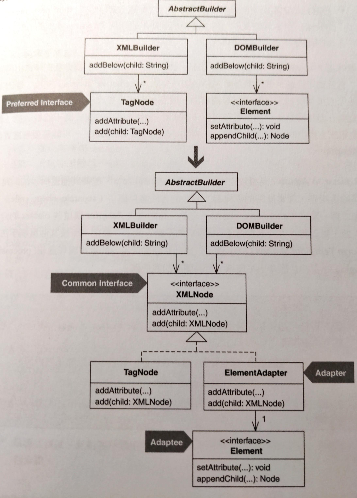
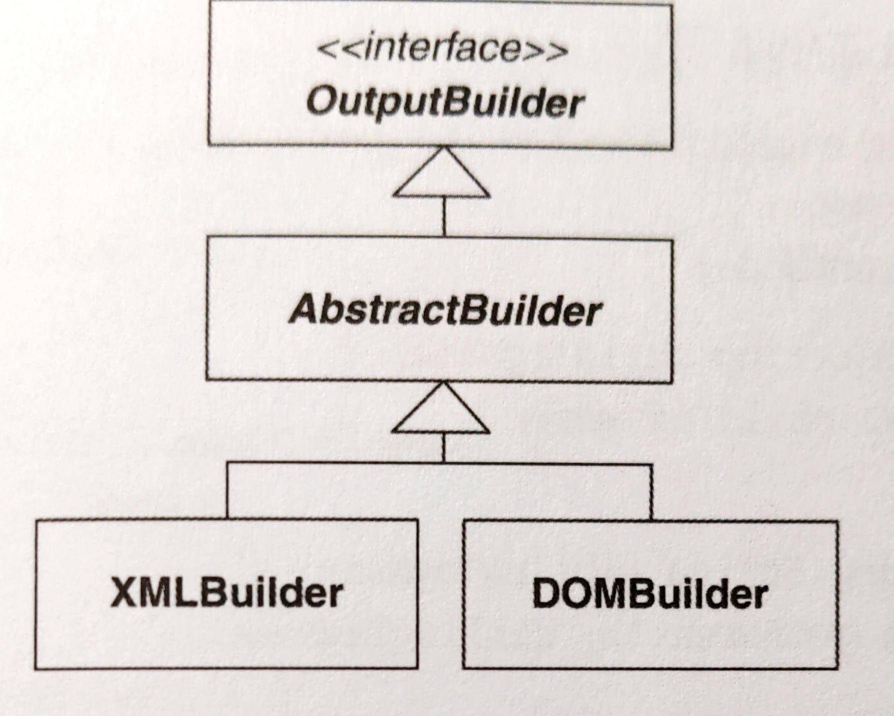
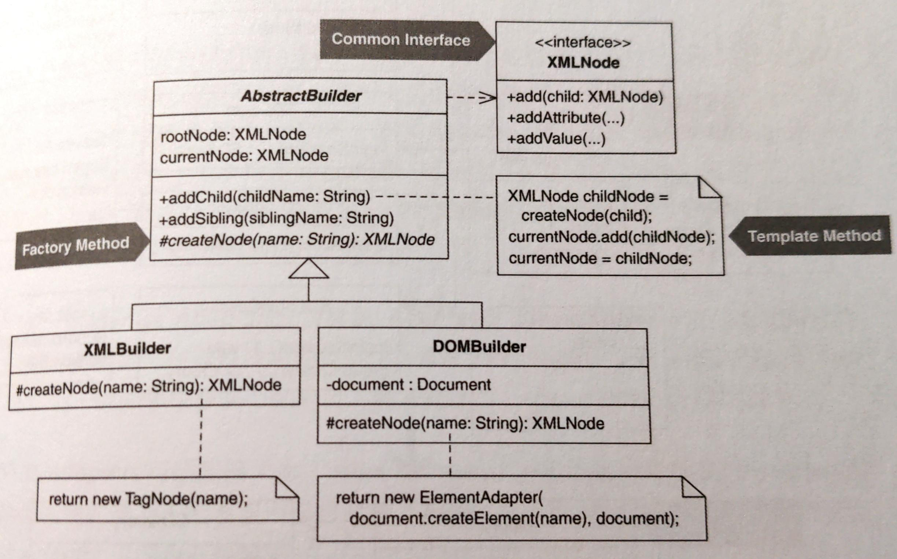

# Unify Interfaces with Adapter

用 **Adapter** 統一介面



## 動機

當下列所有條件成立時，refactor to Adapter 可以帶來效益：

- 兩個類別做相同或類似的事情，但擁有不同的介面
- 如果這些類別共用相同介面，客戶碼會更單純、更直觀、更簡練
- 你無法改變其中一個類別的介面，因為
  - 它是第三方函式庫的一部分
  - 它是其他許多客戶已經使用的框架的一部分
  - 你沒有他的 source code

::: tip 優點
- 讓客戶碼可以透過相同介面來和替換性類別（alternative classes）溝通，來移除或減少重複碼
- 讓客戶碼有可能透過一個共同介面來和各物件溝通，以簡化客戶碼
- 讓客戶馬漢替換性類別（alternative classes）的互動方式一致

:::

::: warning 缺點
- 如果可以改變類別的介面而不必 adapt 它的話，這樣做會讓設計變得複雜

:::


## 作法

1. 客戶偏好某個類別（A）的介面勝過另一個（B），對 A 進行 *Extract Interface*，建立公共介面。如果類別 A 有任何函式的參數是自身的型別，將型別改為上面的公共介面。
2. 面對任何使用 adaptee（類別 B）的客戶碼，進行 *Extract Class* 產生一個 primitive **adapter**，這個新抽取出來的類別內含一個 adaptee 欄位、一個該欄位的 getter、一個該欄位的 setter、或「用來設定 adaptee」的建構式參數和建構式函式碼。
3. 將客戶碼中所有與 adaptee 型別有關的欄位、區域變數和參數都改成 adapter 型別。這會改變客戶碼對 adaptee 的所有呼叫動作，讓它在呼叫任何 adaptee 函式前先從 adapter 取得一個 adaptee reference。
4. 在客戶碼呼叫一個 adaptee 函式（透過 adapter 的 getter）的任何地點進行 *Extract Method*，建立「adaptee 叫喚函式」（invocation method）。令此函式帶一個 adaptee 參數，並讓此函式在呼叫 adaptee 函式時用上這一個參數值。
5. 對「adaptee 叫喚函式」實施 *Move Method* 移到 adapter 內。現在客戶對任何 adaptee 函式的呼叫都會穿過 adapter。

    將函式移到 adapter 時，讓它近似公共介面中對應的函式。如果被移動的函式需要從客戶端取一個值來通過編譯，請避免用參數的形式加入函式，這會讓函式的簽名式和公共介面對應的函式不同。盡量找不擾動簽名式又能傳遞該值的方法
    - 透過 adapter 的建構式
    - 把某個物件的 reference 傳給 adapter，讓 adapter 能在執行期獲得該值
6. 修改 adapter，讓它正式實作公共介面。修改所有「接受 adapter 型別參數」的 adapter 函式，讓它們改成接受「型別為公共介面」的參數。
7. 修改客戶端類別，讓它所有欄位、區域變數和參數都使用公共介面，不再使用 adapter 型別。

    現在，客戶碼使用公共介面來和兩個類別溝通。如果要更進一步在客戶碼移除重複，通常可以使用 [Form Template Method](../ch8/form-template-method.md) 和 [Introduce Polymorphic Creation with Factory Method](../ch6/introduce-polymorphic-creation-with-factory-method.md) 等重構。


## 範例

本範例和建立 XML 的程式碼有關，請參考：
- [Replace Implicit Tree with Composite](../ch7/replace-implicit-tree-with-composite.md)
- [Encapsulate Compose with Builder](../ch6/)
- [Introduce Polymorphic Creation with Factory Method](../ch6/introduce-polymorphic-creation-with-factory-method.md)

`XMLBuilder` 和 `DOMBuilder` 程式碼大半相同，不過 `XMLBuilder` 和 `TagNode` 類別合作，而 `DOMBuilder` 則是和實作 `Element` 的物件合作：

```java
public class DOMBuilder extends AbstractBuilder { 
    private Document document; 
    private Element root; 
    private Element parent;
    private Element current; 
    
    public void addAttribute(String name, String value) { 
        current.setAttribute(name, value); 
    } 
    public void addBelow(String child) { 
        Element childNode = document.createElement(child); 
        current.appendChild(childNode); 
        parent = current; 
        current = childNode; 
        history.push(current); 
    } 
    public void addBeside(String sibling) { 
        if (current == root) 
            throw new RuntimeException(CANNOT_ADD_BESIDE_R OOT); 
            
        Element siblingNode = document.createElement(sibling); 
        parent.appendChild(siblingNode); 
        current = siblingNode; 
        history.pop(); 
        history.push(current); 
    } 
    public void addValue(String value) { 
        current.appendChild(document.createTextNode(value)); 
    }
}
```

以下是 `XMLBuilder`：

```java
public class XMLBuilder extends AbstractBuilder { 
    private TagNode rootNode; 
    private TagNode currentNode; 
    
    public void addChild(String childTagName) { 
        addTo(currentNode, childTagName); 
    } 
    public void addSibling(String siblingTagName) { 
        addTo(currentNode.getParent(), siblingTagName); 
    } 
    private void addTo(TagNode parentNode, String tagName) { 
        currentNode = new TagNode(tagName); parentNode.add(currentNode); 
    } 
    public void addAttribute(String name, String value) { 
        currentNode.addAttribute(name, value); 
    } 
    public void addValue(String value) { 
        currentNode.addValue(value); 
    }
}
```



`DOMBuilder` 和 `XMLBuilder` 幾乎相同，只是每個 builder 不是和 `TagNode` 合作就是和 `XMLBuilder` 一起運作。這項重構目的是建立 `TagNode` 和 `Element` 的公共介面，來消除 builder 各函式的重複。

1. 第一步是建立公共介面。我以 `TagNode` 為這個介面的基礎。`TagNode` 約有 10 個函式，其中 5 個是 public。公共介面只需要其中 3 個。實施 *Extract Interface*：

    ```java
    public interface XMLNode { 
        public abstract void add(XMLNode childNode); 
        public abstract void addAttribute(String attribute, String value); 
        public abstract void addValue(String value);
    } 

    public class TagNode implements XMLNode {
        // ...
        public void add( XMLNode childNode) { 
            children().add(childNode); 
        } 
        // etc.
    }
    ```
2. 開始處理 `DOMBuilder`。實施 *Extract Class* 建立 `Element` 的 adapter：

    ```java
    public class ElementAdapter { 
        Element element; 

        public ElementAdapter(Element element) { 
            this.element = element; 
        } 
        public Element getElement() { 
            return element; 
        }
    }
    ```
3. 把 `DOMBuilder` 所有 `Element` 欄位都改成 `ElementAdapter` 型別，並且更新程式碼：
    
    ```java{3-5,8,11-12,21-22}
    public class DOMBuilder extends AbstractBuilder {
        private Document document; 
        private ElementAdapter rootNode; 
        private ElementAdapter parentNode; 
        private ElementAdapter currentNode; 

        public void addAttribute(String name, String value) { 
            currentNode.getElement().setAttribute(name, value); 
        } 
        public void addChild(String childTagName) { 
            ElementAdapter childNode = new ElementAdapter(document.createElement(childTagName)); 
            currentNode.getElement().appendChild(childNode.getElement()); 
            parentNode = currentNode; 
            currentNode = childNode; 
            history.push(currentNode); 
        } 
        public void addSibling(String siblingTagName) { 
            if (currentNode == root)
                throw new RuntimeException(CANNOT_ADD_BESIDE_ROOT); 
            
            ElementAdapter siblingNode = new ElementAdapter(document.createElement(siblingTagName)); 
            parentNode.getElement().appendChild(siblingNode .getElement()); 
            currentNode = siblingNode; 
            history.pop(); 
            history.push(currentNode); 
        }
    }
    ```
4. 針對 `DOMBuilder` 呼叫的每個 adaptee 函式建立一個「adaptee 叫喚函式」（invocation method）。我以 *Extract Method* 達成目的，並確保每個被提煉的函式都帶有一個 adaptee 參數且在函式本體中使用它。

    ```java{3,6-8,12,18-20,27,34,37-39}
    public class DOMBuilder extends AbstractBuilder {
        public void addAttribute(String name, String value) { 
            addAttribute(currentNode, name, value); 
        }

        private void addAttribute(ElementAdapter current, String name, String value) { 
            currentNode.getElement().setAttribute(name, value); 
        }

        public void addChild(String childTagName) {
            ElementAdapter childNode = new ElementAdapter(document.createElement(childTagName)); 
            add(currentNode, childNode); 
            parentNode = currentNode; 
            currentNode = childNode; 
            history.push(currentNode); 
        }

        private void add(ElementAdapter parent, ElementAdapter child) { 
            parent.getElement().appendChild(child.getElement()); 
        }

        public void addSibling(String siblingTagName) { 
            if (currentNode == root) 
                throw new RuntimeException(CANNOT_ADD_BESIDE_ROOT); 
            
            ElementAdapter siblingNode = new ElementAdapter(document.createElement(siblingTagName)); 
            add(parentNode, siblingNode); 
            currentNode = siblingNode; 
            history.pop(); 
            history.push(currentNode); 
        }

        public void addValue(String value) { 
            addValue(currentNode, value); 
        }

        private void addValue(ElementAdapter current, String value) { 
            currentNode.getElement().appendChild(document.createTextNode(value)); 
        }
    }
    ```
5. 現在我可以實施 *Move Method* 把每個「adaptee 叫喚函式」都移到 `ElementAdapter` 中。我希望被移的函式相似於公共介面 `XMLNode` 中的相應函式。對各個函式都很容易做到，除了 `addValue()`，等等再處理。以下是搬移 `addAttribute()` 和 `add()` 後的結果：

    ```java{12-14,16-18}
    public class ElementAdapter { 
        Element element; 
        
        public ElementAdapter(Element element) { 
            this.element = element; 
        } 
        
        public Element getElement() { 
            return element; 
        } 
        
        public void addAttribute(String name, String value) {
            getElement().setAttribute(name, value); 
        } 
        
        public void add(ElementAdapter child) { 
            getElement().appendChild(child.getElement()); 
        } 
    }
    ```

    以下是 `DOMBuilder` 因為搬移造成的變更例子：
    
    ```java{3,8}
    public class DOMBuilder extends AbstractBuilder {
        public void addAttribute(String name, String value) { 
            currentNode.addAttribute(name, value); 
        } 
        
        public void addChild(String childTagName) { 
            ElementAdapter childNode = new ElementAdapter(document.createElement(childTagName)); 
            currentNode.add(childNode); 
            parentNode = currentNode; 
            currentNode = childNode; 
            history.push(currentNode); 
        } 
    }
    
    // etc.
    ```

    `addValue()` 比較難搬，因為它依賴 `ElementAdapter` 內的 `document` 欄位：
    
    ```java{2,5}
    public class DOMBuilder extends AbstractBuilder {
        private Document document; 

        public void addValue(ElementAdapter current, String value) { 
            current.getElement().appendChild(document.createTextNode(value));
        }
    }
    ```

    我不想把型別為 `Document` 的那個欄位搬到 `ElementAdapter` 的 `addValue()` 中，因為這樣做會讓這個函式更遠離目的地：`XMLNode` 的 `addValue()`。

    我決定藉由 `ElementAdapter` 的建構式把一個 `Document` 實體傳到 `ElementAdapter`：
    
    ```java{3,5,7}
    public class ElementAdapter {
        Element element;
        Document document; 
        
        public ElementAdapter(Element element, Document document ) { 
            this.element = element; 
            this.document = document; 
        }
    }
    ```

    並且在 `DOMBuilder` 做一些必要的修改。現在可以輕鬆搬移 `addValue()` 了：

    ```java
    public class ElementAdapter {
        public void addValue(String value) { 
            getElement().appendChild(document.createTextNode(value)); 
        }
    }
    ```
6. 現在讓 `ElementAdapter` 實作 `XMLNode` interface。這個步驟直接且明確，唯一例外是必須對 `add()` 做些改變，讓它能呼叫 `getElement()`，因為後者並不是 `XMLNode` interface 的一部分：

    ```java{3-4}
    public class ElementAdapter implements XMLNode {
        public void add(XMLNode child) {
            ElementAdapter childElement = (ElementAdapter)child; 
            getElement().appendChild(childElement.getElement());
        }
    }
    ```
7. 最後，修改 `DOMBuilder` 讓它「型別為 `ElementAdapter`」的所有欄位、區域變數和參數都改變型別為 `XMLNode`：

    ```java{3-5,8,15}
    public class DOMBuilder extends AbstractBuilder {
        private Document document; 
        private XMLNode rootNode; 
        private XMLNode parentNode; 
        private XMLNode currentNode; 
        
        public void addChild(String childTagName) { 
            XMLNode childNode = new ElementAdapter(document.createElement(childTagName), document); 
            // ... 
        } 
        
        protected void init(String rootName) { 
            document = new DocumentImpl(); 
            rootNode = new ElementAdapter(document.createElement(rootName), document); 
            document.appendChild(((ElementAdapter)rootNode).getElement()); 
            // ... 
        }
    }
    ```

    這時候由於配接 `DOMBuilder` 內的 `Element` 造成 `XMLBuilder` 的程式碼和 `DOMBuilder` 的程式碼如此相似，導致將程式碼上提到 `AbstractBuilder` 變得可行。最後實施 [Form Template Method](../ch8/form-template-method.md) 和 [Introduce Polymorphic Creation with Factory Method](../ch6/introduce-polymorphic-creation-with-factory-method.md) 完成。以下是最後結果：

    
