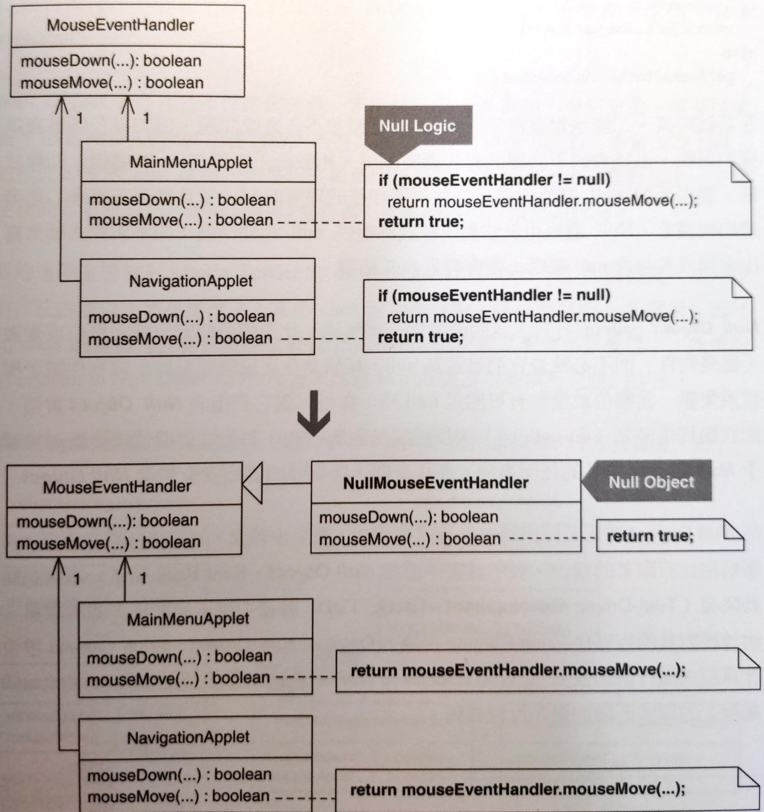
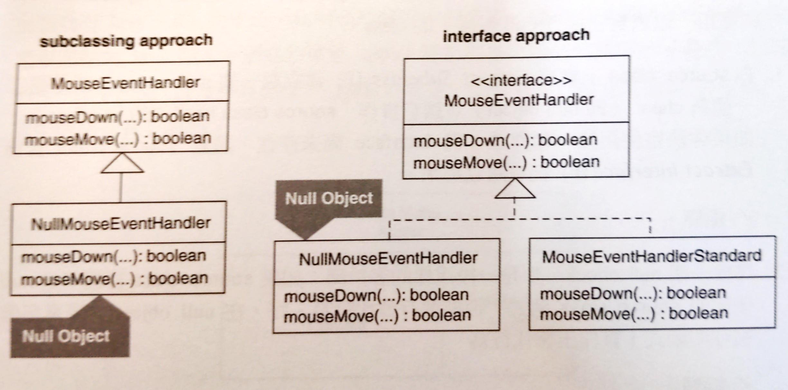
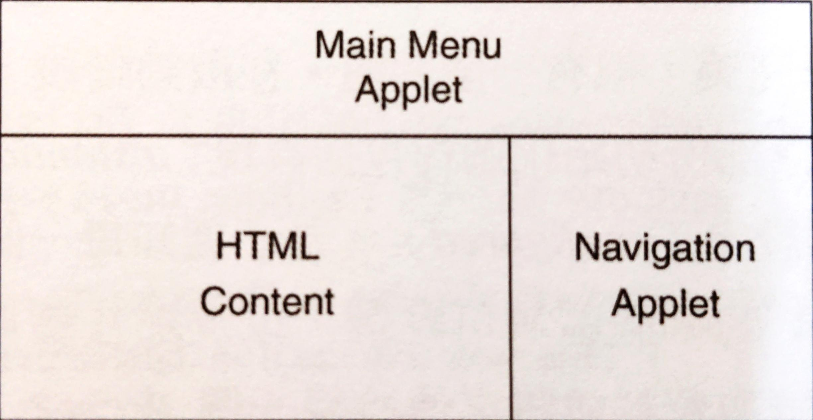
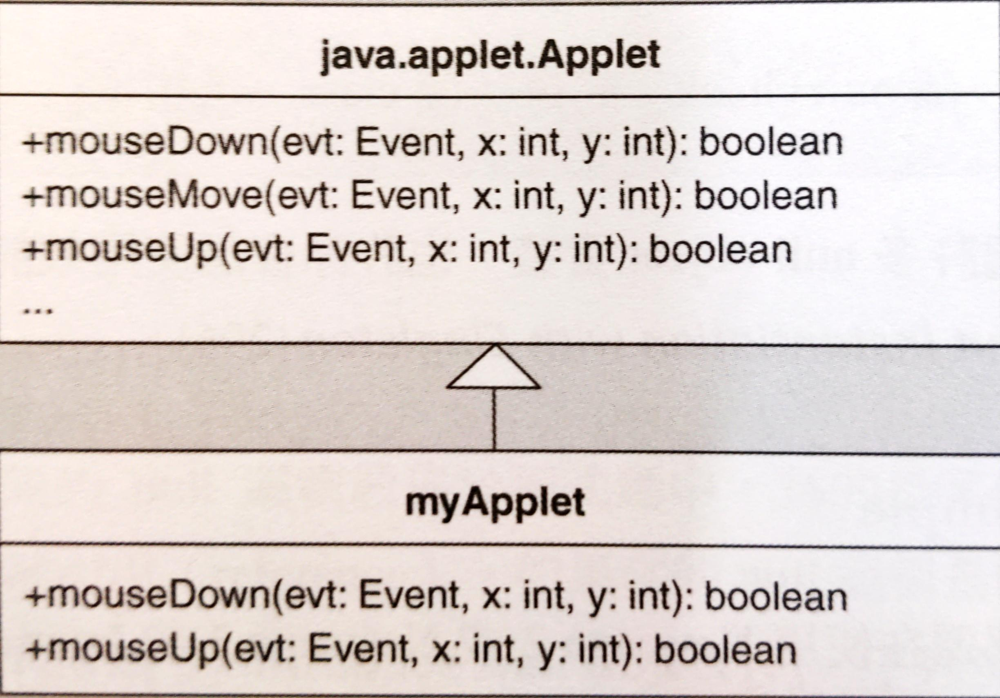

# Introduce Null Object

導入 Null Object。

處理 null 的邏輯遍布各地程式碼。以 **Null Object** 取代 null 邏輯，提供適切的 null 行為。




## 動機

為了避免呼叫 null 欄位或變數被呼叫，就會撰寫檢查碼：

```java
if (someObject != null) 
    someObject.doSomething(); 
else 
    performAlternativeBehavior();
```

問題：當多處重複這種邏輯，系統就會被不必要的程式碼膨脹。另外，如果撰寫新的程式碼但沒有包含 null 檢查邏輯，也會發生 null 錯誤。

**Null Object** 針對這個問題提供解法。當欄位或變數有可能是 null 時，你可以讓它們指向 **Null Object** 實體。

**Null Object** 並不保證程式員一定不須撰寫 null 邏輯。例如：程式員不知道 **Null Object** 已經對程式碼進行 null 保護，就有可能對「不會出現 null」的程式碼撰寫 null 邏輯。如果程式員預期某個條件下會回傳 null，進而寫出一些重要的程式碼來處理它，**Null Object** 實作可能會導致不可預期的行為。

這項重構是對 Martin Fowler 的 *Introduce Null Object* 進行擴充，提供額外作法處理以下的情況：「某個類別充斥著對某個欄位而寫的 null 邏輯，因為此類別的實體可能會在該欄位被賦予 non-null 值之前試圖使用它」。這種情況下 refactor to **Null Object** 的作法並不同於 Martin 對這項重構所定義的作法。

**Null Object** 常常透過子類別或實作介面的方式實現，如下：



如果透過子類別建立 **Null Object**，必須覆寫所有繼承來的 public 函式，用來提供適當的 null 行為。這種作法有個風險：如果有個新函式被加入到超類別，程式員必須記得在這個 **Null Object** 中以 null 行為覆寫那個函式。如果忘記這麼做，**Null Object** 會繼承那個函式，因而可能在執行期引發多餘的行為。如果讓 **Null Object** 實作某個介面而非超類別，可以消除上述的風險。

::: tip 優點
- 不需要以重複的 null 邏輯來預防 null 錯誤。
- 透過將 null 檢查最小量化來簡化程式碼。

:::

::: warning 缺點
- 當系統只需少量的 null 檢查時，這會讓程式碼變得複雜。
- 如果程式員不知道已經存在 **Null Object** 實作碼，會寫出多餘的 null 檢查。
- 讓維護工作變得複雜。如果 **Null Object** 擁有超類別，必須覆寫超類別的所有新增的 public 函式。

:::


## 作法

假設你為了某個欄位或是區域變數能在其為 null 狀態時被引用（reference）而讓相同的 null 邏輯散佈在程式碼中。如果是因為其他理由而存在，請考慮使用 Martin Fowler 的 *Introduce Null Object*。

下列步驟中的 source class 是指「你想對它進行 null 保護」的類別。

1. 在 source class 上實施 *Extract Subclass* 建立起一個 null object，或是建立一個新的 class（即 null object）並讓它實作「source class 所實作的 interface」。

    如果你決定使用後一種作法，但 interface 並不存在，請對 source class 實施 *Extract Interface* 把它建立起來。
2. 尋找一個 null check，在 null object 覆寫那個被呼叫的函式，實作出替代行為。
3. 針對 source class 相關的其他 null checks，重複進行步驟 2。
4. 找出「內含至少一個 null checks」的類別，為此類別中的那些「被 null check 引用的欄位或區域變數」設定初始值，設為一個 null object 實體。在那個類別的實體存活期間盡可能早（例如緊接著在它被具現出來之後）進行上述的初始化。

    上述程式碼應該不會影響既有的「對上述欄位或區域變數賦予一個 source class 實體」的程式碼。新的程式碼只在任何其他賦值動作之前才執行「賦予 null object」動作。
5. 針對步驟 4 選出來的類別，移除其所出現的每一個 null check。
6. 針對「出現一個或多個 null check」的每個類別，重複進行步驟 4--5。


## 範例

（老人講古）開發某個知名音樂電視網站的 Java 版本。網站的特徵是 applet 搭配許多可點選的選單和子選單、動畫短片、音樂新聞，還有很多酷圖。主網頁外貌是一個分割成三個部份的框（frame），其中兩個含有 applets。



公司員工需要能在用戶和 applets 互動時輕鬆控制 applets 的行為。員工們希望在控制 applet 行為時不必每次為了更動幾個功能而驚動程式員。我們可以滿足他的需求，作法是使用 **Command** pattern 且建立並使用一個名為 `MouseEventHandler` 的自訂滑鼠事件處理類別。每當用戶將滑鼠移到影像區上方，或在影像區點選，`MouseEventHandler` 實體都可以被設定而執行 **Command**。



這份程式碼運作得十分完美，但有個問題。在啟動階段，我們的 applet 會被載入瀏覽器並自行初始化。部份初始化過程包括具現 `MouseEventHandler` 物件並對它們進行組態設定。為了通知每個 `MouseEventHandler` 實體，讓它們知道 applet 的哪個區域可以點選，還有哪些區域被點選時會執行什麼 **Command**，我們需要讀取資料並將它傳給每個 `MouseEventHandler` 實體。雖然載入那些資料不會花很多時間，但的確會花一些時間，使得「當我們的 `MouseEventHandler` 實體尚未準備好接收滑鼠事件」時會造成某個視窗成為孤兒（對滑鼠沒有反應）。在我自訂的滑鼠事件處理函式完全被具現化以及被設定之前，如果使用者將滑鼠移到 applet 上方或在 applet 上以滑鼠點選，瀏覽器會在主控台顯示錯誤，而 applet 會變得不穩定。

有一個簡單的修正辦法：找出 `MouseEventHandler` 實體還是 null（還未被具現化）但可被呼叫的每個地點，撰寫檢查碼隔離它。這個作法的問題是系統中有許多類別充斥 null 檢查：

```java
public class NavigationApplet extends Applet {
    // ...
    public boolean mouseMove(Event event, int x, int y) { 
        if (mouseEventHandler != null) 
           return 
        mouseEventHandler.mouseMove(graphicsContext, event, x, y );     
        return true; 
    } 
    
    public boolean mouseDown(Event event, int x, int y) { 
        if (mouseEventHandler != null) 
            return mouseEventHandler.mouseDown(graphicsContext, event, x, y );     
        return true; 
    }
    
    public boolean mouseUp(Event event, int x, int y) { 
        if (mouseEventHandler != null) 
            return mouseEventHandler.mouseUp(graphicsContext, event, x, y ); 
        return true; 
    } 
    
    public boolean mouseExit(Event event, int x, int y) { 
        if (mouseEventHandler != null) 
            return mouseEventHandler.mouseExit(graphicsContext, event, x, y ); 
        return true; 
    }
}
```

為了移除這些 null 檢查，我們重構這些 applets，讓它們在啟動時使用 `NullMouseEventHandler`，然後當某個 applet 準備好了就切換改用 `MouseEventHandler` 實體。以下是進行這項重構的步驟：

1. 實施 *Extract Subclass* 定義出 `NullMouseEventHandler`：
    ```java
    public class NullMouseEventHandler extends MouseEventHandler { 
        public NullMouseEventHandler(Context context) { 
            super(context); 
        } 
    }
    ```
2. 找出一個 null 檢查：

    ```java
    public class NavigationApplet extends Applet {
        // ... 
        public boolean mouseMove(Event event, int x, int y) { 
            if (mouseEventHandler != null) // null check 
                return mouseEventHandler.mouseMove(graphicsContext, event, x, y); 
            return true;
        }
    }
    ```
    
    上面的 null 檢查呼叫的函式為 `mouseEventHandler.mouseMove(...)`。把「`mouseEventHandler` 等於 null 時所呼叫的程式碼」實作於 `NullMouseEventHandler` 覆寫的 `mouseMove(...)` 函式中，這很容易辦到：

    ```java{3-5}
    public class NullMouseEventHandler {
        // ...
        public boolean mouseMove(MetaGraphicsContext mgc, Event event, int x, int y) { 
            return true; 
        }
    }
    ```
3. 在其他出現 null 檢查的地方重複步驟 2，如下：
    ```java
    public class NullMouseEventHandler {
        // ...
        public boolean mouseDown(MetaGraphicsContext mgc, Event event, int x, int y) { 
            return true; 
        }

        public boolean mouseUp(MetaGraphicsContext mgc, Event event, int x, int y) { 
            return true; 
        } 
        
        public boolean mouseEnter(MetaGraphicsContext mgc, Event event, int x, int y) { 
            return true; 
        } 
        
        public void doMouseClick(String imageMapName, String APID) { 
        }
    }
    ```
4. 接下來初始化 `mouseEventHandler`，這欄位被 `NavigationApplet` 類別內的 null 檢查引用。將它初始化成一個 `NullMouseEventHandler` 實體：

    ```java
    public class NavigationApplet extends Applet {
        // ...
        private MouseEventHandler mouseEventHandler = new NullMouseEventHandler(null);
    }
    ```

    呼叫時指定的參數值 null 被傳給 `NullMouseEventHandler` 的建構式，之後轉傳給它的超類別 `MouseEventHandler` 的建構式。由於我們不喜歡四處傳遞這樣的 nulls，因此修改 `NullMouseEventHandler` 建構式，讓它去做這件事就好：

    ```java{2-3,9}
    public class NullMouseEventHandler extends MouseEventHandler { 
        public NullMouseEventHandler(/* Context context */) { 
            super(null); 
        } 
    }

    public class NavigationApplet extends Applet {
        // ...
        private MouseEventHandler mouseEventHandler = new NullMouseEventHandler();
    }
    ```
5. 刪除上述的類別（e.g. `NavigationApplet`）內所有的 null 檢查：

    ```java
    public class NavigationApplet extends Applet {
        // ... 
        public boolean mouseMove(Event event, int x, int y) { 
            // if (mouseEventHandler != null) 
            return mouseEventHandler.mouseMove(grap hicsContext, event, x, y ); 
            // return true; 
        }

        public boolean mouseDown(Event event, int x, int y) { 
            // if (mouseEventHandler != null) 
            return mouseEventHandler.mouseDown(graphicsContext, event, x, y); 
            // return true; 
        } 

        public boolean mouseUp(Event event, int x, int y) { 
            // if (mouseEventHandler != null) 
            return mouseEventHandler.mouseUp(graphicsContext, event, x, y); 
            // return true; 
        }
    }
    ```

    完成之後，編譯並測試。本例沒有自動化測試，必須在瀏覽器上執行網頁，並以滑鼠反覆試驗。
6. 對所有相同的 null 檢查的其他類別重複步驟 4--5，直到原本含有 null 檢查的所有類別完全消除 null 檢查為止。

    由於我們的系統只使用兩個 `NullMouseEventHandler` 實體，所以我們不讓它成為一個 **Singleton**。
