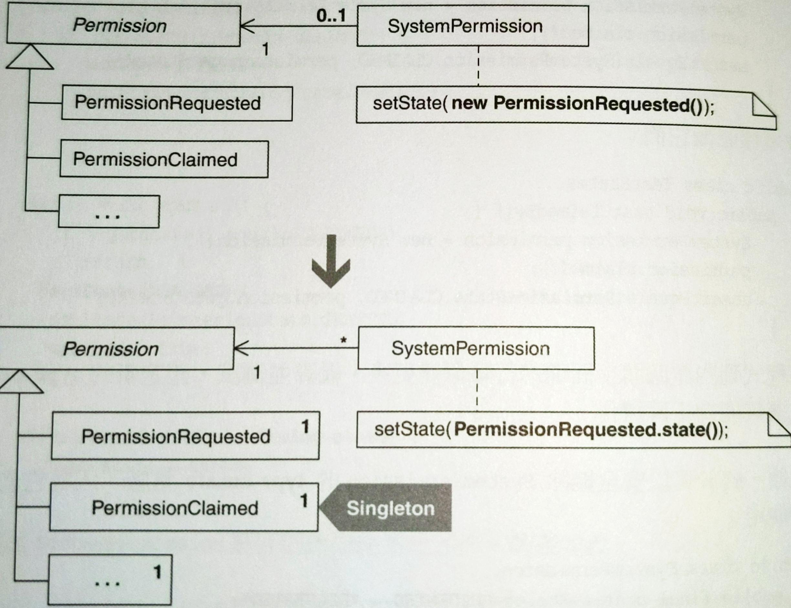

# Limit Instantiation with Singleton

以 **Singleton** 限制具現次數。

用法: 程式碼產生太多物件實體，導致耗用太多記憶體或降低系統效能時。以一個 **Singleton** 取代多份實體。




## 動機

如果要成為優秀的軟體工程師，就不要過早進行最佳化。如果你染上了單例癖，請遵循 [Inline Singleton](../ch6/inline-singleton.md) 的忠告。但有時候 refactor to **Singleton** 是個好決定，例如以下：
- 你的使用者對系統效能抱怨
- 你的效能剖析器 (profiler) 一再通知你改善效能的方式就是不要具現某些物件
- 你打算共用物件不含狀態，或是含有可共用的狀態


::: tip 優點
- 改善效能

:::

::: warning 缺點
- 可輕易從任何地點存取，很多情況下這可能代表一個設計缺陷
- 當物件的狀態無法被共用時，本重構無用

:::


## 作法

進行重構前，請確認你想轉為 **Singleton** 的物件是「無狀態」或者「擁有可共用狀態」。由於大多數「最終變成 **Singleton**」的類別都有一個建構式，所以本處的作法假設你的類別有一個建構式。

1. 找出一個 multiple instance class (多實體類別)，這個類別被一個或多個客戶端具現一次以上。實施 [Replace Constructors with Creation Method](../ch6/replace-constructors-with-creation-methods.md)，即使這個類別只有一個建構式。先建立的 Creation Method 回傳型別應該是這個多實體類別。
2. 在多實體類別內宣告一個 `private static ... singleton` 欄位，型別正是那個多實體類別。如果可能的話，把它初始化成為那個多實體類別的實體。

    也有可能無法初始化。目前只需要定義欄位，不一定要將它初始化。
3. 讓你的 Creation Method 回傳 `singleton` 的值。如果它必須被延遲具現 (lazy instantiation)，那就在 Creation Method 完成延遲具現。


## 範例

本範例是以 [Replace State-Altering Conditionals with State](../ch7/replace-state-altering-conditionals-with-state.md) 的安全檢查範例為基礎。如果研究實施該重構後的程式碼，你會發現每個 **State** 實體都是 **Singleton**。但是這些 **Singleton State** 實體的誕生理由並不是因為效能，它們是因為實施重構方法 [Replace Type Code with Class](replace-type-code-with-class.md) 而誕生。

作者最初在上面的專案中 refactor to State pattern 時並沒有使用 Replace Type Code with Class。當時還不知道這個重構手法能為接下來的 refactor to State pattern 簡化多少步驟。先前的重構作法是每當需要的時候就具現 `Permission` 子類別，並沒有考慮 **Singleton** pattern。

在那個專案上，作者利用效能剖析器發現一些可改進的地方，其中一個地方經常出現 state classes。因此，我們利用 **Singleton** 重構「反覆具現 `Permission` 子類別」的程式碼：

1. 一共有 6 個 `State` 類別，每個都是多具現類別。此範例拿 `PermissionRequested` 來說明：
    
    ```java
    public class PermissionRequested extends Permission { 
        public static final String NAME= "REQUESTED"; 
        
        public String name() { 
            return NAME; 
        } 
        
        public void claimedBy(SystemAdmin admin, SystemPermission permission) { 
            permission.willBeHandledBy(admin); 
            permission.setState(new PermissionClaimed()); 
        } 
    }
    ```

    `PermissionRequested` 沒有建構式，因為它使用 Java 的 default 建構式。第一步是要將建構式轉為 Creation Methods，所以我定義一個如下：

    ```java{3-5}
    public class PermissionRequested extends Permission {
        // ...
        public static Permission state() { 
            return new PermissionRequested(); 
        }
    }
    ```

    我以 `Permission` 作為這個 Creation Method 的回傳型別，因為我希望所有客戶碼與 `State` 子類別的交談都是透過那些子類別的介面。我也修改這個建構式的所有呼叫者，讓它們改呼叫 Creation Method:

    ```java{8-9}
    public class SystemPermission {
        // ...
        private Permission state; 
        
        public SystemPermission(SystemUser requestor, SystemProfile profile) { 
            this.requestor = requestor; 
            this.profile = profile; 
            // state = new PermissionRequested(); 
            state = PermissionRequested.state(); 
            // ... 
        }
    }
    ```
2. 現在，建立 `singleton` 欄位，將它初始化為一個 `PermissionRequested` 實體:

    ```java
    public class PermissionRequested extends Permission {
        private static Permission state = new PermissionRequested();
    }
    ```
3. 最後，修改 Creation Method `state()`，讓它回傳 `state` 欄位值:

    ```java{4}
    public class PermissionRequested extends Permission {
        // ...
        public static Permission state() { 
            return state;
        }
    }
    ```
