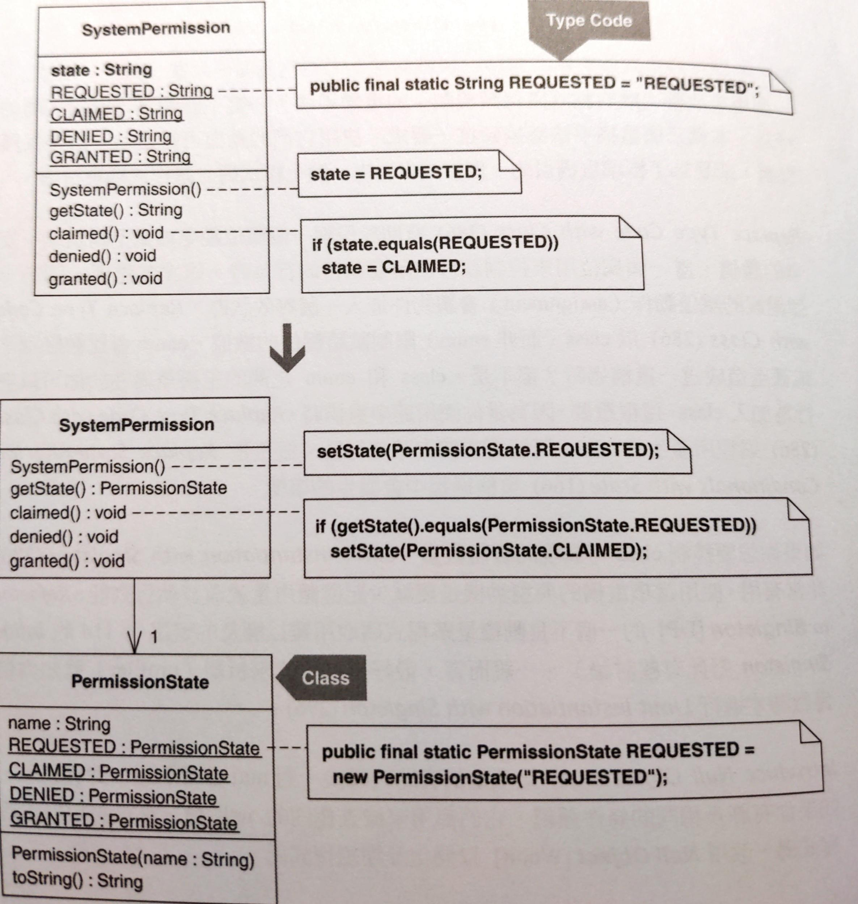

# Replace Type Code with Class

以類別取代基本型別。

當基本型別無法保護自己免受不安全的賦值（unsafe assignments）和無效的相等性比較（invalid equality comparisons），就需要這項重構。




## 動機

這項重構主要動機是使程式碼具備型別安全（type-safe）。方法是對 **可被賦予欄位或變數** 的可能值 或是 **以等式符號表現等同於某欄位或變數** 的可能值設限。
> ... constrain the possible values that may be assigned to or equated with a field or variable.

例如以下程式碼，它沒有型別安全性：

```java
public void testDefaultsToPermissionRequested() { 
    SystemPermission permission = new SystemPermission(); 
    assertEquals(permission.REQUESTED, permission.state()); 
    assertEquals("REQUESTED", permission.state()); 
}

public SystemPermission() { 
    state = REQUESTED; 
}
```

`state` 欄位可以指定系統狀態，可能的值如 `GRANTED` 和 `DENIED`。如果這些狀態以 `String` 型別來定義（例如：`public final static String REQUESTED = "REQUESTED"`），那麼上面兩個 `assert` 都會通過。

這樣做的問題是，如果字串內容打錯（例如：`"REQUESTED"` => `"REQESTED"`）不會造成編譯錯誤，使得 `SystemPermission` 實體進入無效（invalid）狀態，而它的狀態轉換邏輯並不會讓它離開這個無效狀態。

改用類別作為 `state` 欄位的型別可以減少這類的錯誤。這個作法 Joshua Bloch 稱為 **Type-Safe Enum** pattern。他的解釋很好，也說明如何處理 serialization/deserialization 議題。如果語言本身支援 enums，這項重構還是有用，因為進行這項重構之後可以常常擴充程式碼支援更多行為，這對 enums 來說是不可能的。[Replace State-Altering Conditionals with State](../ch7/replace-state-altering-conditionals-with-state.md) 作法的第一步就需要這項重構，且無法依賴語言提供的 enum 機制。


::: tip 優點
- 提供更好的保護，避免無效的賦值和相等性比較。

:::

::: warning 缺點
- 所需要的程式碼比「使用不安全的型別」還要多。

:::


## 作法

以下步驟所謂的 type-unsafe 常數是一個以原生型別或是非類別型別定義出來的常數。

1. 找出一個 type-unsafe 欄位，此欄位宣告為原生型別或非類別型別。通常程式各處會賦予他一整族（a family of）type-unsafe 常數，或拿來比較。實施 *Self Encapsulate Field* 完成此欄位的自我封裝。
2. 建立一個新的類別，這個類別稍後會被用來取代 type-unsafe 欄位的型別。
3. 選擇一個常數值，它在程式中被賦值給 type-unsafe 欄位或是與 type-unsafe 欄位進行比較。在 2. 的類別內為此常數定義一個新版本，作法是建立一個常數，其值是此類別的一份實體。Java 中常見的作法是把這個常數宣告為 `public final static ...`。

    所有被賦給 type-unsafe 欄位的常數，或是與它進行相等性比較的常數值，都要進行這個步驟。

    如果「防止客戶端對此系列常數增加成員」是重要的事，請 **為此類別宣告一個 private 建構式**，或是把類別標示為 `final`（不可變）。
4. 在 type-unsafe 欄位宣告所在的類別內產生一個 type-safe 欄位，型別為上述的類別。為此欄位建立一個 setter。
5. 在「對 type-unsafe 欄位賦值」處增加一個類似的「對 type-safe 欄位賦值」語句（statement），新的語句使用新類別內的適當常數。
6. 變更 type-unsafe 欄位的 getter，令其回傳值取自 type-safe 欄位。這首先必須讓新類別內的常數有能力回傳正確值。
7. 在 type-unsafe 欄位宣告式所在的類別內刪除 type-unsafe 欄位，同時也刪除 setter 和所有對 setter 的呼叫。
8. 找出每個指向 type-unsafe 常數的 references，將它們替換為「呼叫對應新類別常數」。


## 範例

```java
public class SystemPermission { 
    private String state; 
    private boolean granted; 
    public final static String REQUESTED = "REQUESTED"; 
    public final static String CLAIMED = "CLAIMED"; 
    public final static String DENIED = "DENIED"; 
    public final static String GRANTED = "GRANTED"; 

    public SystemPermission() { 
        state = REQUESTED; 
        granted = false; 
    } 

    public void claimed() { 
        if (state.equals(REQUESTED)) 
            state = CLAIMED; 
    } 

    public void denied() { 
        if (state.equals(CLAIMED)) 
        state = DENIED; 
    } 

    public void granted() { 
        if (!state.equals(CLAIMED)) 
        return;
    }
}
```

1. 把 `SystemPermission` 的 type-unsafe 欄位命名為 `state`；「賦值給它」以及「進行相等性比較」的 `String` 常數同樣被定義在 `SystemPermission` 內。我們的目標是藉由「將 `state` 型別由 `String` 改為某個類別」使 `state` 具備 type-safe 特性。
    
    先讓 state 自我封裝：
    ```java{3,12-14}
    public class SystemPermission {
        public SystemPermission() { 
            setState(REQUESTED); 
            granted = false;
        } 

        public void claimed() { 
            if (getState().equals(REQUESTED)) 
                setState(CLAIMED); 
        } 
        
        private void setState(String state) { 
            this.state = state; 
        } 
        
        public String getState() { // note: this method already existed 
            return state; 
        } 
    }
    // etc.
    ```
2. 產生一個新類別，將它命名為 `PermissionState`。
    ```java
    public class PermissionState {
    }
    ```
3. 選出一個「被賦值給 type-unsafe 欄位」或「與 type-unsafe 欄位進行相等性比較」的常數值，並在 `PermissionState` 內宣告一個 `public final static` 變數，並讓它成為一個 `PermissionState` 實體：

    ```java
    public final class PermissionState { 
        public final static PermissionState REQUESTED = new PermissionState(); 
    }
    ```

    對 `SystemPermission` 內的每個常數重複這個步驟，獲得以下程式碼：

    ```java
    public class PermissionState { 
        public final static PermissionState REQUESTED = new PermissionState(); 
        public final static PermissionState CLAIMED = new PermissionState(); 
        public final static PermissionState GRANTED = new PermissionState(); 
        public final static PermissionState DENIED = new PermissionState(); 
    }
    ```

    現在，要確認是否「防止客戶端對此系列常數增加成員」。此例不需要這麼嚴格，因此略過。
4. 接下來，在 `SystemPermission` 內部以 `PermissionState` 型別建立一個 type-safe 欄位。同時為它建立一個 setter：

    ```java{4-8}
    public class SystemPermission {
        // ...
        private String state; 
        private PermissionState permission; 
        
        private void setState(PermissionState permission) { 
            this.permission = permission; 
        }
    }
    ```
5. 現在必須找出「對 type-unsafe 欄位（i.e. `state`）的賦值語句」，並建立「對 type-safe 欄位（i.e. `permission`）的賦值語句」：

    ```java{5,12,19,28}
    public class SystemPermission {
        // ...
        public SystemPermission() { 
            setState(REQUESTED); 
            setState(PermissionState.REQUESTED); 
            granted = false; 
        } 

        public void claimed() { 
            if (getState().equals(REQUESTED)) { 
                setState(CLAIMED); 
                setState(PermissionState.CLAIMED); 
            } 
        } 

        public void denied() { 
            if (getState().equals(CLAIMED)) { 
                setState(DENIED); 
                setState(PermissionState.DENIED); 
            } 
        } 

        public void granted() { 
            if (!getState().equals(CLAIMED)) 
                return; 
            
            setState(GRANTED); 
            setState(PermissionState.GRANTED);
            granted = true; 
        }
    }
    ```
6. 變更 `state` 的 getter，讓它回傳 type-safe 欄位的值。由於 `state` 回傳 `String`，因此我必須讓 `permission` 也有能力回傳 `String`。

    首先修改 `PermissionState`，讓它支援一個「能夠回傳每個常數名稱」的 `toString()`：

    ```java{1-10}
    public class PermissionState { 
        private final String name; 

        private PermissionState(String name) { 
            this.name = name; 
        } 

        public String toString() { 
            return name; 
        }

        public final static PermissionState REQUESTED = new PermissionState( "REQUESTED" ); 
        public final static PermissionState CLAIMED = new PermissionState( "CLAIMED" ); 
        public final static PermissionState GRANTED = new PermissionState( "GRANTED" ); 
        public final static PermissionState DENIED = new PermissionState( "DENIED" ); 
    }
    ```

    之後，就可以修改 `state` 的 getter 了：

    ```java{4-5}
    public class SystemPermission {
        // ...
        public String getState() { 
            // return state; 
            return permission.toString(); 
        }
    }
    ```
7. 現在可以刪除 type-unsafe 欄位（state）、`SystemPermission` 內部的 private setter、以及 setter 本身：

    ```java{2,7,14,21,30,35-37}
    public class SystemPermission {
        // private String state; 
        private PermissionState permission; 
        private boolean granted;
        
        public SystemPermission() { 
            // setState(REQUESTED); 
            setState(PermissionState.REQUESTED); 
            granted = false; 
        } 
        
        public void claimed() { 
            if (getState().equals(REQUESTED)) { 
                // setState(CLAIMED); 
                setState(PermissionState.CLAIMED); 
            } 
        } 
        
        public void denied() { 
            if (getState().equals(CLAIMED)) { 
                // setState(DENIED); 
                setState(PermissionState.DENIED); 
            } 
        } 
        
        public void granted() { 
            if (!getState().equals(CLAIMED)) 
                return; 
            
            // setState(GRANTED); 
            setState(PermissionState.GRANTED); 
            granted = true;
        } 
        
        // private void setState(String state) { 
        //     this.state = state; 
        // }
    }
    ```
8. 現在，替換所有「引用到 `SystemPermission` 的 type-unsafe 常數」的程式碼，改成「引用 `PermissionState` 的常數值」。例如：

    ```java
    public class SystemPermission {
        // ... 
        public void claimed() { 
            if (getState().equals(REQUESTED)) // equality logic with type-unsafe constant 
                setState(PermissionState.CLAIMED); 
        }
    }
    ```

    這裡仍然引用 type-unsafe 常數 `"REQUESTED"`，修改如下：

    ```java{4,8}
    public class SystemPermission {
        // ...
        public PermissionState getState() { 
            return permission // .toString();
        } 
        
        public void claimed() { 
            if (getState().equals(PermissionState.REQUESTED)) { 
                setState(PermissionState.CLAIMED); 
            }
        }
    }
    ```

    以此類推，全面變更過後確定新的 type-safe 相等比較邏輯能夠正確運作。

    最後，終於可以安全刪除 `SystemPermission` 的 type-unsafe 變數，因為它們不再使用：

    ```java{2-5}
    public class SystemPermission {
        // public final static String REQUESTED = "REQUESTED"; 
        // public final static String CLAIMED = "CLAIMED"; 
        // public final static String DENIED = "DENIED"; 
        // public final static String GRANTED = "GRANTED";
    }
    ```